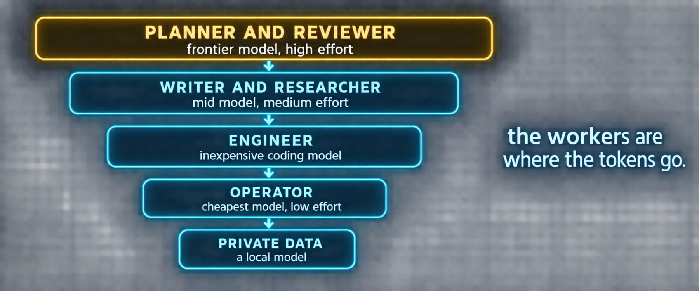

# Build 2: A Model per Bot



### What you are building

A model, a provider and an effort level for each bot, chosen for the role and priced before the first message, plus the credential rule that decides whether a bot can even start.

### What the docs say

Checked against the Bot Mode page (Model and provider pin, Copy API keys), the Profiles page (Every profile owns its credentials), the Kanban page (Cost strategy) and the Configuration reference.

| Fact | Detail |
|---|---|
| Per-bot pin | The New Agent dialog's Advanced section pins a provider and model per Bot; different Bots run different models side by side. Unset means inherit from the launch profile. In the profile it is `model.default` in that profile's config.yaml |
| Effort | `agent.reasoning_effort` per profile: none, minimal, low, medium, high, xhigh, max, ultra |
| Keys are copied, logins are not | Copy API keys from the main profile is on by default and copies static keys into the Bot's own credential store. Single-use OAuth logins (Anthropic, OpenAI Codex, xAI) are never copied; sign the Bot in itself with `hermes -p <bot> auth add <provider>` |
| Why | A named profile resolves providers from its own `auth.json` and `.env` only. A copied OAuth refresh token is the same credential with two owners, and the first refresh breaks the other |
| The split that pays | Planner on a frontier model, workers on inexpensive models, quality-sensitive work pinned back up per task. Workers are where the vast majority of tokens are spent |

### The decision table

| Role | Model class | Effort | Why |
|---|---|---|---|
| Planner (atlas) | Frontier | high | Decomposition, routing and judgment are the expensive skills; the planner sends few tokens and each one steers many |
| Reviewer (sentinel) | Frontier or strong mid | high | A cheap reviewer approves cheap mistakes. This is the second place the money goes and the last place to save it |
| Engineer (forge) | Inexpensive coding model | medium | Well-specified cards are throughput work; a fast coding model on a card with a definition of done beats a frontier model on a vague one |
| Researcher (scout) | Mid model with strong web tools | medium | Reading and citing needs care, not genius; the browser and search tools matter more than the model |
| Writer (quill) | Mid model you like the voice of | medium | Voice is taste; pick the model whose prose you would sign |
| Operator (ops) | Inexpensive | low | Routines read tool output and format it; no reasoning budget needed |
| Anything touching private data | A local model | medium | Privacy is a property of where the tokens go, not of the prompt |

> 📝 **From the field: a bot's own reasons**
>
> When Tonbi's bot HR assigned models it explained itself. Gameplay code went to a high-throughput coding model because "gameplay is a large amount of iterative, relatively self-contained implementation work"; technical art went to a model it judged "suited to generative and creative implementation" because it had to "translate a detailed visual target into procedural geometry"; the WebGL lead got the strongest coding model available. His take: "interesting model choices, but you can see it's fairly well thought out." He also reports that the same project failed outright on a local model. Take both as data from one run, not as a rule.

### Commands

*`models.sh`*

```bash
# Pin a model per bot; this writes model.default in that profile's config.yaml
hermes -p atlas config set model.default "<frontier model>"
hermes -p forge config set model.default "<inexpensive coding model>"
hermes -p ops config set model.default "<inexpensive model>"

# Effort per bot
hermes -p atlas config set agent.reasoning_effort high
hermes -p ops config set agent.reasoning_effort low

# OAuth providers are signed in per profile, never copied
hermes -p atlas auth add <provider>

# Read it back
hermes -p forge config show | grep -A2 '^model:'
```

### Prompts

*`prompt-b2-price-the-roster.md`*

```markdown
Read the "Cost strategy" section of
https://hermes-agent.nousresearch.com/docs/user-guide/features/kanban and
the "Every profile owns its credentials" section of
https://hermes-agent.nousresearch.com/docs/user-guide/profiles. Then, for the
roster in my roster document:

1. List the providers and models I actually have configured (hermes model,
   and each provider's status), with their prices per million tokens as
   the provider publishes them.
2. Assign one to each bot using the decision table (planner frontier,
   reviewer strong, workers inexpensive, private data local), and give the
   one-line reason.
3. Estimate a day's cost for a normal day: the planner runs a standup and
   routes ten cards, workers execute them, the operator runs three
   routines. Show your token assumptions.
4. Tell me which bots will need their own OAuth sign-in because the
   provider uses single-use tokens.

Stop there. Do not change any config.
```

### Verify

- [ ] Every bot has a model.default and an agent.reasoning_effort you chose, readable with hermes -p <bot> config show
- [ ] The planner and the reviewer are on the strongest models; the operator on the cheapest
- [ ] Any bot on an OAuth provider has completed its own sign-in and answers a test message
- [ ] You have a per-day estimate written down to compare against hermes insights in a week

---

[← Back to the index](../README.md) · [Whole volume in one file](FULL-HERMES-BOTS.md)
