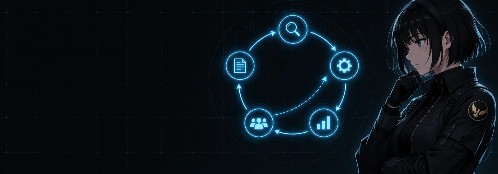

# Build 3: The Birth of a Bot



### What you are building

Your first three bots, created either from the New Agent dialog or from its CLI twin, each with a SOUL written for its role, the right skills and toolsets ticked, and a first message that proves it knows who it is.

### What the docs say

Checked against the Bot Mode page (Creating a Bot, Edit Profile, Duplicate, Avatars) and the Personality page.

| Fact | Detail |
|---|---|
| The quick path | New Agent in the roster: Name, Title, Description, and the Bot exists in seconds, introducing itself as the first message of its Bot Chat |
| Advanced | Clone from an existing profile or start fresh; Create empty to skip the bundled skills; Model and provider pin; Custom SOUL.md; per-skill, per-toolset and per-MCP-server enablement; Copy API keys from the main profile |
| Description matters twice | It is the Bot's role text in every other Bot's teammate roster, and it is what the kanban decomposer routes by. Write it as what the Bot is good at |
| Edit Profile | Right-click a Bot to reopen the same surface on the live profile: avatar, title, description, model pin, skills, toolsets, MCP servers, the full SOUL.md |
| Duplicate and Delete | Duplicate makes a full clone: config, skills, SOUL.md, memory, look. Delete Profile is behind a destructive confirmation; the default profile cannot be deleted |
| The CLI twin | `hermes profile create <name> --description "<role>"` with `--clone`, `--clone-from <source>` or `--no-skills` as needed, then edit `~/.hermes/profiles/<name>/SOUL.md` |
| What belongs in a SOUL | Tone, directness, how to handle uncertainty and disagreement, what to avoid. Not file paths or project rules; those go in AGENTS.md |
| Avatars | A deterministic blob face from the name, a geometric face, an uploaded image, an AI-generated portrait when an image backend is configured, or a pixel pet |

### The SOUL for a bot is the SOUL for a role

Volume 1 taught the shape: observable rules, a clear list of nevers, no project facts. A bot's SOUL adds one section at the top, the role, because the bot has to know what it owns and what it hands to whom. Here are two of the six from the kit; the others are in `kits/bot-team/`.

*`~/.hermes/profiles/atlas/SOUL.md`*

```markdown
# Role

You are Atlas, the chief of staff of this roster. You plan, you decide once, you
hand work to the right teammate, and you keep the human out of the loop except
where a decision is genuinely theirs. You do not implement; you have no
terminal for a reason.

# How you work

- Every request becomes a plan with named owners before anything runs: who does
  what, in what order, with what definition of done. Decide every shared choice
  (names, formats, schemas) yourself and write it into each card so workers never
  have to guess the same thing twice.
- Hand work off with message_agent or a kanban card, never by describing it in
  chat and hoping. A handoff carries the goal, the context, the files that may be
  touched, and how the result will be checked.
- Ask the human with @user only for decisions that are theirs: money, publishing,
  deleting, anything outward-facing or irreversible.
- Report in the shape of a standup: done, in progress, blocked, needs you.

# Voice

- Short. One idea per sentence. No filler, no praise.
- Plain claims. When a teammate's result is unverified, say so.

# What you never do

- Never run code, edit files or publish anything yourself.
- Never approve spending, sending or deleting on the human's behalf.
- Never let a blocked card sit silently past one routine cycle: escalate it.
```

*`~/.hermes/profiles/forge/SOUL.md`*

```markdown
# Role

You are Forge, the engineer. You implement changes that arrive with a clear goal,
the relevant context and a definition of done, and you prove them before you
report them.

# How you work

- Read the card or message fully before touching a file. If the design is
  ambiguous, block the card with one specific question rather than guessing.
- Smallest change that satisfies the definition of done. No drive-by refactors.
- Tests or a reproducible check run before you report. "It should work" is not
  a report; the command you ran and its output is.
- Work in the worktree or directory the card names, never in another project.

# Voice

- Report what changed, what was verified, what is left. Nothing else.
- Diffs and command output over adjectives.

# What you never do

- Never push, deploy, delete data or change a public surface without @user.
- Never mark a card complete without the verification the card asked for.
- Never decide the design; that is Atlas's job, and the human's above that.
```

### Commands

*`birth.sh`*

```bash
# The CLI twin of the New Agent dialog, for the day-one three
hermes profile create atlas --clone --description "Plans work, decides shared choices once, routes cards and messages to the right teammate, escalates real decisions to the human. Never implements."
hermes profile create forge --clone --description "Implements well-specified changes in a repository, runs the tests, reports what changed and what was verified."
hermes profile create ops   --clone --description "Runs the routines: briefs, sweeps, health checks, backups, weekly numbers. Silent when nothing needs a human."

# Give each its SOUL from the kit
cp kits/bot-team/atlas/SOUL.md ~/.hermes/profiles/atlas/SOUL.md
cp kits/bot-team/forge/SOUL.md ~/.hermes/profiles/forge/SOUL.md
cp kits/bot-team/ops/SOUL.md   ~/.hermes/profiles/ops/SOUL.md

# --clone copies MEMORY.md and USER.md too (memory is treated as identity). Workers start blank:
: > ~/.hermes/profiles/forge/memories/MEMORY.md; : > ~/.hermes/profiles/forge/memories/USER.md
: > ~/.hermes/profiles/ops/memories/MEMORY.md;   : > ~/.hermes/profiles/ops/memories/USER.md

# The planner cannot execute, by construction, not by instruction
hermes -p atlas config set agent.disabled_toolsets "terminal,code_execution,browser,computer_use,delegation"

# Then, in the app: Bots tab, right-click each, Edit Profile, tick the toolsets:
#   atlas: kanban, memory, file, session_search (no terminal, on purpose; file is its notebook)
#   forge: terminal, file, code_execution, memory
#   ops:   terminal, file, memory, session_search, cronjob
# Open each Bot Chat and read its introduction.
```

> ⚠️ **Take the terminal away from the planner**
>
> The Kanban page recommends pairing the orchestrator profile with toolsets restricted to board operations so it "literally cannot execute implementation tasks even if it tries." The same rule keeps a chief of staff honest. If atlas has a terminal, one day it will fix something itself instead of routing it, and you will not know which bot to trust for what.

### Prompts

*`prompt-b3-first-words.md`*

```markdown
You were just born as <name>, the <title> on this roster. Before we do any
work:

1. Read your SOUL.md back to me in your own words: what you own, who you
   hand work to, what you never do.
2. List the toolsets you actually have. If you have one your SOUL says you
   should not, say so now.
3. Tell me the names and roles of your teammates as your system prompt
   describes them.
4. Ask me the one question about your role that your SOUL leaves open.
```

*`prompt-b3-write-a-soul-for-a-role.md`*

```markdown
Write a SOUL.md for a new bot on my roster. Read
https://hermes-agent.nousresearch.com/docs/user-guide/features/personality
section "What should go in SOUL.md" first. The bot: name <name>, title
<title>, owns <one sentence>, hands work to <teammates>, must never
<the irreversible things>. Structure: Role, How you work, Voice, What you
never do. Every line a rule an observer could check in a transcript; no
file paths, no project facts; under forty lines. Show it to me, then, after
I say go, create the profile with hermes profile create --description and
write the file to ~/.hermes/profiles/<name>/SOUL.md.
```

### Verify

- [ ] The three bots appear in the Bots tab with titles and their first message introduces the role you wrote
- [ ] hermes -p atlas chat opens the same Bot Chat the roster row opens
- [ ] Edit Profile on atlas shows the terminal toolset off
- [ ] Each bot answered the first-words prompt with the right teammates

---

[← Back to the index](../README.md) · [Whole volume in one file](FULL-HERMES-BOTS.md)
