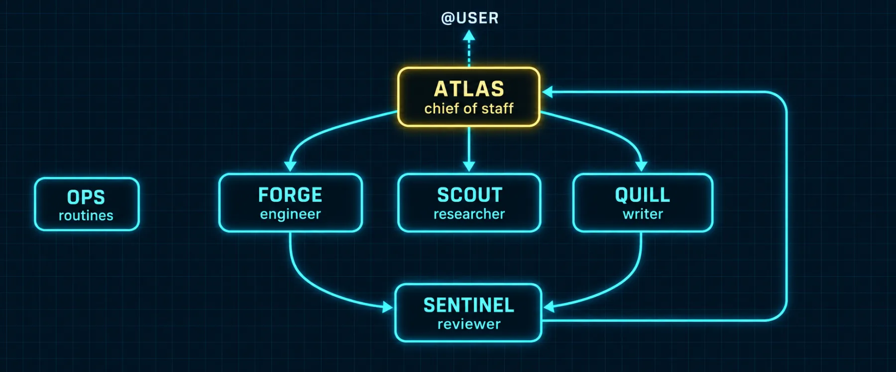

# Build 5: Bots Talking to Each Other



### What you are building

The habit and the mechanics of handing work between bots: an @mention in any chat, a `message_agent` call from inside a Bot Chat, the roster every bot carries in its prompt, and the delivery contract that tells you what "queued" means and what happens when a turn fails.

### What the docs say

Checked against the Bot Mode page: Bot-to-bot messaging, What actually makes a chat a Bot Chat, Failed turns retry safely, When a delivery fails.

| Fact | Detail |
|---|---|
| @mentions | Type `@researcher have a look at this` in any chat; the composer resolves it against the live roster and the active Bot is told exactly who you mean. The Bot then composes its own message and sends it with `message_agent`. Your text is never forwarded verbatim |
| The tool | `message_agent(target="researcher", message="…")` from inside a canonical Bot Chat. The target is a profile name, a friendly name, or the `@` tag. The tool validates the target against the roster and prefixes `Message from 🤖 <name> (@<handle>):` automatically |
| Fire and forget | The sender gets `status: queued` plus a `delivery_id` and finishes its turn. The completion notification later carries the reply or the failure. Queued means handed off, not delivered |
| The roster in the prompt | Teammate names and roles, from each profile's title and description, are part of every Bot Chat's system prompt, so a bot knows who does what before choosing a recipient |
| Only in Bot Chats | `message_agent` exists only in canonical Bot Chat sessions on Bot-Mode-managed installs, never in regular chats, room member sessions or plain CLI sessions |
| Staying silent | A bot with nothing to add ends its turn with `[SILENT]` or `NO_REPLY`; the sender gets an empty reply instead of the token |
| Retries | A failed delivery turn is retried at most once and only when a retry can help: offline target, timeout, rate limit, server error, context overflow (compacted first). Auth, quota and configuration failures surface immediately |
| Reason codes | A failed turn carries a machine-readable reason: `provider_auth_or_access`, `provider_quota_limit`, `provider_rate_limit`, `provider_server_error`, `context_overflow`, `missing_config`, `model_unavailable`, `runtime_offline`, `queued_expired`, `delivery_timeout`, `target_busy`, `unknown` |
| The switch | `agent.bot_mode_protocol: true` in config.yaml (default on) injects the protocol into canonical Bot Chats only; your SOUL.md and regular sessions stay untouched |
| Headless | On a gateway-only install nothing writes the markers. To enable by hand: `hermes -p <bot> chat -c "Bot Chat" --create-if-missing` and an empty `ui_meta: { hermes-bots: {} }` block in one profile's profile.yaml |

*`~/.hermes/config.yaml`*

```yaml
agent:
  bot_mode_protocol: true   # inject the bot-to-bot messaging protocol into canonical Bot Chats
```

*`~/.hermes/profiles/atlas/profile.yaml`*

```yaml
ui_meta:
  hermes-bots: {}
```

### The message paths

The plate above is the whole team's wiring. Read it as five standing paths:

| From | To | Carries | Trigger |
|---|---|---|---|
| you | atlas | a goal | you type it in atlas's chat |
| atlas | forge, scout, quill | a card or a message with goal, context, files, definition of done | atlas's plan |
| forge, quill | sentinel | "review this" with the definition of done attached | the worker finishing |
| sentinel | forge, quill, atlas | findings ranked by severity, or a block | the review |
| anyone | you | `@user` with one specific question | a decision that is yours |

Everything else is noise. If a bot is messaging outside these paths, its SOUL is missing a line.

> 📝 **From the field: the first message you should send**
>
> Tonbi's very first test of bot-to-bot messaging is the right one to copy: he tells one bot, in plain language, "send a message to <other bot> asking to introduce itself, and then tell me the response." The exchange shows up in the receiver's Bot Chat, and the reply comes back to the sender. Do that once with every pair you expect to talk; it costs a minute and it proves the roster, the protocol and the routing in one go.

### Prompts

*`prompt-b5-handshake.md`*

```markdown
Send a message to @<other bot> asking it to introduce itself in two lines
and to tell you which toolsets it has. Tell me the delivery status you got
back, then the reply when it arrives. If the reply does not arrive, tell me
the reason code from the completion notification and what the docs say it
means.
```

*`prompt-b5-handoff-shape.md`*

```markdown
From now on, every handoff you send with message_agent carries four parts
in this order: the goal in one sentence; the context (paths, facts,
constraints) the recipient cannot see; the files it may touch; and the
definition of done, stated so the recipient can check it without you. Show
me the message you would send to @forge for this task before you send it:
<task>.
```

### Verify

- [ ] A handshake between every pair that should talk came back with a reply, and the exchange is visible in the receiver's Bot Chat
- [ ] The sender's completion notification showed the reply, not just queued
- [ ] A message to a bot that is signed out surfaced a provider_auth_or_access reason instead of hanging
- [ ] Your handoffs carry goal, context, files and definition of done

---

[← Back to the index](../README.md) · [Whole volume in one file](FULL-HERMES-BOTS.md)
