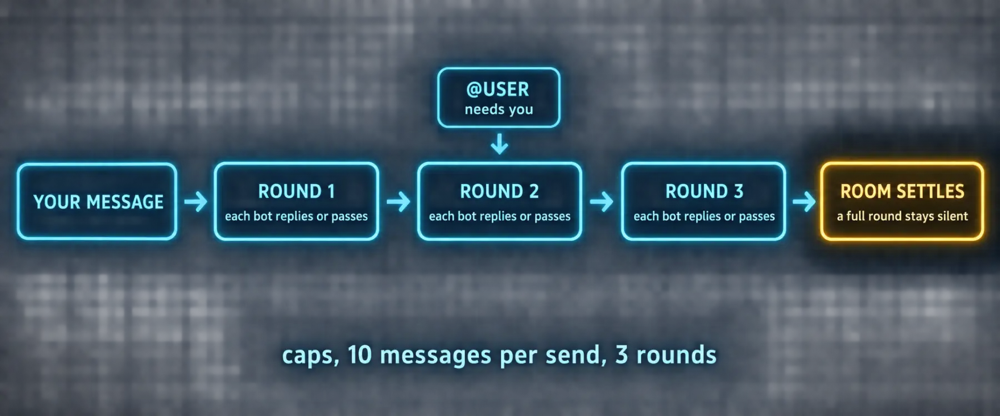

# Build 6: Rooms



### What you are building

Group chats that do real deliberation without spinning: a planning room where atlas, forge and scout agree a phase plan; a review room where sentinel judges before you do; and the habits, three rounds, @user escalation, threads, that keep a room useful.

### What the docs say

Checked against the Bot Mode page: Groups and group chats.

| Fact | Detail |
|---|---|
| Membership | 2 to 6 Bots per room. Right-click a Bot, Manage groups, or the room header's Manage members to edit the roster in place; a removed Bot takes no further turns, an added one reads recent history on its first turn |
| Rounds | In the page's words: "Your message triggers up to three serial rounds of member turns. @-mentioned Bots respond (everyone responds when nobody is mentioned); each Bot replies briefly or passes, and the room settles when a full round stays silent." Hard caps: 10 messages per send, 3 rounds |
| Not everyone speaks | Speaking is each member's choice; a Bot replies only when it has something new to add. Mentioning specific members scopes the round to them |
| Escalation | Bots pull each other in with `@name` and escalate to you with `@user`; the room row shows a needs-you badge, and command approvals in the room answer on the click |
| Threads | Reply in thread continues a topic without reordering the room; Activity is a status view, not the conversation |
| Handoff to the primary | `@hermes` reaches the primary Bot from any room |
| Keeps running | When every member lives on the same gateway, that gateway owns turn scheduling; closing the Desktop does not stop a room mid-discussion. Rooms are mirrored into every connected gateway's shared metadata |
| Cross-machine rooms | Members on other connections are seated with a device badge and a device-qualified handle such as `@reviewer-mini`; each member's turns run on its own machine |
| Holds | `stop @bot` holds a member; `@all resume` or any message addressing the room releases everyone |

### Two standing rooms

| Room | Members | When you open it | What good looks like |
|---|---|---|---|
| planning | atlas, forge, scout | a new project or a change of direction | a numbered phase plan with owners, the shared decisions written out, and one @user question at most |
| review | sentinel, forge, quill | before anything ships | findings ranked by severity, a verdict per artifact, and a block that stays a block |

> 📝 **From the field: plan first, then let the boss push**
>
> Tonbi's racing-game run is the clearest public example of a room doing work. His kickoff to the group was two moves: "everyone introduce yourselves and your role, take a look at the spec," then "decide amongst yourselves the phases for this project and the roles. Just plan it, no coding yet." The bots negotiated phases, asked each other real interface questions (texture atlas dimensions, of all things) and marked phase one parallel. Only then: "start working on this project based on this plan. Please report back when you are done with the task or if you hit any blockers, need help from me." He added his orchestrator bot afterward and told it to check in every twenty minutes and push anyone who had not started. His honest note: with no tool calls visible in a room, he repeatedly doubted whether work was happening. Threads are the cure; talk to the orchestrator in a separate thread and let the workers alone.

### Prompts

*`prompt-b6-planning-room.md`*

```markdown
@atlas @forge @scout Everyone introduce yourself in one line: your role and
what you own. Then read <the brief, attached or at this path> and decide
among yourselves the phases for this project and who owns each. Write the
shared decisions (names, formats, interfaces) into the plan so nobody has to
guess them later. Mark which phases can run in parallel. Plan only, no
work yet. When you agree, @atlas posts the plan as a numbered list and asks
me the one question you could not settle, if any.
```

*`prompt-b6-review-room.md`*

```markdown
@sentinel review <the artifact: a path, a diff, a draft> against this
definition of done: <paste it>. Rank findings by severity with location and
failure scenario. @forge and @quill answer only findings addressed to you,
with the fix or a reason to disagree, no rewrites in the room. @sentinel
closes with one of approve, changes requested, or blocked, and @user only if
the block needs my decision.
```

*`prompt-b6-start-work.md`*

```markdown
@atlas Start work on the plan we agreed. Hand each phase-one owner its card
or message with goal, context, files and definition of done. Check the room
every twenty minutes: nudge anyone who has not started, unblock what you can,
and post a standup line when a phase completes. Report to me in this thread
only when a phase is done or you are blocked on a decision that is mine.
```

### Verify

- [ ] The planning room produced a numbered plan with owners and settled at most three rounds after your kickoff
- [ ] A review room ended with a verdict per artifact and a needs-you badge only when a decision was genuinely yours
- [ ] Closing and reopening the Desktop found the room where it was
- [ ] Reply in thread kept a side question from reordering the main conversation

---

[← Back to the index](../README.md) · [Whole volume in one file](FULL-HERMES-BOTS.md)
