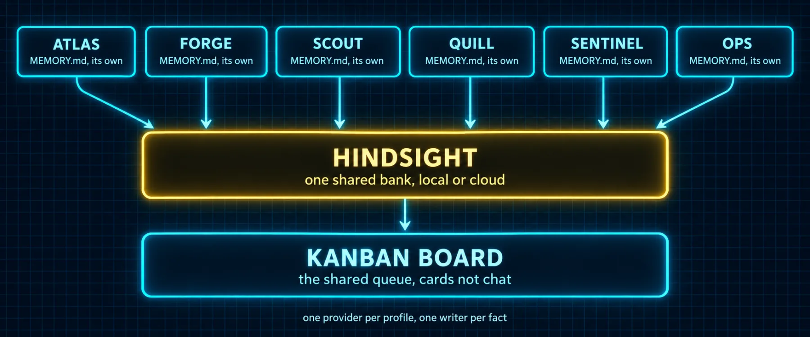

# Build 7: Shared Memory and a Shared Board



### What you are building

The two things a team needs that a single agent never did: a memory the bots share on purpose, and a queue they work from instead of talking. The memory is Hindsight, one bank, local or cloud, joined by the bots whose context should compound and withheld from the ones whose notes should stay private. The queue is the kanban board, where a card carries the goal, the owner, the thread and the verdict, and the dispatcher does the handing out. Mnemosyne is here too, as the local-first provider for a bot whose data must never leave the machine.

### What the docs say

Checked against the Memory Providers page, the Profiles page (the caution box about two writers on one home), the multi-profile gateways page (which credentials follow which profile), the Kanban page, and the Hindsight and Mnemosyne READMEs at the versions installed while writing.

| Fact | Detail |
|---|---|
| Two memories, always | Built-in memory (MEMORY.md and USER.md, per profile) is always on. One external provider can sit beside it per profile, chosen with memory.provider in that profile's config.yaml; hermes memory setup picks it, hermes memory status shows it, hermes memory off drops it and the built-in files keep working |
| One provider per profile | The external slot is single-select. A bot is on Hindsight or on Mnemosyne, never both. Different bots may choose differently, because each bot is its own profile with its own config |
| Never share a home | The Profiles page is blunt: two agent processes on one profile both write memory and each loads the other's writes into its prompt "until it stops being anything you configured." Agents that need shared memory use an external provider. That sentence is why this build exists |
| What a provider does | Injects provider context into the system prompt, prefetches relevant memories before each turn in the background, syncs turns after each reply, extracts on session end where supported, mirrors built-in memory writes, and adds its own tools |
| Hindsight | Knowledge graph with entity resolution and multi-strategy retrieval. Tools hindsight_retain, hindsight_recall, hindsight_reflect (cross-memory synthesis, unique among the providers). Config at $HERMES_HOME/hindsight/config.json, so one file per bot. Modes in the README: cloud (API key), local_embedded (Hermes starts a daemon with built-in PostgreSQL, needs an LLM key or any OpenAI-compatible endpoint for extraction, stops after 5 minutes idle), local_external (a Hindsight you already run, one URL) |
| The bank is the sharing unit | bank_id names the bank, default hermes. bank_id_template derives it with placeholders such as {profile}; empty means every bot with the same bank_id shares one memory. HINDSIGHT_BANK_ID in a profile's own .env is honored per profile, never inherited from the default profile |
| Tags keep provenance | retain_tags stamps everything a bot writes; recall_tags filters what it reads back. A shared bank with per-bot retain tags tells you who learned what |
| recall_types | Defaults to observation only: the consolidated layer, deduplicated and refreshed. Set observation,world,experience to recall raw facts too. It applies to auto-recall and to the hindsight_recall tool alike |
| Mnemosyne | Third-party, MIT, local-first: one SQLite file with sqlite-vec plus FTS5, no daemon, no telemetry, no LLM needed to run. Installed into a venv of its own under $HERMES_HOME/.mnemosyne, exposed by its wrapper installer under ~/.hermes/plugins/mnemosyne, promoted to a provider with hermes memory setup, verified with hermes memory status and hermes mnemosyne stats. Its docs suggest turning off the built-in file injection for that profile, in config.yaml; Hindsight runs alongside the built-in files. Never hermes tools disable memory; that removes provider tools with the built-in ones |
| The board | A task has one assignee, a profile name, and a status in triage, todo, ready, running, blocked, review, done, archived. Comments are the inter-agent protocol: a respawned worker reads the whole thread. The dispatcher runs inside the gateway, ticks every 60 seconds, promotes todo to ready when parents are done, claims and spawns the assigned profile, and auto-blocks a task after two consecutive spawn failures |
| Who may create cards | The Desktop Kanban plugin displays the board; it grants nothing. Enable the kanban toolset on the bot that orchestrates: hermes -p atlas tools enable kanban. Workers get their lifecycle tools automatically from HERMES_KANBAN_TASK; they never shell out to the CLI |
| Workspaces | scratch (deleted on completion, declared artifacts survive), dir:<absolute path> (preserved), worktree (a git worktree, preserved). A relative dir path is rejected at dispatch |
| Shared boards | One kanban.db across several homes shares the board, and every home has a profile named default, so set kanban.dispatch_profiles per home to say which assignees it may claim |

> ⚠️ **Local or cloud is one decision, made once**
>
> Every bot that joins a bank must reach the same Hindsight. Pick the mode before the first bot: local_embedded when one machine hosts the team and you want zero services to run; local_external when the team spans machines and one always-on box (the mini, the VPS) runs Hindsight for all of them; cloud when the machines come and go. Mixing modes across bots gives you three banks that happen to share a name.

### Two shapes, both real

| Shape | Who writes | Who reads | When it fits | Who runs it |
|---|---|---|---|---|
| Shared bank, tagged | atlas, scout, quill, sentinel, each with retain_tags set to its own name | the same four | one project, one company, decisions that every planner and reviewer should know | the setup this volume ships; a working local_external install was read while writing |
| Single writer | the orchestrator only; workers stay on built-in memory | the orchestrator, then it briefs the workers | when workers fetch from outside and should not inherit the team's history, or when you distrust concurrent writes | Wanderloots, orchestrator plus researcher plus librarian |

> 📝 **From the field: why Wanderloots gave only one bot the external memory**
>
> "We don't necessarily want to have all of our bots writing to the same memory system, because they might be conflicting with one another. Instead, I'll leave that ability, the external memory provider, on orchestrator so that the orchestrator will be the only one able to write to that external memory system." His researcher kept persistent memory and the user profile on, "so that it slowly improves itself over time," and nothing else. Both shapes in the table above are defensible. The tagged shared bank trades his caution for provenance: conflicts become visible as two observations with different tags, and hindsight_reflect is the tool that reconciles them.

> 📝 **From the field: what Wanderloots learned running Hindsight for real**
>
> Two videos, one self-hosted Hindsight in Docker, first on a local model (a 20B open model, 13 GB on disk, and it must support tool calling) and later on a Codex subscription with a cheaper model for retain and a stronger one for consolidation and reflect. The rules he states: a bank is a hard recall boundary, one profile connects to exactly one bank, and there is no cross-bank query, so tags are the only soft partition you get; configure the bank before any agent connects (extraction mode concise, a mission statement for retain, custom entity labels such as project and harness turned on as tags, memory defense set to redact); put an API key on the connector and a separate key on the control plane; install backups with hindsight admin backup before the first agent joins and again before every upgrade. His bank held 33,000 memories after a week and a half, and a fact stored by one agent was recalled by another on the next turn. His verdict on the two providers is the Mnemosyne author's own: Hindsight is a memory engine, Mnemosyne is a memory layer. Test one for a week; you can export from one to the other.

> 📝 **From the field: the honest state of memory**
>
> HolmeBengt, 28 cron jobs and more than 30 self-built skills in: "Long-term memory is still the biggest unsolved problem. Dreaming helps, but session-to-session recall remains inconsistent." His fix is a 3 AM job that reads every conversation and writes a structured summary that loads at the start of every session. riceinmybelly runs three layers and caps the first: MEMORY.md at 2,200 characters for behavioral rules only, "larger MEMORY.md starts crowding out system prompt instructions"; an Obsidian vault for long-form knowledge; Hindsight synced from the vault every 30 minutes with a 90-second budget, additive on top. Build the shared bank; keep the nightly summary and the small MEMORY.md anyway.

### The kit

*`kits/bot-team/memory/hindsight-config.json`*

```json
{
  "mode": "local_external",
  "api_url": "http://127.0.0.1:8888",
  "bank_id": "team-shared",
  "bank_id_template": "",
  "memory_mode": "hybrid",
  "auto_retain": true,
  "auto_recall": true,
  "retain_async": true,
  "retain_every_n_turns": 1,
  "retain_tags": [
    "<bot-name>"
  ],
  "recall_tags": "",
  "recall_types": [
    "observation"
  ],
  "recall_budget": "mid",
  "recall_prefetch_method": "recall",
  "recall_sync": false,
  "recall_indicator": true,
  "retain_indicator": true
}
```

*`kits/bot-team/memory/hindsight-setup.sh`*

```bash
#!/bin/sh
# One shared Hindsight bank for the bots that share context. Run once per bot that joins the bank.
# Pick ONE mode and keep it for every bot: local_embedded (Hermes runs the daemon, free, needs an LLM key
# or a local OpenAI-compatible endpoint for extraction), local_external (a Hindsight you run yourself,
# Docker or bare, one URL), or cloud (an API key from ui.hindsight.vectorize.io).

BOT="${1:?usage: hindsight-setup.sh <bot> [bank]}"
BANK="${2:-team-shared}"
HOME_DIR="$HOME/.hermes/profiles/$BOT"

# 1. Interactive wizard, once per bot. It installs the client, asks the mode, and offers a starter
#    memory template (skip it for a bot joining an existing bank; it warns before overwriting).
hermes -p "$BOT" memory setup            # choose hindsight, then the mode you picked above

# 2. Point this bot at the shared bank and tag what it writes with its own name.
#    The config file is per profile: each bot has its own $HERMES_HOME/hindsight/config.json.
[ -f "$HOME_DIR/hindsight/config.json" ] || { echo "no $HOME_DIR/hindsight/config.json: the wizard did not finish for $BOT, run it again"; exit 1; }
python3 - "$HOME_DIR/hindsight/config.json" "$BANK" "$BOT" <<'PY'
import json, sys
path, bank, bot = sys.argv[1:4]
cfg = json.load(open(path))
cfg["bank_id"] = bank
cfg["bank_id_template"] = ""
cfg["retain_tags"] = [bot]
cfg["memory_mode"] = "hybrid"
json.dump(cfg, open(path, "w"), indent=2)
print("wrote", path, "bank", bank, "tags", cfg["retain_tags"])
PY

# 3. Read it back. The provider must say hindsight and available.
hermes -p "$BOT" memory status

# Rollback for one bot: hermes -p <bot> memory off   (built-in MEMORY.md and USER.md keep working)
```

*`kits/bot-team/memory/mnemosyne-setup.sh`*

```bash
#!/bin/sh
# Mnemosyne for a bot whose memory must never leave the machine. Local-first, one SQLite file, no daemon.
# A profile runs ONE external provider, so a bot is on Mnemosyne or on Hindsight, never both.
# Two rules learned in the field: never install into the Hermes-managed venv (hermes update rebuilds it and
# wipes extra packages), and if your terminal backend is Docker, run this from the host yourself, not via Hermes.

BOT="${1:?usage: mnemosyne-setup.sh <bot>}"
HERMES_HOME="${HERMES_HOME:-$HOME/.hermes}"
VENV="$HERMES_HOME/.mnemosyne/venv"          # the side venv the Mnemosyne README's update path expects

# 1. A venv of its own, with local embeddings (about 800 MB of RAM at run time; the core-only profile is
#    about 50 MB but sends embeddings to a remote endpoint, which defeats the point of a private bot).
python3 -m venv "$VENV"
"$VENV/bin/python" -m pip install --upgrade pip
"$VENV/bin/python" -m pip install --upgrade "mnemosyne-memory[embeddings]" mnemosyne-hermes

# 2. The wrapper install writes the plugin files under $HERMES_HOME/plugins/mnemosyne, where Hermes discovers them.
"$VENV/bin/mnemosyne-hermes" install --mode wrapper --force --python "$VENV/bin/python"

# 3. Select it for THIS bot and read it back. The README's path is the config key; in Wanderloots' recorded walkthrough the
#    same wizard (hermes memory setup) offered "Mnemosyne local" and asked for the default remember scope, which he set to
#    global rather than per session. If your wizard does not list Mnemosyne, the config key alone selects it.
hermes -p "$BOT" config set memory.provider mnemosyne
hermes -p "$BOT" memory setup
hermes -p "$BOT" memory status
hermes -p "$BOT" tools list | grep mnemosyne_
hermes -p "$BOT" mnemosyne stats 2>/dev/null || true   # the plugin's own CLI command as shown in that walkthrough; optional

# If memory status says plugin missing or the Python environments do not match, re-run step 2, then step 3.
# Mnemosyne's docs suggest turning the built-in MEMORY.md and USER.md injection off for this bot to avoid
# duplicate context; do that in the bot's config.yaml (memory.enabled, user_profile.enabled), not with
# `hermes tools disable memory`, which removes the whole memory toolset, provider tools included.
# Update later: "$VENV/bin/python" -m pip install --upgrade 'mnemosyne-memory[embeddings]' mnemosyne-hermes,
# re-run step 2, then hermes gateway restart. To leave: hermes -p <bot> memory off
```

> 📝 **Where Mnemosyne fits**
>
> The bottom rung of the model ladder in Build 2 was a local model for private data. Mnemosyne is the memory for that rung: nothing leaves the machine unless you point it at a remote embedding endpoint or turn on its sync. Two installation facts from the field: it must live in its own venv, because hermes update rebuilds the managed one and wipes extra packages, and if your terminal backend runs in Docker you install it from the host yourself rather than asking Hermes, or it lands inside the container. In Wanderloots' recorded walkthrough the setup wizard listed Mnemosyne and asked one decisive question, the default remember scope, which he set to global rather than per session; the README documents the config key, hermes config set memory.provider mnemosyne, which selects it either way. Its own README is unusually candid about benchmarks, which is a reason to trust it: the BEAM numbers were measured on an older version with a different judge than Hindsight's published score, and a LongMemEval figure was withdrawn until it can be reproduced. Read it as a local-first store that abstains rather than invents, not as a Hindsight replacement for the shared bank. On the machine this was written on it shows in hermes memory status as an installed provider, local, next to Hindsight.

### Commands

*`b7-commands.sh`*

```bash
# 1. The bank. Local external shown; the setup script asks the mode once per bot.
sh kits/bot-team/memory/hindsight-setup.sh atlas team-shared
sh kits/bot-team/memory/hindsight-setup.sh scout team-shared
sh kits/bot-team/memory/hindsight-setup.sh quill team-shared
sh kits/bot-team/memory/hindsight-setup.sh sentinel team-shared
# forge and ops stay on built-in memory: working notes, not team knowledge. (Born with --clone they carry a copy of the
# primary MEMORY.md and USER.md; Build 3 blanks those, so check that it happened.)

# 2. Prove the sharing, from the terminal, no app in the loop.
hermes -p scout chat -q "Use hindsight_retain to store: the team's release day is Thursday. Then reply done."
hermes -p atlas chat -q "Use hindsight_recall for 'release day' and tell me what you find and which tag it carries."

# 3. The board.
hermes kanban init
hermes -p atlas tools enable kanban          # atlas creates and routes cards
hermes gateway status                        # the dispatcher lives in the gateway; it must be up
hermes kanban create "Draft the release notes for Thursday" --assignee quill
hermes kanban watch                          # in a second terminal: claim, spawn, comments, done

# 4. A bot whose memory must stay on this machine, if you have one.
sh kits/bot-team/memory/mnemosyne-setup.sh vault
```

### Prompts

*`prompt-b7-memory-audit.md`*

```markdown
You are @ops, because this needs a shell. Audit the team's memory before we
share any of it. For every profile in hermes profile list, read
hermes -p <bot> memory status and that bot's
~/.hermes/profiles/<bot>/hindsight/config.json if it exists. Produce a
table: bot, provider, mode, bank_id, retain_tags, memory_mode. Flag: two
bots on different Hindsight modes; a bot on a bank nobody else uses that
should be shared; forge or ops on the external provider; any bot with
recall_tags set, since that hides teammates' memories. Propose the change
per bot as the exact command or JSON edit. Change nothing until I say go.
```

*`prompt-b7-first-shared-memories.md`*

```markdown
@atlas @scout @quill @sentinel Each of you: use hindsight_retain to store
three things a new teammate would need to know about your job on this
team, tagged as yourself. Then @atlas: run hindsight_reflect with the
question "what does this team know about how it works?" and post the
answer here. If two bots stored contradicting facts, say which two and
which one is right, and ask me only if you cannot tell.
```

*`prompt-b7-board-as-queue.md`*

```markdown
You are @atlas. From now on, work that takes more than one message becomes
a card, not a chat. For each item in <the plan, pasted or at this path>
call kanban_create with: a one-line title, a body carrying goal, context,
files and the definition of done, the assignee (forge, scout, quill or
sentinel), and links so review cards depend on the work they review. Put
build cards on a worktree workspace and writing cards on
dir:<absolute path to the drafts folder>. Post the list of card ids with
owners. Then leave the dispatcher alone; check hermes kanban list at the
standup, not every minute.
```

*`prompt-b7-worker-contract.md`*

```markdown
You are @forge on card <id>. Read the card with kanban_show and the whole
comment thread before doing anything. Work in the card's workspace only.
Post a comment when you start, when you hit a decision that is not yours,
and when you finish, naming the verification you ran and its output.
Declare every deliverable in kanban_complete artifacts, because a scratch
workspace is deleted on completion. If you are blocked, kanban_block with
the reason and stop; do not improvise around it.
```

### Verify

- [ ] hermes -p <bot> memory status says hindsight and available for every bot that joined the bank, and built-in only for forge and ops
- [ ] A fact retained by scout is recalled by atlas, and the recall carries scout's tag
- [ ] hindsight_reflect answered a question no single bot's memory could
- [ ] hermes kanban watch showed a card go ready, running, review, done without you touching the terminal
- [ ] The Desktop's Kanban page shows the same board the CLI lists
- [ ] A bot on Mnemosyne, if you set one up, lists mnemosyne_ tools and hermes memory status names it

---

[← Back to the index](../README.md) · [Whole volume in one file](FULL-HERMES-BOTS.md)
