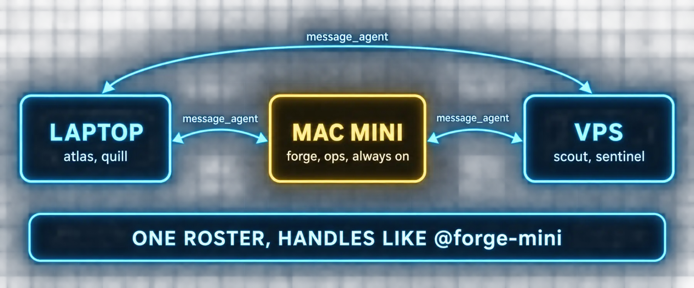

# Build 8: Bots Across Machines



### What you are building

The team spread over the machines you already own: the planner and the writer on your laptop, the engineer and the operator on an always-on Mac mini, the researcher and the reviewer on a VPS, all in one roster, messaging each other, sitting in the same rooms.

### What the docs say

Checked against the Bot Mode page (Bots across machines, Messaging across connected machines, Bot-initiated DMs across machines, One-way reachability) and the multi-connection guide.

| Fact | Detail |
|---|---|
| The union roster | Register several backends in Settings, Gateways and the Bots pane shows the Bots from every connected source, persistently. Unreachable machines keep their last-known rows |
| Handles | The same profile name on several sources disambiguates as `@name-device`, for example `@research-homelab` |
| Where a bot lives | Its chats, sessions, memory and routines live on the machine that owns the profile. Clicking a Connections Bot does not hop your window; @mention it, seat it in a room, or create new agents on it with the Create on picker |
| Create on | With more than one connection registered, New Agent grows a Create on picker; the profile is created on that machine's backend, cloning from that machine's `default` |
| The Desktop relay | Rosters propagate on their own while the Desktop runs; `message_agent` reaches bots on other connections, disambiguated as `target="moxie@<connection>"`; delivery rides the Desktop, which holds the sockets and credentials. Close the Desktop mid-delivery and the sender is told the reply did not arrive |
| Without a Desktop | Register the other gateway as a peer: `hermes peer add <name> --url http://host:8377 --key <API_SERVER_KEY>`; then `hermes peer dm <name>/<profile> < msg.txt` for short exchanges and `hermes peer run` with `--idempotency-key` for long ones. Once a peer is registered, every Bot Chat's protocol includes the peer roster and `message_agent` accepts `target="<peer>/<profile>"` |
| The peer's key | The peer machine runs the `api_server` gateway platform with a strong `API_SERVER_KEY`; the key lives in `~/.hermes/.env` as `HERMES_PEER_<NAME>_KEY`; peer names and URLs live in config.yaml under `bot_peers` |
| NAT | Cross-gateway links are direct. A gateway behind home NAT can dial out to a public peer; the reverse fails unless the network provides a route. Put a room's authority on the host every participant can reach, or bridge with Tailscale |
| Rooms across machines | Members on other connections are seated with a device badge and a device-qualified handle; each member's turns run on its own machine |

### Commands

*`peers.sh`*

```bash
# On the laptop: reach the mini's bots without the Desktop in the loop
hermes peer add mini --url http://<mini-tailscale-ip>:8377 --key <the mini's API_SERVER_KEY>
hermes peer list
echo "Introduce yourself in two lines and list your toolsets." > /tmp/dm.txt
hermes peer dm mini/forge < /tmp/dm.txt

# A long job on the mini, idempotent, polled
hermes peer run mini --idempotency-key nightly-2026-09-19 "$(cat /tmp/long-task.txt)"
hermes peer status mini <run_id>
```

### Prompts

*`prompt-b8-place-the-team.md`*

```markdown
Read https://hermes-agent.nousresearch.com/docs/user-guide/bot-mode sections
"Bots across machines", "Messaging across connected machines", "Bot-initiated
DMs across machines" and the NAT note. I have these machines: <list, with
which are always on and how they reach each other>. For my roster, propose
where each bot lives and why (always-on for routines and long jobs, the
laptop for what I talk to most), which handles will need a device suffix,
whether I need hermes peer for machine-to-machine messaging when the
Desktop is closed, and where a room's authority should sit given my NAT.
Then give me the hermes peer add command for each pair that needs one.
Do not run anything.
```

### Verify

- [ ] The Bots pane lists bots from every registered gateway, with @name-device handles where names collide
- [ ] A message from a laptop bot to a mini bot arrives with the Desktop open, and hermes peer dm works with it closed
- [ ] A room with members on two machines settles and shows device badges
- [ ] You know which machine holds authority for each cross-machine room

---

[← Back to the index](../README.md) · [Whole volume in one file](FULL-HERMES-BOTS.md)
