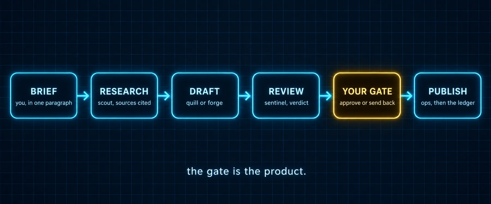
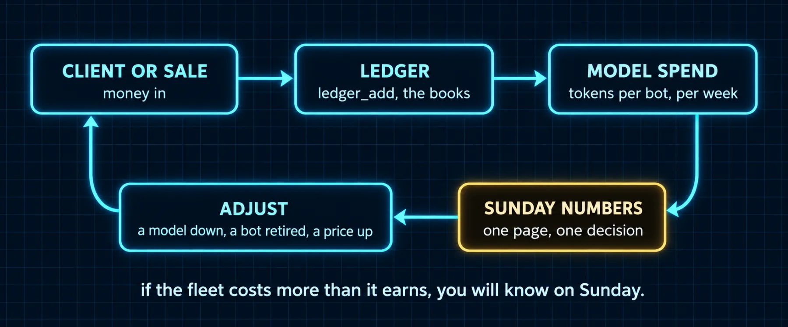
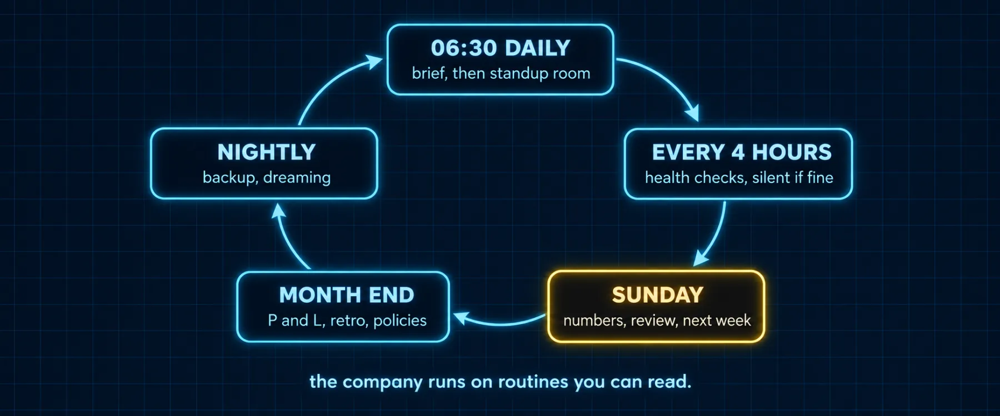

# The Hermes Company Masterclass


## Contents

- [Orientation](#user-content-orientation)
- **[Build 0](#user-content-build-0-the-case)** The Case
- **[Build 1](#user-content-build-1-life-first)** Life First
- **[Build 2](#user-content-build-2-the-company-blueprint)** The Company Blueprint
- **[Build 3](#user-content-build-3-the-chief-of-staff)** The Chief of Staff
- **[Build 4](#user-content-build-4-production-lines)** Production Lines
- **[Build 5](#user-content-build-5-clients)** Clients
- **[Build 6](#user-content-build-6-money)** Money
- **[Build 7](#user-content-build-7-the-cadence)** The Cadence
- **[Build 8](#user-content-build-8-learn-while-you-run)** Learn While You Run
- **[Build 9](#user-content-build-9-ship-the-company)** Ship the Company
- [The Company Ledger](#user-content-the-company-ledger)

---

## Orientation

Volumes 1 to 3 gave you the agent, the app and the team. This volume gives them a job. It is written in the order a real operator gets there: first your own week, because a founder who is the bottleneck of their own life never has the hours to run a company; then the company as an org chart of bots with decision rights and human gates; then the production lines that make and sell things; then the cadence and the numbers that tell you whether it is working.

Everything here is grounded in named, public setups. The official Hermes user stories corpus holds 326 stories; the ones that describe a business, an agency, a content operation or a whole life were opened at the source (Reddit threads, X posts, GitHub repositories, blogs) and are quoted by handle. Where a source has been removed or a number is self-reported, the text says so. Nothing is invented, and the honest limits are listed in Build 0 before anything else.

> ⚠️ **Read this before you copy anyone**
>
> No revenue figure in this volume is audited. Two of the most-cited business posts have been deleted from Reddit and survive only as the Hermes team's curated quotes. No operator reports churn, a rollback, or a security review. The setups are real and the mechanisms are reusable; the money claims are one person's word. This volume teaches the mechanisms.

| Build | You end up with | Grounded in | Time |
|---|---|---|---|
| 0 | The case: what people actually run, what it costs, what nobody has proven | 13 named cases | 20 minutes |
| 1 | Life first: inbox, calendar, health, money and the weekly review, as bots and routines | HolmeBengt, SquishyData, stan_frbd | 90 minutes |
| 2 | The company blueprint: a charter, an org of bots, decision rights, human gates | Jinn, RUDR9, ogiberstein | 60 minutes |
| 3 | The chief of staff: your planner bot owning the board and the cadence | RUDR9, Hermes Swarm | 45 minutes |
| 4 | Production lines: content, products, education, from research to a publish gate | cyrilXBT, Metics, kenmazaika | 90 minutes |
| 5 | Clients: research before calls, proposals, notes, invoices behind a gate | mvanhorn, IBuzovskyi, pacmanpill | 60 minutes |
| 6 | Money: the ledger as the books, a weekly P&L routine, what the fleet costs | HolmeBengt, witcheer, Volume 2's ledger | 45 minutes |
| 7 | The cadence: standup room, weekly review, monthly retro, the dashboard | Hermes Swarm, Gumroad | 45 minutes |
| 8 | Learn while you run: corrections become files, skills become SOPs | Gumroad, HolmeBengt, riceinmybelly | 45 minutes |
| 9 | Ship the company: one repo installs the whole roster; backups, security, the always-on box | RUDR9, stan_frbd | 60 minutes |

### How to use a build

Same shape as the other volumes: what you are building, what the sources say (here, cases rather than docs, with the Hermes docs cited where a mechanism needs it), prompts to paste, commands to run, a verify list. The kit under `kits/company/` holds the charter template, the org file, the policy-rules file and the life-ops routines. Volume 3's six bots are assumed; this volume adds the files that give them a company to run.

## Build 0: The Case


### What you are building

A clear picture, from named operators, of what running a business on Hermes looks like day to day: the hardware it runs on, the shape of the fleets, the costs people attest to, and the eight mechanisms that repeat across every serious setup.

### What the sources say

Thirteen cases carry this volume. Nine were opened at the source (Reddit threads, GitHub repositories, blogs, the recorded videos); the four marked "curated" are X posts quoted as the Hermes documentation team curated them for the official user stories, and were not opened here.

| Operator | What runs | The transferable mechanism |
|---|---|---|
| @scotty529 (X, July 2026, curated), a Gumroad operation | An agent named Gumclaw on a dedicated Mac, woken by cron to check support tickets, watch X mentions, do engineering tasks, update finance docs, and follow up on earlier work | "When Gumclaw makes a mistake, the correction becomes a dated policy rule that every future session must read." |
| u/HolmeBengt (Reddit, June 2026) | 28 cron jobs and 30 or more self-built skills on a Mac mini running a local model 24/7 plus a VPS: a 3 AM Dreaming job, a local mail gatekeeper that never sends, a health coach, a finance review, infrastructure checks, a 6:30 AM tactical report | "Each skill is one file, one job, no dependencies." Attested cost about 17 dollars a month, agreed to a commenter's figure |
| u/humanth-shashani, RUDR9 (Reddit and GitHub, July 2026, MIT) | One installer that turns a fresh Hermes into what the post counts as eight specialist profiles plus a CTO (it lists seven: planner, architect, version control, builder, security auditor, performance auditor, reviewer), coordinated through the built-in kanban board | "Authority is enforced by toolset restrictions, not just system prompt instructions. The planner profile doesn't have the file write tool." |
| u/TotalGod, Jinn (Reddit and GitHub, July 2026, MIT) | A self-hosted workspace that treats agents as "a small local company": employees are YAML org nodes with a role, an engine and a model; work moves through chat, sessions, cron and a board | "The goal is not to replace coding agents. It's to give them a shared operating layer: who owns what, what is in progress, what needs review, and what got handed off." |
| u/Upset_Simple_4858, Hermes Swarm (Reddit and GitHub, June 2026) | Teams of full Hermes agents running 24/7 for a SaaS's marketing: blog posts, social, prospect lists, email outreach; each agent has its own terminal, browser and shared filesystem | "Every team also has a supervisor agent that periodically reviews each agent's transcripts. If someone is stalled, looping, or idle while still owing work, the supervisor nudges them." Decisions, approvals and credentials route to a human inbox |
| u/stan_frbd (Reddit, July 2026), a DFIR analyst | Three profiles, work, personal coach and homelab guardian, each with its own Telegram bot; daily lesson, backup, wiki lint and dream crons; a mini PC running Proxmox | "Never run Hermes from your personal daily-use environment. Give it a dedicated environment and keep clear separation between personal usage, work, and automation." |
| u/SquishyData (Reddit, July 2026) | About twenty cron "signals" that only append to a daily ledger, then one agentic job that triages the ledger and notifies whoever needs to know | The cheap layer is deterministic; only the triage step spends a model |
| u/kenmazaika (Reddit, July 2026), a content business | Phone dictation into a Telegram topic, shaped by Hermes into a structured outline with a section of connections he did not see, saved locally | "Automate the 97 percent, don't kill the project trying to automate the last 3 percent." |
| u/Godzillaton (Reddit, June 2026), construction | Eleven WhatsApp site groups read through a self-hosted WhatsApp API on an 8 GB laptop, summarized to three lines, with scheduled outbound messages, controlled from Telegram | "82 WhatsApp messages boiled down to 3 lines." |
| u/pacmanpill (Reddit, June 2026, post since removed) | Installing and adapting Hermes for French small businesses, reported at about 2,700 euros in a month; a commenter cites 200 euros a month per client for maintenance | The value, per the surviving quote, "is not just installing an AI agent. It's adapting it to the company's real workflows." A GDPR question in the thread never got an answer |
| @IBuzovskyi (X, May 2026, curated) | "One Hermes profile per client, fully isolated, each gets their own SOUL.md, memory, cron," at a stated 497 dollars a month per client | The client boundary is a profile |
| @ogiberstein (Discord, curated) | A Chief of Staff agent with cross-project memory, one sub-profile per project where one project is one Slack channel, on a VPS with backup routing | The planner is a separate agent from the doers |
| @witcheer (X, March 2026, curated) | A 24/7 agent on a Mac mini for two months: 18 cron jobs, 35 scripts, 6 skills, "a structured context system that makes every session smarter than the last," at a stated 21 dollars a month | Always-on is a small machine and a small bill |

### The eight mechanisms that repeat

| Mechanism | Who does it | Where this volume builds it |
|---|---|---|
| Corrections become files, not chat | Gumroad's dated policy rules, HolmeBengt's Saturday rewrite of his own prompt from saved corrections, riceinmybelly's lessons folder (his own verdict on his setup: "nowhere near an example to follow") | Build 8 |
| Cheap deterministic collection, expensive selective triage | SquishyData's ledger, HolmeBengt's local mail judge | Builds 1 and 7 |
| One profile per boundary | stan_frbd's three lives, IBuzovskyi's one profile per client | Builds 2 and 5 |
| Authority by removing tools, not by asking nicely | RUDR9's planner without file write and auditor without terminal | Builds 2 and 3 |
| A board plus a dispatcher, not agents talking freely | RUDR9, Jinn, riceinmybelly | Build 3 |
| A supervisor that reads transcripts and nudges | Hermes Swarm | Build 7 |
| The human gate is the design | kenmazaika's 97 percent, Hermes Swarm's inbox and browser handoff | every build |
| Always-on is small | Mac minis, an 8 GB laptop, a mini PC, a cheap VPS; attested bills of 17 and 21 dollars a month | Build 9 |

> ℹ️ **What nobody has proven**
>
> No audited revenue. No client counts over time. No churn, no rollback, no security review. Several stories in the official corpus are feature requests filed alongside running systems. A second removed post, a "Twin AI" for a physical-product business, is left out of this volume for that reason. And riceinmybelly, cited here for his three-layer memory and his backups, prefaced his own write-up with "this is nowhere near an example to follow. It is messy, has tons of security holes"; he is quoted for mechanisms, never as a setup to copy. The mechanisms above are real and repeat across independent operators; treat every dollar figure as one person's report until your own ledger says otherwise.

### Prompts

*`prompt-c0-what-would-i-run.md`*

```markdown
Read these two public write-ups and summarize each in five lines: what
runs, on what hardware, which pieces are cron and which are agents, how
the human stays in the loop, and what the author warns about.
- https://www.reddit.com/r/hermesagent/comments/1udesr1/
- https://github.com/ardhaecosystem/RUDR9
Then look at my own last four weeks (session_search) and tell me which of
their mechanisms I am already doing by hand, and which single one would
save me the most hours if a routine did it. Change nothing.
```

### Verify

- [ ] You can name the operator behind each of the eight mechanisms without looking
- [ ] You wrote down the one mechanism you will build first and why
- [ ] You know which source in this build is a deleted post, which second deleted post was left out, and why neither is cited for detail

## Build 1: Life First


### What you are building

The personal operations layer that buys back the hours: the ops bot from Volume 3 running your inbox sweep, calendar prep, health log, money ledger and a weekly review, with a human gate on anything that leaves the machine.

### What the sources say

| Source | The pattern |
|---|---|
| HolmeBengt's Daily Status Report at 6:30 AM | Calendar and what needs preparation, open to-dos, system health, anomalies from the overnight run. "This is not the news. This is the tactical dashboard." |
| HolmeBengt's Mail Gatekeeper | A local model judges mail as safe or blocked; blocked means 2FA codes, logins, password resets, bank transactions, spam; safe mail lands in a Telegram topic; an evening watchdog reviews the blocked folder for false positives. "There is no send endpoint anywhere in the system, Hermes can read and draft, but nothing can physically leave the machine" |
| HolmeBengt's Health Coach at noon | Wearable recovery and sleep, phone steps and resting heart rate, a self-built food log fed by Telegram text, photo or barcode, checked against a calorie and protein target |
| HolmeBengt's Finance Review | Sundays at 6 PM weekly, the 28th monthly: income, expenses, liquid assets, burn rate versus budget, month-over-month variance, savings rate, "delivered with voice" |
| SquishyData's signals | Twenty cron skills append to a daily ledger; one agentic job triages it; forwarding goes "to whoever can help or needs to know" |
| stan_frbd | A personal-coach profile for gym, running and nutrition, separate from work, with its own Telegram bot |
| kenmazaika | Dictate messy ideas from the phone into a Telegram topic; Hermes returns a structured outline plus a "riff" of connections; saved locally |

The Hermes mechanisms underneath: cron routines with `[SILENT]` (Volume 1, Build 8), the ledger plugin (Volume 2, Build 7), a profile per boundary (Volume 3), and the Telegram gateway for the phone (Volume 1, Part 7).

### The life routines the kit ships

*`kits/company/life/routines.sh`*

```bash
#!/bin/sh
# Life-ops routines, owned by ops. Run once: sh kits/company/life/routines.sh. Nothing here sends, pays, posts or deletes.
# ops needs the terminal, file, memory and session_search toolsets, and the ledger plugin for sunday-money.

hermes -p ops cron create "every day at 06:30" \
  "Tactical brief for today. If you have calendar access, list today's events with what each needs prepared; otherwise say calendar is not connected. List open to-dos from ~/inbox/todo.md if it exists. Add one line of machine health from hermes doctor. Add anomalies from the last 24 hours of error logs (hermes logs --level WARNING, summarized). Six lines maximum. If there are no events, no to-dos and no anomalies, reply with only [SILENT]." \
  --name "life-brief"

hermes -p ops cron create "every day at 12:00" \
  "Health check-in. Read ~/inbox/health.md (a log I append to by voice: sleep, training, food, weight). Compare today's entries against the targets at the top of the file. Reply with two lines: where I stand against each target, and the one thing to do this afternoon. If the file has no entry for today, reply with only [SILENT]." \
  --name "health-noon"

hermes -p ops cron create "every sunday 18:00" \
  "Sunday money. Call ledger_report for this month and for last month. Report income, expenses, net, the three biggest expense categories and how each moved versus last month, and the savings rate. Five lines. Deliver even when unchanged." \
  --name "sunday-money"

hermes -p ops cron create "every day at 21:00" \
  "Mail sweep, read only. If a mail tool is available, list unread messages from the last 24 hours that a human must answer, one line each with sender and ask; never draft a reply and never send. Skip newsletters, receipts and notifications. If nothing needs me, reply with only [SILENT]. If no mail tool is available, reply with only [SILENT]." \
  --name "mail-sweep"

hermes -p ops cron create "every saturday 17:00" \
  "Weekly review prep. Using session_search over the last seven days, list: decisions I made, things I said I would do and did not, and questions I asked more than once. Ten lines maximum, dated. Deliver even when short." \
  --name "weekly-review-prep"
```

> ⚠️ **Two gates that are not optional**
>
> Nothing in these routines sends mail, moves money or messages another person. Drafts, yes; sends, no. HolmeBengt built that as an architectural fact rather than a rule, by having no send endpoint at all. If you later give a bot a send tool, it goes on a separate profile with its own approvals, never on the one that reads everything.

### Prompts

*`prompt-c1-design-my-week.md`*

```markdown
You are @ops. Design my personal operations layer from evidence. Read my
calendar for the last four weeks if you have a tool for it, otherwise ask
me for the five things that recur weekly. Then propose at most six
routines, each with: name, schedule, the exact self-contained prompt, the
silent condition, and the delivery target. Rules: nothing sends, posts,
pays or deletes; anything that would needs a human gate and a separate
profile. Show me the hermes cron create commands. Do not create them until
I say go.
```

*`prompt-c1-dictation-inbox.md`*

```markdown
Set up the dictation inbox. Read
https://hermes-agent.nousresearch.com/docs/user-guide/messaging and tell
me how to give a Telegram topic its own handling, then write the standing
instruction for it: when a long dictated message arrives, shape it into a
structured outline, add a short section of connections to things I have
said before (session_search), save it as a markdown file under
<path>/inbox/<date>-<slug>.md, and reply with the file path and a
three-line summary. Never act on the content; only structure it.
```

### Verify

- [ ] A 6:30 AM brief arrives on your phone with calendar, to-dos and health, and is silent on empty days
- [ ] Money recorded by voice through the ledger tools shows up in the Sunday review
- [ ] A dictated ramble from your phone comes back as a structured file within a minute
- [ ] Nothing in the life layer has a send tool; you checked each profile's toolsets

## Build 2: The Company Blueprint


### What you are building

Three files that turn a roster into a company: a charter that says what the company is for and what only you decide; an org file that names every bot, its role, its model and what it may touch; and a policy-rules file that every bot reads and that grows every time something goes wrong.

### What the sources say

| Source | The pattern |
|---|---|
| Jinn | "You define an org: employees are YAML org nodes; each employee has a role, engine, and model; skills are separate reusable workflows; work can move through chat, sessions, cron jobs, and a Kanban-style board." |
| RUDR9 | Nine roles, coordinated through the kanban board; authority by toolset restriction; an honest limitations section; and a reviewer who told the author nine roles was over-engineered and three would do |
| ogiberstein | A Chief of Staff with cross-project memory; one sub-profile per project |
| @code_rams | "A smarter model will not give you an AI cofounder. What the agent is allowed to own will." |
| @shannholmberg | A maturity ladder: "once a workflow is solid, break it out into its own agent with its own credentials, memory and scope." |

> 📝 **ORG.yaml is a planning file, not a Hermes setting**
>
> Hermes has no org file. Jinn and RUDR9 each invented their own way to write the org down, and so does this kit: `ORG.yaml` is the document your chief-of-staff bot reads at the start of every planning routine, and the source of truth you edit when the company changes. The Hermes-native truth stays where Hermes keeps it: profiles, SOULs, toolsets, cron jobs, the board. The prompts in this build keep the two in step.

### The files

*`kits/company/COMPANY.md`*

```markdown
# Company charter

One page. Every bot reads it at the start of a planning routine. Edit it when the company changes, not when a bot asks.

## What we make, and for whom

<One paragraph. The product or service, the customer, the problem it solves for them. Plain words a stranger would understand.>

## The one number

<The single measure that says the company is working this quarter, and its current value with the date. Revenue, paying customers, published episodes, signed clients. One.>

## Production lines

- <Line 1, for example: a weekly video channel. Input, output, cadence, owner bot.>
- <Line 2, for example: a paid product built from our own skills and plugins.>
- <Line 3, for example: client work, at most N active clients.>

## Decisions that are the human's alone

- Money out of any account, any amount.
- Anything published under a name, a brand or a channel.
- Sending a message to a client, a customer or anyone outside the company.
- Adding or removing a bot, or changing a bot's toolsets.
- Deleting data, repositories, or accounts.
- Signing anything.

Bots prepare these completely and stop. The gate is a message to @user with the exact thing to approve.

## Lines we never cross

- We never claim a result we did not verify with a tool.
- We never store or send a credential outside the profile that owns it.
- We never publish content that quotes a private conversation.
- <Your own.>

## How work moves

Goals arrive with the human or with @atlas. @atlas turns them into cards with owners and a definition of done. Workers take cards, @sentinel reviews, @ops runs the routines, @atlas reports in the standup shape: done, in progress, blocked, needs you.
```

*`kits/company/ORG.yaml`*

```yaml
# ORG.yaml: the company as bots. A planning file the chief of staff reads; the install stays the truth.
# Keep it in step with `hermes profile list` and each bot's Edit Profile toolsets. The prompts in
# Volume 4, Build 2 check the two against each other.

company: <name>
charter: COMPANY.md
policies: POLICIES.md
one_number: "<metric>: <value> (<date>)"

human_gates:
  - money_out
  - publish
  - message_outside
  - change_roster
  - delete
  - sign

bots:
  - name: atlas
    title: Chief of staff
    owns: [planning, routing, standup, escalation]
    reports_to: human
    model: "<frontier model>"
    effort: high
    toolsets: [kanban, memory, file, session_search]   # no terminal, no code execution; file is the planner's notebook
    gates: [change_roster]
    routines: [standup, weekly-review, dreaming]

  - name: forge
    title: Engineer
    owns: [implementation, tests, pull requests]
    reports_to: atlas
    model: "<inexpensive coding model>"
    effort: medium
    toolsets: [terminal, file, code_execution, memory]
    gates: [delete]                          # pushes and deploys go through sentinel and the human
    routines: []

  - name: scout
    title: Researcher
    owns: [research, sources, competitor scans]
    reports_to: atlas
    model: "<mid model>"
    effort: medium
    toolsets: [web, browser, file, memory]
    gates: [money_out]                       # paid sources
    routines: [source-watch]

  - name: quill
    title: Writer
    owns: [scripts, posts, docs, client messages as drafts]
    reports_to: atlas
    model: "<mid model>"
    effort: medium
    toolsets: [file, memory, skills]
    gates: [publish, message_outside]
    routines: []

  - name: sentinel
    title: Reviewer
    owns: [review, verification, the last check]
    reports_to: atlas
    model: "<frontier or strong mid model>"
    effort: high
    toolsets: [terminal, file, web, memory]
    gates: []
    routines: []

  - name: ops
    title: Operator
    owns: [briefs, sweeps, health, backups, weekly numbers, the ledger]
    reports_to: human
    model: "<inexpensive model>"
    effort: low
    toolsets: [terminal, file, memory, session_search, cronjob]
    gates: [money_out, message_outside]
    routines: [morning-brief, nightly-backup, weekly-numbers, board-sweep, sunday-numbers, month-end, health-4h, life-brief, sunday-money]

production_lines:
  - name: <channel or product>
    owner: atlas
    steps: [research:scout, draft:quill, build:forge, review:sentinel, publish:human]
    cadence: weekly
```

*`kits/company/POLICIES.md`*

```markdown
# Policy rules

Dated rules every bot reads. When a bot makes a mistake, the correction becomes a rule here, with the date and the incident, never only a message in a chat. Newest at the bottom. Each bot's SOUL.md carries the line "Read POLICIES.md before you start work."

Format: `- YYYY-MM-DD (bot): rule. Why: one sentence.`

- 2026-09-19 (all): Verify a claim with a tool before stating it as a fact. Why: a summarized number was reported that did not match the source.
- 2026-09-19 (quill): Every published piece names its sources in the piece. Why: a draft went out with a figure nobody could trace.
- 2026-09-19 (forge): A card is not complete until the verification the card named has run and its output is in the card. Why: "should work" shipped a broken link.
- 2026-09-19 (ops): Routines end with [SILENT] when nothing needs a human. Why: the morning brief was being ignored because it always arrived.
```

### Prompts

*`prompt-c2-write-the-charter.md`*

```markdown
You are @atlas. Interview me in three short rounds and then write
COMPANY.md from the kit template. Round one: what the company makes and
for whom, in plain words, and the one number that tells us it is working.
Round two: the decisions that are mine alone (money out, publishing,
hiring a bot, deleting anything, anything with my name on it). Round
three: the lines we never cross. Then show me the file, and separately the
list of things I said that belong in ORG.yaml instead.
```

*`prompt-c2-org-from-roster.md`*

```markdown
You are @ops, because this needs the shell; atlas owns the file and will
write it from your findings. Read kits/company/ORG.yaml and run
hermes profile list and hermes -p <bot> tools list for each bot. For every
bot in the roster draft its ORG.yaml node: role, what it owns, model
and effort from its config, toolsets as they are actually enabled, who it
reports to, and the human gates that apply to it. Flag every place the
file and the install disagree (a toolset ORG.yaml forbids that the profile
has, a bot in the roster with no node). Propose the fix on whichever side
is wrong. Change nothing until I say go.
```

### Verify

- [ ] COMPANY.md names the product, the customer, the one number, and the decisions that are yours alone
- [ ] ORG.yaml has one node per bot in hermes profile list, and the toolsets in it match Edit Profile
- [ ] POLICIES.md exists, is loaded by every bot (a line in each SOUL), and has at least one dated rule
- [ ] The planner's node has no terminal and the file says why

## Build 3: The Chief of Staff

### What you are building

One bot that owns the board and the cadence so you do not: atlas, already born in Volume 3, given a company protocol, a supervisor routine, and the rule that it never does the work itself. Every multi-bot setup in the case file, and both recorded Bot Mode teams, put one agent in this seat, whatever they called it.

### What the sources say

| Source | The pattern |
|---|---|
| RUDR9 | The default profile acts as CTO: "The CTO creates tasks, the dispatcher spawns the assigned profile as a worker, results flow through task comments and linked dependencies. You see everything on the board." |
| Hermes Swarm | "Every team also has a supervisor agent that periodically reviews each agent's transcripts. If someone is stalled, looping, or idle while still owing work, the supervisor nudges them back on track so tokens aren't wasted." |
| ogiberstein | "My 'main agent' is my 'Chief of Staff' who has his own memory cross-project/workflow. Every 'project' has its own agent sub-profile with its own memory." |
| Wanderloots | The orchestrator's soul gained one line that changed its behavior: "always state the outcome, acceptance criteria, owner, deliverable, and stop condition." And a removal: it may not research, so it always delegates |
| Tonbi's AI Garage | Added the orchestrator after the plan existed and told it to check in every twenty minutes and push anyone who had not started |

> 📝 **The seat is defined by what it cannot do**
>
> atlas has no terminal. That was decided in Volume 3 and this build keeps it, because the Wanderloots recording shows exactly what happens otherwise: the generated soul claimed "taking real action, using tools to research, build, run, and verify things," and the operator had to cut it. A chief of staff with a shell becomes the busiest worker on the team and the board goes quiet. Authority here is the kanban toolset, message_agent in its Bot Chat, memory, session_search, and the file tools for the company folder, which is its notebook. No terminal, no code execution, no browser, and the kit's config.yaml disables them so the rule holds by construction. Anything that needs a shell, hermes insights or hermes kanban list, ops gathers and delivers into atlas's Bot Chat.

### The protocol atlas carries

*`kits/company/ATLAS-PROTOCOL.md`*

```markdown
Add to atlas's SOUL.md, under "How you work".

Company protocol
- Read COMPANY.md, ORG.yaml and POLICIES.md with the file tools at the start of every planning routine. They outrank anything in this chat.
- You have no shell. Numbers from hermes insights, the board from hermes kanban list, and machine health come to you from ops in your Bot Chat; ask ops when you need them.
- For every piece of work, state five things before you assign it: outcome, acceptance criteria, owner, deliverable, stop condition.
- Work that takes more than one message becomes a card. You create cards; you do not do cards.
- You never research, write, build or review. You delegate to scout, quill, forge and sentinel, and you judge what comes back against the acceptance criteria you wrote.
- Allow at most one focused revision before escalating to the human with a recommendation.
- Human gates in COMPANY.md are absolute: money out, publishing, messaging outside the team, changing the roster, deleting, signing. You prepare; the human acts.
- When you nudge a teammate, name the card and ask one question. Do not lecture.
- Prefer silence. A standup with nothing new is one line.
```

### Prompts

*`prompt-c3-install-the-protocol.md`*

```markdown
You are @atlas. Read kits/company/ATLAS-PROTOCOL.md and merge it into
your SOUL.md under "How you work", without removing what is there. Then
tell me, in your own words, what changed about how you will handle the
next request I give you, and what you are now not allowed to do. If any
line conflicts with your existing SOUL, show me both lines and ask.
```

*`prompt-c3-first-week-on-the-board.md`*

```markdown
You are @atlas. Here is what the company needs done this week:
<paste the list, one item per line>. For each item state outcome,
acceptance criteria, owner, deliverable and stop condition, then create
the card with kanban_create: title, body carrying those five, assignee,
parent links where one item waits on another, workspace worktree for
code and dir:<absolute drafts path> for writing. Post the card ids with
owners. Do none of the work yourself. If an item is not clear enough to
write acceptance criteria for, ask me about that one item only.
```

*`prompt-c3-supervisor-dry-run.md`*

```markdown
You are @atlas. Run the supervisor sweep once, now, by hand: list the
board with the kanban tools, find anything running over two hours or
blocked over a day, and draft the nudge you would send each owner with
message_agent. Show me the drafts and do not send them. Then tell me
whether the every-two-hours schedule in kits/company/cadence/routines.sh
is right for how this team actually works, and why.
```

### Verify

- [ ] atlas's SOUL.md carries the protocol and hermes -p atlas tools list shows no terminal
- [ ] A week's work exists as cards with owners and links, created by atlas, none of them assigned to atlas
- [ ] The supervisor sweep is in hermes -p ops cron list and its first real run nudged nobody who did not need it
- [ ] You asked atlas to write a paragraph and it delegated to quill instead

## Build 4: Production Lines



### What you are building

The things your company makes, written down as lines: brief in, research, draft, review, your gate, publish, ledger entry. One file per line, one card per step, the same shape for a blog post, a client report, a video script or a software release. The front end is a brainstorming session that refuses bad ideas, the back end is a gate only you can open.

### What the sources say

| Source | The line they run |
|---|---|
| cyrilXBT | "It researches the topic, writes the script, formats the slides, outputs in the exact dimensions TikTok needs. 10 slideshows a week manually takes 30-40 hours. With Hermes it takes the time to review and approve." |
| Metics Media | The exact routine prompt: "Research the top trending AI tools right now and come back with the top three that would make for an interesting tutorial video. Create a new skill based on your approach and call it YouTube-video-research. Can you set up a weekly job that runs every Monday at 9:00 AM using that skill?" |
| kenmazaika | Dictation on the phone, a dedicated Telegram topic, a structured outline with a "riff" section of connections, a local markdown file, then a document generated from it. "Automate the 97%, don't kill the project trying to automate the last 3%." |
| mvanhorn | "Weekly podcast digest replaced 10+ hrs of listening with a 2hr Hermes workflow." Content ops: blogs, cold emails, lead scraping |
| Wanderloots | Research, orchestrator quality check with one revision, human approval, librarian files it. The orchestrator rejected a first draft because "the evidence base is vendor authored and contains no 2026 study," and the operator agreed |
| Tonbi's AI Garage | A brainstorming skill the agent wrote itself over months: orient, research the reality, find the wedge, a verdict of yes, maybe or no, keep a living record, hand off a spec. "It's not sycophantic. It's not just going to be a yes man." |

> 📝 **From the field: the idea goes in through a bot that says no**
>
> Tonbi's brainstorming agent lives on a seven-year-old laptop, runs a mid-tier model because the frontier one "is way overkill for this, and it's too slow," and its whole job is to take a half-formed idea and pressure-test it against what exists, who pays, and what the smallest first offer would be. The output is a spec with five sections: original spark, destination, open uncertainty, validation plan, recommended first offer. His rule: the agent does not generate the idea, you bring it; the agent researches and challenges it. That spec is the brief a production line starts from.

### The file

*`kits/company/production/LINE-TEMPLATE.md`*

```markdown
# Production line: <name>

One line makes one kind of thing, the same way every time. Copy this file per line into <company folder>/lines/<name>.md. atlas turns a filled-in line into cards; the human holds the gate.

## What comes out
- Deliverable: <a post, a video script, a report, a proposal, a release>
- Where it lands: <path, channel, repository>
- The ledger entry when it ships: <ledger_add category and amount, or "none">

## What goes in
- Brief: one paragraph from the human, or an item from a routine (research watch, dictation inbox, a client request)
- Sources allowed: <list; "any public source with a citation" is a fine default>
- Sources forbidden: <client data outside the client's folder, anything under an NDA, personal accounts>

## Steps, each a card
| Step | Owner | Input | Output | Done means |
| research | scout | brief | sources.md with citations and counter-evidence | every claim has a source, gaps are named |
| draft | quill or forge | sources.md | draft in the drafts folder | reads in the house voice, nothing invented |
| review | sentinel | draft | verdict with ranked findings | approve, changes requested, or blocked |
| gate | human | verdict and draft | approve or send back | your word in the card |
| publish | ops | approved draft | the deliverable where it lands, plus a ledger entry | the URL or path is in the card |

## Rules this line follows
- POLICIES.md applies. Corrections to this line become dated rules there.
- No step publishes, sends, pays or deletes. Only ops publishes, only after the gate.
- A line that needs a new tool gets it on the owner's profile, not on everyone's.

## Numbers
- Cycle time target: <hours from brief to gate>
- Cost target per unit: <from hermes insights; fill in after the first five>
- First five units: dates, cycle time, cost, and what you changed after each
```

### Prompts

*`prompt-c4-pressure-test-an-idea.md`*

```markdown
You are @scout, acting as a brainstorming partner, not a cheerleader. I
have a half-formed idea: <one or two sentences>. Work in five moves.
Orient: ask me at most three questions that change what you would
research. Research the reality: who does this today, what they charge,
what the buyers complain about, with sources. Find the wedge: the
narrowest version a real person would pay for first. Verdict: yes, maybe
or no, with the reason, and change your verdict as evidence comes in.
Record: write <company folder>/ideas/<slug>.md with sections original
spark, destination, open uncertainty, validation plan, recommended first
offer. Do not flatter the idea. If it is a no, say so and say why.
```

*`prompt-c4-define-a-line.md`*

```markdown
You are @atlas. We are going to make <the deliverable> repeatedly. Copy
kits/company/production/LINE-TEMPLATE.md to <company folder>/lines/<name>.md
with the file tools and fill it in from these facts: <where it lands, who
the reader is, what sources are allowed, the house voice, the cadence>.
Owners come from ORG.yaml. The gate step is always the human. Show me the
file and the one step you think will fail first and why.
```

*`prompt-c4-run-the-line-once.md`*

```markdown
You are @atlas. Run <company folder>/lines/<name>.md once for this brief:
<paragraph>. Create one card per step with kanban_create, linked in
order so each waits on the previous, owners from the line file, the
review card carrying the definition of done from the line. When the
review card reaches done, message me with the verdict and the path to
the draft, and stop. Nothing publishes until I comment approve on the
gate card.
```

*`prompt-c4-weekly-research-watch.md`*

```markdown
You are @scout. Create a routine on yourself: every Monday at 09:00,
research what changed in <the niche> in the last seven days, pick the
three items most worth making something about, and for each write two
lines: why now, and which production line it feeds. Save the result to
<company folder>/inbox/watch-<date>.md and deliver the three items to
atlas's Bot Chat. Show me the hermes cron create command before you run
it, with the schedule "every monday at 09:00" and --deliver bot-chat:atlas.
```

### Verify

- [ ] One line file exists with every step owned by a bot that has the tools that step needs
- [ ] A brief went in and a reviewed draft came out without you touching a step between the brief and the gate
- [ ] The gate card waited for your comment; nothing reached its destination before it
- [ ] The first unit's cycle time and cost are written at the bottom of the line file
- [ ] A bad idea got a no from the pressure test, with sources

## Build 5: Clients

### What you are building

The part of the company that talks to people who pay: research before every call, notes within the hour, proposals and invoices drafted from the books, one profile per client whose data must stay apart, and a send button that only you press. This is the build with the most money in the case file and the least evidence, so the limits are stated first.

### What the sources say

| Source | The pattern | Treat as |
|---|---|---|
| mvanhorn | "Client research before calls saves 20-30 min every time. Meeting notes [to] follow-up drafts." | first-hand, self-reported |
| u/Elegant_Emergency859 (Reddit, July 2026), a web agency | A 50-page client PDF forwarded over Telegram; the agent cloned the repo, learned the i18n conventions, added the file, ran build, typecheck and all 48 tests, spawned a reviewer subagent, got APPROVED, opened a PR and pinged the human to merge. Twenty to thirty minutes of fiddly work, done while making coffee | first-hand, post intact |
| IBuzovskyi | "one Hermes profile per client, fully isolated, each gets their own SOUL.md, memory, cron. Charge $497/month per client to manage their workflows." | a single X post, quoted as curated in the official user stories |
| pacmanpill | EUR 2,700 in a month installing Hermes for French small businesses. The post is now removed; the surviving detail is a commenter's reply putting maintenance at EUR 200 per client per month with clients paying their own model use | second-hand, post removed |
| OkSucco, same thread | The same play with a Tailscale hub: "a beefy box sitting on prem that I can do whatever I want with," same 200 a month, "This will not last long" | first-hand comment |
| Voxandr, same thread | "Don't charge too low. at the end they are replacing employees and atleast we should save enough before we are out of job , replacing ourselves." (verbatim) | opinion |
| Silent-Nectarine6798, same thread | Asked whether clients raise GDPR. No answer survives | an open question |
| stan_frbd | "Never run Hermes from your personal daily-use environment. Give it a dedicated environment and keep clear separation between personal usage, work, and automation." | first-hand |

> ⚠️ **What nobody in the case file has shown**
>
> No churn, no client who left, no security review, no answer to the data-protection question. The French installer reportedly disclaimed responsibility for the security of the setups he sold. If you sell this, the client template below has a compliance section for a reason: write down whose law applies, what you told the client about where their data is processed, and who is responsible for the install's security, before the first invoice. Those three lines are the difference between a service and a liability.

### The files

*`kits/company/clients/CLIENT-TEMPLATE.md`*

```markdown
# Client: <name>

One folder per client, one profile per client when their data must stay apart. Copy to <company folder>/clients/<slug>/CLIENT.md.

## Boundary
- Profile: <slug> (hermes profile create <slug> --description "..."), or "shared" when nothing here is confidential
- Data lives in: <absolute path to the client folder>; nothing about this client is stored anywhere else
- Tools this client's profile has: <the smallest list that does the work>
- Never: send on the client's behalf, log in as the client, store their credentials in a chat

## What we do for them
- Offer: <the service in one sentence>
- Cadence: <weekly, monthly, on request>
- Price and terms: <amount, currency, billing day, what is included>
- The number they care about: <what they will judge us on>

## Before every call
- scout: what changed for them since last time (their site, their news, their market), five lines with sources
- atlas: open items from the last notes, promises we made, questions to ask
- Delivered to the human 30 minutes before the call, in one message

## After every call
- Notes in <client folder>/notes/<date>.md within the hour: decisions, promises, dates
- Follow-up draft written by quill, sent by the human only
- New work becomes cards with this client's tenant on the board

## Money
- Every invoice and every payment is a ledger_add entry with category client:<slug>
- Invoices are drafted by quill from the ledger and this file; the human sends them
- Model spend for this client's profile is read from hermes insights and compared with the price monthly

## Notes on compliance
- Whose data protection rules apply: <country and law>
- What we told the client about where their data is processed: <the sentence, dated>
- Who is responsible for the security of the install: <written down, agreed, signed>
```

*`kits/company/clients/OFFER-TEMPLATE.md`*

```markdown
# The offer

What we sell when we install or run Hermes for someone else. Written before the first invoice, because the case file shows the questions nobody answered.

## What we install
- <the profiles, the routines, the integrations, in plain words>

## What we maintain, and how often
- <updates, gateway restarts, routine health, skill retests after an update>
- Response time: <hours or days>

## What the client pays for themselves
- Their model use (their own keys or subscriptions), their machine or VPS, any paid data source

## What we are responsible for, and what we are not
- We are: <the install working as described, the routines running, the backups existing>
- We are not: <the client's model bills, decisions the client makes on the agent's output, the security of accounts the client connects>

## Where the client's data is processed, and under whose law
- Processing: <on their machine only | on our machine | at these model providers>
- Law: <country; the data protection rules that apply>
- What we told them, in one sentence, dated: <...>

## Security of the install
- Who holds admin on the machine: <...>
- Who can read the agent's memory and sessions: <...>
- What is backed up, where, and who can restore it: <...>

## How a client leaves
- They get: <their profile export, their files, their ledger>
- We delete: <what, when, and how we prove it>
```

### Commands

*`c5-commands.sh`*

```bash
# A client whose data must stay apart gets its own profile, cloned from the worker that will serve it.
hermes profile create acme --description "Client work for Acme only. Data lives in the Acme folder." --clone-from quill
# --clone-from copies config, .env, SOUL and skills, plus MEMORY.md and USER.md; a client profile starts with blank memory.
: > ~/.hermes/profiles/acme/memories/MEMORY.md; : > ~/.hermes/profiles/acme/memories/USER.md
# Sign in its providers separately; OAuth is never copied between profiles.
hermes -p acme auth add
# Plugins are not cloned either; the client profile records its own money.
hermes -p acme plugins enable ledger
# Give it the smallest toolset that does the work, then read it back.
hermes -p acme tools list
# Client work rides the board under a tenant, so one fleet serves many clients with separate workspaces.
hermes kanban create "Acme: monthly report" --assignee acme --tenant acme --workspace "dir:$HOME/company/clients/acme"
```

### Prompts

*`prompt-c5-before-the-call.md`*

```markdown
You are @atlas. I have a call with <client> at <time>. Have @scout write
five lines on what changed for them since our last notes (their site,
their news, their market), each with a source, and write yourself the
open items from <client folder>/notes/, the promises we made, and three
questions worth asking. Deliver both to me in one message thirty minutes
before the call. Do not contact the client.
```

*`prompt-c5-after-the-call.md`*

```markdown
You are @quill. Here are my raw notes from the <client> call: <paste or
dictate>. Write <client folder>/notes/<date>.md with decisions, promises
with dates, and open questions. Draft the follow-up email in my voice,
save it as <client folder>/drafts/<date>-followup.md, and tell atlas
which promises should become cards. Do not send anything.
```

*`prompt-c5-proposal-and-invoice.md`*

```markdown
You are @quill. From <client folder>/CLIENT.md and the ledger
(ledger_report, category client:<slug>), draft two documents: a proposal
for <the new work> with scope, what is not included, price and terms in
the same format we used last time, and this month's invoice from the
ledger entries. Save both under <client folder>/drafts/. List every
number you used and where it came from. I send; you do not.
```

*`prompt-c5-scope-the-service.md`*

```markdown
You are @atlas. Before we sell installs or managed workflows to anyone,
fill in kits/company/clients/OFFER-TEMPLATE.md as <company folder>/OFFER.md
from these constraints: what we install, what we maintain and how often,
what the client pays for themselves (their model use, their machine),
what we are responsible for and what we are not, where the client's data
is processed and under whose law, and how a client leaves with their
data. Use plain words. Mark every line you are unsure about and I will
answer them.
```

### Verify

- [ ] A client profile exists with its own sign-ins, blank memory files, the ledger plugin, and a toolset smaller than quill's
- [ ] A pre-call brief arrived with sources before a real call, and you used at least one line of it
- [ ] Notes were on disk within the hour and the follow-up draft waited for you to send it
- [ ] Every invoice and payment for one client is in the ledger under client:<slug>
- [ ] OFFER.md answers the data and responsibility questions the Reddit thread never did

## Build 6: Money



### What you are building

The books and the bill for the bots, in one loop: every dollar in and out goes through the ledger plugin from Volume 2, model spend comes from hermes insights per profile, and a Sunday routine puts both on one page with one recommended decision. The case file has the cheapest always-on setups on record and no cost figure for any multi-bot fleet. This build is how you become the first person who knows theirs.

### What the sources say

| Source | The number or the mechanism |
|---|---|
| HolmeBengt | Finance Review, Sunday at 18:00 and the 28th at 20:00: income, expenses, liquid assets, burn rate versus budget weekly; P&L, month-over-month variance, net worth trajectory and savings rate monthly. Total cost about USD 17 a month, agreed to in a comment rather than stated; DeepSeek's API "way cheaper than using an account" |
| witcheer | "I've been running a 24/7 AI agent on a Mac Mini for 2 months. 18 cron jobs, 35 scripts, 6 custom skills, a structured context system that makes every session smarter than the last. Total cost: $21/month." |
| SquishyData | Twenty signals on plain cron append to a ledger; one agentic job triages it. The cheap layer is deterministic, only the triage spends a model |
| Hermes Swarm | "track costs with daily budget caps" |
| stan_frbd | "For everyday usage, you don't need the biggest models. I use GPT-5.4-mini by default. I use GPT-5.5 for orchestrating multiple agents and for important tasks" |
| Wanderloots | "I can delegate specific tasks or bots to local models so that a more powerful cloud agent like the orchestrator can delegate to local models to do most of the work and still maintain the same level of quality but significantly reduce the cost." |
| Hermes docs | hermes insights --days N reports tokens, cost, tool patterns and activity per session source; hermes cron create --no-agent --script runs a deterministic watchdog with no model at all |

> 📝 **What the fleet costs is a routine, not a feeling**
>
> Nobody in the case file reports a multi-bot number because nobody made a bot report it. Volume 3 already gave ops a weekly-numbers routine over hermes insights. This build gives the team the Sunday page that joins that number to the ledger: ops gathers the figures with the shell and delivers them into atlas's Bot Chat, atlas writes the page and the decision it implies: a model down, a bot retired, a price up.

### Commands

*`c6-commands.sh`*

```bash
# The books: the ledger plugin from Volume 2, Build 8, enabled on the bots that record money.
hermes -p ops plugins enable ledger
hermes -p quill plugins enable ledger
# Record by voice or by chat; read back by month. --oneshot answers and exits; -q alone opens a session, and it never parses slash commands.
hermes -p ops chat --oneshot -q "Call ledger_add with amount 497.00, kind income, category client:acme, note September retainer, and confirm the id."
hermes -p ops chat --oneshot -q "Call ledger_report for this month and show me the table."
# The bill for the bots, per profile, last 7 days.
hermes insights --days 7
hermes -p forge insights --days 7
# A watchdog that costs nothing: a script under ~/.hermes/scripts/ that prints only when spend crosses a line.
hermes -p ops cron create "every day at 07:00" --no-agent --script spend-guard.sh --name "spend-guard"
```

### Prompts

*`prompt-c6-cost-per-bot.md`*

```markdown
You are @ops, because this needs the shell. Run hermes insights --days 30
for every profile in hermes profile list. Table: bot, model, sessions,
tokens, cost, cost per card completed (from hermes kanban stats). Then
three recommendations with the saving each: a bot that could drop one
model tier, a routine that could run --no-agent, a bot whose sessions are
mostly idle chatter. Change nothing; atlas decides.
```

*`prompt-c6-sunday-page.md`*

```markdown
You are @atlas. ops has posted this week's figures in your Bot Chat (or
I paste them here). Produce the Sunday page: money in and out this month
with the biggest three categories; fleet cost this week versus last;
cards shipped and blocked; the one number from COMPANY.md and its trend.
End with exactly one recommended decision and the number that would
change if I take it. One page. If nothing moved, say so in one line and
stop.
```

*`prompt-c6-spend-guard.md`*

```markdown
You are @ops. Write ~/.hermes/scripts/spend-guard.sh: a script with no
model call that reads the last 24 hours of cost from hermes insights
--days 1, compares it to a line in <company folder>/budget.txt, and
prints one line only when the cost is over the line, otherwise prints
nothing. Test it twice: once with the line above today's spend (silent)
and once below it (one line). Then show me the hermes cron create
--no-agent --script command and wait.
```

### Verify

- [ ] ledger_report for this month matches your bank to the dollar for the entries you recorded
- [ ] hermes insights gives you a number per bot, and the Sunday page shows it next to money in
- [ ] The spend guard printed nothing on a normal day and one line when you lowered the budget
- [ ] You made one decision from a Sunday page and wrote it into POLICIES.md or ORG.yaml

## Build 7: The Cadence



### What you are building

The clock the company runs on: a standup that reads the board, a supervisor sweep that catches stalls, a Sunday page, a month end, a nightly dreaming pass and a health check that stays silent. All of it as routines you can list, read, pause and edit, owned by the bot that should own each. Plus the two places you look: the board and the standup room.

### What the sources say

| Source | Their clock |
|---|---|
| HolmeBengt | 03:00 Dreaming, 06:30 Daily Status Report ("This is not the news. This is the tactical dashboard."), 12:00 Health Coach, 21:00 Study Audit, Saturdays writing analysis, Sunday 18:00 Finance Review, the 28th at 20:00 monthly P&L, every four hours infrastructure monitoring, every morning a compressed config backup |
| Gumroad | "cron jobs wake it up to check support tickets, watch X mentions, work on engineering tasks, update finance docs, and follow up on previous work" |
| Hermes Swarm | A supervisor that "periodically reviews each agent's transcripts" and nudges the stalled, the looping and the idle; a dashboard with a network graph of who is talking to whom |
| Tonbi's AI Garage | The orchestrator checks the room every twenty minutes and pushes anyone who has not started; the operator's own note is that with no tool calls visible in a room he kept doubting work was happening, and threads fixed it |
| stan_frbd | Daily lesson, daily backup "no LLM involved", daily wiki lint, daily dream, daily articles |
| Hermes docs and hermes cron create --help | A routine's --deliver can be bot-chat:<profile> (Cron page), which drops the output into that bot's Bot Chat as a message it answers; --monitor-script (in the command's own help, not yet on the docs page) runs a cheap script first and only wakes the model when its output changed byte for byte |

> 📝 **Two tricks newer than every operator write-up**
>
> Delivering a routine to bot-chat:atlas means the standup is not a report you read, it is a message atlas answers, in its own chat, with the board in front of it; it is also the only way a scheduled job reaches message_agent, which exists in Bot Chat sessions and nowhere else, so every kit routine that needs a teammate nudged is delivered to atlas rather than told to message anyone. And --monitor-script turns a noisy watch into a quiet one: a script prints the state, the model runs only when the bytes changed. The first is used throughout the kit's routines; the second is added by the quiet-watch prompt below.

### The routines the kit ships

*`kits/company/cadence/routines.sh`*

```bash
#!/bin/sh
# Company cadence. ops owns everything that needs a shell (hermes insights, hermes kanban list, ledger_report) and
# delivers into atlas's Bot Chat with --deliver bot-chat:atlas; atlas owns what needs judgment and the kanban, file
# and session_search tools it has. A routine runs in a fresh session with no chat history and no message_agent;
# the Bot Chat reply that a delivery triggers does have message_agent, which is how atlas nudges owners.
# Schedules: "every day at 08:00", "every sunday 18:00", "every 2h", or a cron expression like "0 20 28 * *".
# Replace <company folder> with the absolute path before running. Run once: sh kits/company/cadence/routines.sh

# Daily standup: atlas reads the board with the kanban tools and the company files with the file tools.
hermes -p atlas cron create "every day at 08:00" \
  "Standup. Read <company folder>/ORG.yaml and <company folder>/POLICIES.md with the file tools, then list the board with the kanban tools. Post one line per bot: what is running, what is blocked and why, what finished since yesterday. End with the one decision that is the human's today, or [SILENT] if there is none and nothing is blocked." \
  --name "standup" --deliver bot-chat:atlas

# Supervisor sweep: the Hermes Swarm pattern. ops finds the stalled cards; atlas, in its Bot Chat, nudges the owners.
hermes -p ops cron create "every 2h" \
  "Supervisor sweep. Run hermes kanban list. List every card in running for more than 2 hours, blocked for more than 24 hours, or in review for more than 4 hours: card id, title, owner, how long. If the list is empty reply with only [SILENT]. Otherwise start the reply with '@atlas these cards look stalled. Message each owner with message_agent: name the card and ask for a one-line status or a kanban_block with the reason. Do not create or close cards.' followed by the list." \
  --name "supervisor-sweep" --deliver bot-chat:atlas

# Sunday numbers: ops gathers the figures, atlas writes the page and the one decision.
hermes -p ops cron create "every sunday 18:00" \
  "Sunday numbers, data pass. Call ledger_report for this month. Run hermes insights --days 7 and hermes insights --days 14 for tokens and cost per profile. Run hermes kanban stats. Reply with the raw figures grouped as money, fleet cost this week versus last, board, and then the line '@atlas write this week's Sunday page from these figures: money in, money out, net; fleet cost this week versus last; cards shipped, cards blocked, the oldest open card; the one number from <company folder>/COMPANY.md and its trend; end with exactly one recommended decision for the human.' Deliver even when unchanged." \
  --name "sunday-numbers" --deliver bot-chat:atlas

# Month end: same split. ops gathers, atlas writes the P and L, the retro and the proposed rules.
hermes -p ops cron create "0 20 28 * *" \
  "Month end, data pass. Call ledger_report for this month and for last month. Run hermes insights --days 30. Run hermes kanban stats. Reply with the raw figures, then the line '@atlas write the month end: P and L, month over month variance by category, the fleet's model spend; a retro of three things that worked and three that did not, each tied to a card id or routine name; then read <company folder>/POLICIES.md and propose new dated rules for anything that went wrong twice. Propose only; the human edits POLICIES.md.'" \
  --name "month-end" --deliver bot-chat:atlas

# Nightly dreaming: the HolmeBengt pattern, owned by atlas with session_search, the file tools and the memory tool.
hermes -p atlas cron create "every day at 03:00" \
  "Dreaming. Using session_search over the last 24 hours across the team, extract decisions made, cards moved, mistakes that must not repeat, and open questions. Write a dated summary to <company folder>/journal/<date>.md with the file tools and update MEMORY.md with the memory tool with at most two behavioral rules if a mistake repeated. Reply with the file path and three lines." \
  --name "dreaming"

# Health every four hours, silent when fine. ops owns machines.
hermes -p ops cron create "every 4h" \
  "Health. Run hermes doctor and hermes gateway status. Check that the always-on box answers (ping the host named in <company folder>/ORG.yaml if any). Check free disk. If everything is healthy reply with only [SILENT]; otherwise three lines: what, since when, what you recommend." \
  --name "health-4h"
```

### The two places you look

| Place | What it shows | When |
|---|---|---|
| The Kanban page in the Desktop, or hermes kanban list and stats | every card, its owner, its status, its thread | any time, and at the standup |
| The standup room from Volume 3 (atlas, forge, scout, quill, sentinel) | the one conversation where the day gets settled, threads for side questions | 08:00, after atlas posts the standup line in its Bot Chat |

### Prompts

*`prompt-c7-install-the-clock.md`*

```markdown
You are @ops. Read kits/company/cadence/routines.sh. For each routine
tell me: owner, schedule, what it reads, what it delivers, and its
silent condition. Flag any two routines that would collide (same hour,
same board reads) and any routine whose owner lacks a tool it needs.
Then show me the exact commands with <company folder> replaced by the
real path, and run them only when I say go. Afterward read back
hermes -p atlas cron list and hermes -p ops cron list and prove each job
exists by name.
```

*`prompt-c7-quiet-watch.md`*

```markdown
You are @ops. Turn the health routine into a monitor: write
~/.hermes/scripts/health-state.sh that prints, one per line, gateway
status as a word, disk as ok or low against a 20 GB line (never the raw
number, the output must be byte-stable), and the reachability of the
always-on box from ORG.yaml as up or down. Then recreate the health routine with --monitor-script
health-state.sh so the model runs only when a line changes. Show me the
command first. Test by stopping nothing; just confirm two consecutive
ticks stayed silent.
```

*`prompt-c7-first-standup.md`*

```markdown
@atlas @forge @scout @quill @sentinel Standup. atlas has posted the
board summary in its Bot Chat; each of you, one line: what you finished
since yesterday, what you are on, what you are blocked on, by card id.
Questions go in threads, not in the room. atlas closes with the one
decision that is mine today, or says there is none.
```

### Verify

- [ ] hermes -p atlas cron list and hermes -p ops cron list show every routine from the kit by name
- [ ] The 08:00 standup arrived in atlas's Bot Chat and atlas answered it with the board open
- [ ] The supervisor sweep nudged a card you had deliberately left running, and nothing else
- [ ] The health routine stayed silent for a whole day on a healthy machine
- [ ] The Sunday page and the month end both delivered even when nothing changed

## Build 8: Learn While You Run

### What you are building

The mechanism that makes the company better every week without you rewriting prompts: corrections become dated rules in POLICIES.md, repeated corrections become changes to a bot's own instructions, and repeated workflows become skills. This is the single most repeated pattern in the case file, and it is the one that separates operators who are still running from operators who quit.

### What the sources say

| Source | The loop |
|---|---|
| Gumroad | "When Gumclaw makes a mistake, the correction becomes a dated policy rule that every future session must read." |
| HolmeBengt | "Every time I correct something Hermes wrote, the before-and-after gets saved to Notion with notes on what was wrong and why my version was better. On Saturdays, Hermes analyzes the full collection looking for patterns in my corrections. Then it updates its own system prompt to fix those patterns permanently." |
| riceinmybelly | MEMORY.md capped at 2,200 characters, his own convention rather than a Hermes limit, for behavioral rules only; lessons too detailed for it go to Meta/hermes-learnings/ in the vault. His own caveat on the whole setup: "nowhere near an example to follow" |
| aakashgupta | "it writes its own skills. My competitive briefing went from 20 min to 8 min over 6 weeks. Same prompt." |
| Yashica Jain | "Every time you do something, for example, using Hermes to write a LinkedIn post, it uses that experience to create a new skill." |
| Better Stack | "Brand new session test: it recalled everything, including preferred emojis." |
| Wanderloots | refine at the end of a session "will review the conversation and save what it needs to its own skills and memories"; @all plus an explicit memory instruction does it for a room. The orchestrator learned where raw reports go and never had to be told again |
| HolmeBengt, the warning | "Thirty-plus skills means thirty-plus things that can break when APIs or Hermes itself updates." |

> 📝 **What the kit gives Build 8**
>
> Three templates: kits/company/POLICIES.md for the fast loop, kits/company/corrections/README.md for the format of a saved correction, and kits/company/SKILLS-LEDGER.md for the skills you build and must retest after every update.

> 📝 **Three files, three speeds**
>
> POLICIES.md is the fast loop: one dated line the day something goes wrong, read by every bot before work. A bot's SOUL.md or MEMORY.md is the weekly loop: only after the same correction shows up three times does a rule move into the bot's own instructions, and MEMORY.md stays small on purpose. A skill is the slow loop: a workflow you have run five times the same way becomes a file with a name, and gets a line in the ledger of things that can break on the next update.

### Prompts

*`prompt-c8-correction-to-rule.md`*

```markdown
You are @atlas. I just corrected <bot> on <what happened>. Write the
POLICIES.md line in the kit's format, dated today, naming the bot, the
rule and the why in one sentence each. Show me the line. When I approve,
append it, then message <bot> with message_agent: quote the new rule and
ask it to confirm in one line how its next similar task changes.
```

*`prompt-c8-saturday-patterns.md`*

```markdown
You are @quill. Read every file in <company folder>/corrections/ (each
one holds a before, an after, and my note on why mine was better). Find
the patterns: filler words, wrong register for the channel, over-
explaining, invented specifics, anything that appears three times or
more. For each pattern propose the exact line to add to your SOUL.md
under Voice. Show me the proposals with the three examples behind each.
Change your SOUL only when I say which ones.
```

*`prompt-c8-workflow-to-skill.md`*

```markdown
You are @<bot>. We have done <the workflow> the same way at least five
times; find the sessions with session_search and read how it actually
went. Write a skill with skill_manage: a name, when to use it, the steps
as we really run them, the checks that caught mistakes, and the output
format. Keep it to one job with no dependencies. Then run it once on
<a real input> and show me the result next to the last manual run. Add
the skill's name to <company folder>/SKILLS-LEDGER.md with today's date
and the Hermes version, so we know what to retest after an update.
```

*`prompt-c8-end-of-session.md`*

```markdown
@all Before we close: each of you, update your own memory with anything
you learned in this session that will save a step next time. Say in one
line what you saved, or say nothing if there was nothing. atlas, check
that no two of you saved contradicting rules.
```

### Verify

- [ ] POLICIES.md has a rule dated this week that came from a real mistake, and the bot that made it confirmed the change
- [ ] A Saturday pass over your corrections produced at least one SOUL.md line you accepted
- [ ] One repeated workflow is now a skill, ran once on real input, and is listed in SKILLS-LEDGER.md with a version
- [ ] MEMORY.md on every bot is still short after a month (riceinmybelly caps his at 2,200 characters; pick your line and hold it)

## Build 9: Ship the Company

### What you are building

The whole company as something that installs: the roster from Volume 3 as distributions, the company files from this volume in one repository, the routines as scripts, a backup that runs with no model, and the security lines that the case file's operators learned the hard way. The end state is that a fresh Mac with Hermes on it becomes your company in the time it takes to sign in to your providers.

### What the sources say

| Source | What they did |
|---|---|
| RUDR9 | One installer, a fresh install becomes eight profiles plus a CTO. "Install time is about 30 seconds. The first version took 8 minutes because the ponytail skill was getting downloaded and security-scanned once per profile (8 times). Fixed by installing it once on the default profile before cloning." A Dockerfile "so you don't risk your own setup" |
| stan_frbd | A dedicated VM for Hermes, services on another, Cloudflare Tunnels with access restrictions, a daily git backup with no LLM involved. "Never run Hermes from your personal daily-use environment." |
| HolmeBengt | Full config compressed and backed up to iCloud every morning; two macOS users so the reading agent and the rest are "completely disconnected"; "There is no send endpoint anywhere in the system" |
| riceinmybelly | Three repositories backed up nightly, a launchd job copying the board database at 03:05, and "Hermes has no admin access to Gitea anywhere, I keep that hard." Also: "tons of security holes (which are kind of fine since it's local)", by his own edit |
| ogiberstein | The whole system on a VPS with fallback routing and a nightly backup to GitHub |
| Hermes docs | hermes backup zips configuration, skills, sessions and data; --quick snapshots critical state; the Profile Distributions page from Volume 3 is the install format; kanban.dispatch_profiles fences which assignees a home may claim |

> ⚠️ **Four lines from the operators, in order of how much they cost to learn late**
>
> One. A dedicated environment: a user account, a VM, a mini, a VPS, never the machine you read your own mail on. Two. No send endpoint on the bot that reads everything; sending is a separate profile with its own approvals, if it exists at all. Three. The agent never holds admin on the thing that stores its backups. Four. Secrets live in each profile's .env and never in the repository you are about to create; sweep before the first push, because history is forever.

### The repository

*`company-repo-layout.txt`*

```text
your-company/
  README.md                      how to install on a fresh machine, in ten lines
  COMPANY.md  ORG.yaml  POLICIES.md
  lines/                         one file per production line
  clients/<slug>/CLIENT.md       one per client; notes and drafts are NOT committed
  cadence/routines.sh            the clock
  life/routines.sh               your own week
  bots/<name>/                   SOUL.md, config.yaml, distribution.yaml, routines.sh (Volume 3's kit)
  scripts/                       backup.sh from the kit, plus spend-guard.sh and health-state.sh once written; installed to ~/.hermes/scripts/
  SKILLS-LEDGER.md               every self-built skill, with the version it was last tested on
  .gitignore                     .env, *.db, notes/, drafts/, journal/, anything a client sent
```

### Commands

*`c9-commands.sh`*

```bash
# Install the roster on a fresh machine (Volume 3, Build 9), then sign in per bot.
for b in atlas forge scout quill sentinel ops; do hermes profile install ./bots/$b --name $b --alias; done
# Skills once, on default, before cloning anything: the RUDR9 lesson.
hermes skills install <your skill source>
# Company files where every bot can read them; ORG.yaml names the path.
mkdir -p "$HOME/company" && cp -R COMPANY.md ORG.yaml POLICIES.md lines cadence life "$HOME/company/"
# The clock (after replacing <company folder> in cadence/routines.sh with the real path).
sh cadence/routines.sh && sh life/routines.sh
# A backup with no model in it, nightly, owned by ops. Scripts must live under ~/.hermes/scripts/.
mkdir -p ~/.hermes/scripts && cp scripts/backup.sh ~/.hermes/scripts/backup.sh
hermes -p ops cron create "every day at 03:00" --no-agent --script backup.sh --name "backup-nightly"
hermes -p ops cron doctor      # reports missing scripts, so run it after every script job you create
# What may this machine claim from a shared board? Fence it.
hermes config set kanban.dispatch_profiles "atlas,forge,scout,quill,sentinel,ops"
# Prove it from a cold start.
hermes profile list && hermes cron list && hermes kanban stats && hermes memory status
```

### Prompts

*`prompt-c9-write-the-installer.md`*

```markdown
You are @forge. Read this repository. Write scripts/install.sh that
takes a fresh machine with Hermes installed to a running company: profile
install for every bot, skills once on default before any clone, the
company folder in place, both routine scripts run, the backup job
created, kanban.dispatch_profiles fenced. Every step prints what it did
and stops on the first failure, and remember that hermes cron create can
exit 0 on failure, so read back hermes cron list and count. Do not
include any secret, any sign-in, or any client file. Show me the script;
I will run it on the spare machine.
```

*`prompt-c9-secrets-sweep.md`*

```markdown
You are @sentinel. Before the first push of this repository, sweep it:
every file, for API keys, tokens, .env contents, OAuth JSON, client
names next to anything private, absolute paths that reveal a person or
a machine, and anything under notes/ or drafts/. List every hit with
file and line. Then propose the .gitignore. If you find one real secret,
say so first and stop; I rotate it before anything else happens.
```

*`prompt-c9-restore-drill.md`*

```markdown
You are @ops. Prove the backup restores. Take the newest hermes backup
zip, unpack it under a scratch path, and tell me which of these it
contains: every profile's config.yaml, SOUL.md and MEMORY.md; the cron
jobs; the kanban database; the ledger database under plugin-data. For
anything missing, tell me what would restore it (the repository, a
re-install, or nothing). Do not restore over the live install.
```

### Verify

- [ ] A spare machine ran install.sh and ended with six profiles, the routines listed by name, and an empty board
- [ ] The secrets sweep found nothing, and the .gitignore keeps notes, drafts, journal and .env out
- [ ] The nightly backup ran with no model and the restore drill named what it contains
- [ ] The bots run under a dedicated user or machine, and the one that reads your mail has no send tool
- [ ] kanban.dispatch_profiles on every machine names only the bots that live there

## The Company Ledger

Everything this volume built, where it lives, and the one probe that proves it.

| Build | Artifact | Where | Proof |
|---|---|---|---|
| 0 | The case, with limits | this volume | you can name the two removed posts and why the money claims are unaudited |
| 1 | Life routines | kits/company/life/routines.sh | the 06:30 brief arrived and was silent on an empty day |
| 2 | COMPANY.md, ORG.yaml, POLICIES.md | kits/company/ | one ORG node per profile; POLICIES.md has a dated rule |
| 3 | The chief of staff | atlas's SOUL.md plus kits/company/ATLAS-PROTOCOL.md | atlas delegated a paragraph instead of writing it |
| 4 | Production lines | kits/company/production/LINE-TEMPLATE.md, lines/ | a brief became a reviewed draft that waited at your gate |
| 5 | Clients | kits/company/clients/CLIENT-TEMPLATE.md and OFFER-TEMPLATE.md | a pre-call brief with sources; an invoice from the ledger |
| 6 | Money | the ledger plugin, hermes insights, spend-guard.sh | the Sunday page shows money in next to fleet cost |
| 7 | The cadence | kits/company/cadence/routines.sh | every routine listed by name; health silent all day |
| 8 | The learning loop | kits/company/POLICIES.md, corrections/README.md, SKILLS-LEDGER.md | a rule from a real mistake; a skill from a repeated workflow |
| 9 | The shipped company | the repository, install.sh, kits/company/scripts/backup.sh | a spare machine became the company from a cold start |

> 📝 **What to read next**
>
> Volume 1 for the agent under all of this, Volume 2 for the app and the plugins that give the company its pages, Volume 3 for the team. And the case file's own advice, from the operator with 28 routines: outline the goal and the constraints, let the agent draft, simplify, build the first version, test immediately because it never works the first time, fix and simplify again. One file, one job, no dependencies. That is the whole process.
