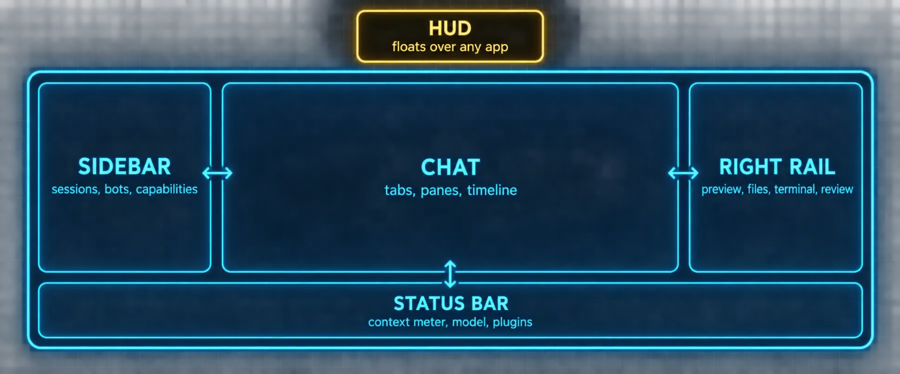

# Build 1: The Window



### What you are building

Fluency. The dozen moves that make the app faster than the terminal for daily work: tabs and panes, the embedded terminal, the file browser, git review and worktrees, the HUD over other apps, Quick Entry from anywhere, the command palette, and the shortcuts worth remapping.

### What the docs say

Checked against the Desktop page: Chat, Status bar, Windows tabs and panes, Terminal, Git review and worktrees, Memory Graph, Quick Entry, Voice, HUD mode, Keyboard and navigation.

| Surface | What it does | Open it |
|---|---|---|
| Tabs and windows | Several sessions at once; pop a session into its own window for another monitor | `Cmd+T` new session tab, `Ctrl+Tab` cycle, `Cmd+Shift+N` new window, `Cmd+W` close, `Cmd+Shift+T` reopen |
| Sidebars | Left is navigation, right holds preview, files, terminal, review | `Cmd+B` left, `Cmd+J` right, `Cmd+\` swap sides |
| Terminal | A real shell in the right sidebar; shells persist while hidden; select output and Add to chat | `` Ctrl+` `` show, `` Ctrl+Shift+` `` another, `Ctrl+Shift+W` close |
| File browser | Browse and preview the working directory as the agent edits it; set the start folder with `hermes desktop --cwd <path>` | right sidebar |
| Git review | Branch status, changed files, diffs scoped to Uncommitted, Branch or Last turn; stage, commit, push, Create PR with `gh`, or Ask Hermes to open PR | `Cmd+G` |
| Worktrees | A parallel copy of the repo on a new branch so an agent works without touching your checkout; shows as its own lane | `Cmd+Shift+B` |
| Preview rail | Web pages, files and tool outputs beside the chat; Hide keeps a live page or shell mounted, Close releases it | right rail |
| Comment mode | Click elements on a live page in the preview, type notes, then attach cropped screenshots plus selectors to the composer in one batch | Annotate in the preview bar |
| Status bar | Context meter with a token breakdown by category, per-session YOLO toggle, optional cache hit rate and tokens per second, right-click to choose items | bottom of the chat, `Cmd+Shift+S` hides it |
| Memory Graph | A zoomable map of learned skills and memories with a timeline | palette, Memory Graph; or `/journey` in chat |
| Quick Entry | A small composer summoned from anywhere on the system | `Cmd+Shift+Space` (Ctrl on Windows and Linux) after enabling it in Settings, Advanced |
| HUD | The chat detached into a chrome-free bar that floats over whatever you work in; where you park it tells Hermes which app and screen you mean | `Cmd+Shift+H`, `Cmd+Shift+G` snaps it to the cursor |
| Palette | Every page, setting, session, model, theme, terminal spawn, gateway restart and update from the keyboard | `Cmd+K` or `Cmd+P` |
| Shortcuts | Almost every binding is rebindable, conflicts flagged; `Cmd+1` to `9` switch profiles, `Cmd+Shift+F` searches sessions | `Cmd+/` |
| Conversation timeline rail | On long chats, a slim rail of markers along the transcript, one per prompt; hover to list the prompts, click to jump, then Show earlier pages back from there | long chats |

> 📝 **From the field: sessions as context, panes as a desk**
>
> Two moves Tonbi found in the app and now uses daily: drag a previous session into the current one to give it as context (start fresh, drop the old session in, ask "summarize this session"), and split a pane right or down to turn tabs into side-by-side sessions, which need not belong to the same project. He built his first desktop widget in one video, a memory monitor and then a baseball scoreboard, the scores widget from two prompts, the memory widget from one plus a follow-up to make it draggable, while watching the agent's own cursor move around the window to test it.

> ℹ️ **The three that change how you work**
>
> The HUD, because it turns "look at this" into a question about the window under the bar. Comment mode in the preview, because it turns a design review into a batch of tasks with selectors attached instead of a paragraph of description. And the Last turn diff scope in git review, because it shows exactly what the agent changed in its most recent turn, which is the review that actually matters.

> 📝 **From the field: sessions are a cost control**
>
> Tonbi's complete guide makes a point the docs state only in passing: one giant thread drags its whole history into every message, and splitting work into small sessions is what keeps that from compounding. His line: "you can end up paying three, four times what you actually need to." The status bar's context meter is where you watch it happen, and `hermes prompt-size` is where you see what every new session already carries before you type a word.

> 📝 **From the field: the HUD does not notice you switched apps**
>
> Tonbi's HUD video runs the bar over a terminal, Steam, Spotify, TradingView, Chrome and a video editor in one sitting, and the one rule he repeats is this: if you change apps mid-conversation and keep talking, the agent assumes you are still on the previous one. Say "what app am I on now" or "I have switched" and it looks again; nothing needs restarting. His other trick is worth stealing: the HUD is a separate agent from whatever runs in the window under it, so a local Hermes in the HUD can read and double-check a remote Hermes working in an SSH terminal beneath it, on a different model.

### Prompts

The first prompt is one you type into the HUD while it floats over another application; it proves the bar carries context.

*`prompt-d1-hud-context.md`*

```markdown
I have parked you over a window. Tell me which application and which screen
you think I am asking about, then describe what you can see in it in three
lines. If you cannot see it, say what permission is missing and where to
grant it.
```

*`prompt-d1-review-last-turn.md`*

```markdown
Make one small, safe change in this repository: add a line to the README
that names today's date and the model you are running on. Then stop. I am
going to open the review pane with Cmd+G, switch the scope to "Last turn",
and expect to see exactly that one file with exactly that one addition.
Tell me before you start whether anything you plan to do would touch a
second file.
```

### Verify

- [ ] You opened a second session tab, popped one into its own window, and closed it with Cmd+W
- [ ] The terminal pane kept its shell and scrollback after being hidden and restored
- [ ] Cmd+G showed the Last turn diff with exactly the change you asked for
- [ ] The HUD answered with the right application under it, or named the permission it needed

---

[← Back to the index](../README.md) · [Whole volume in one file](FULL-HERMES-DESKTOP.md)
