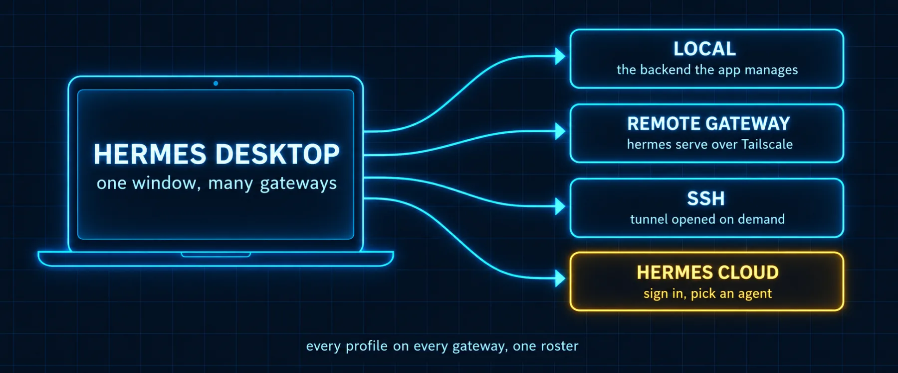

# Build 4: Gateways and Other Machines



### What you are building

The app on your laptop talking to a Hermes that never sleeps on another machine: a Mac mini in the closet, a VPS, a box behind Tailscale. Then the registry that holds every gateway you own, so one window can reach all of them and update all of them.

### What the docs say

Checked against the Desktop page (Connecting to a remote backend, The multi-connection registry, On the backend, In the app, Troubleshooting) and the Connecting Desktop to Many Hermes Instances guide.

| Fact | Detail |
|---|---|
| What a remote backend is | A `hermes serve` process running on the other machine. The app attaches to it; it does not start it for you. Messaging channels are a separate gateway process you also keep running |
| Where it is set | Settings, Gateways. Connection mode offers Remote gateway (a URL plus sign-in) and Hermes Cloud (sign in and pick an agent). The registry below it holds named connections: Local, Remote gateway, SSH, Hermes Cloud |
| Auth on the backend | Binding to a non-loopback address engages the auth gate. Username and password for a trusted LAN or VPN; OAuth through Nous Portal (`hermes dashboard register`) for anything reachable from the internet |
| The env vars | `HERMES_DASHBOARD_BASIC_AUTH_USERNAME`, `HERMES_DASHBOARD_BASIC_AUTH_PASSWORD` (or `_PASSWORD_HASH`), and `HERMES_DASHBOARD_BASIC_AUTH_SECRET` so sessions survive restarts, in `~/.hermes/.env` on the backend |
| Tailscale | Bind `hermes serve` to the machine's tailscale IP and use `http://<tailscale-ip>:9119` as the Remote URL so only your tailnet can reach it |
| Names | Every connection needs a unique device name; when the same profile exists on several gateways, handles disambiguate as `@profile-device` |
| SSH kind | An install reached over SSH; the app opens the tunnel and starts the backend for you; connect on demand, never spawned by a hover |
| Test | Probes the HTTP and WebSocket legs, so a pass means chat will work |
| Update all | Settings, Gateways, Update all instances dispatches `hermes update` to every eligible gateway and updates the app last |
| Sessions stay scoped | Sessions show one active gateway at a time; profiles, chats, messaging, cron, settings, files and memory all belong to the active gateway and profile pair |

> 📝 **From the field: SSH is the two-click path**
>
> Tonbi reached his always-on box through the VS Code Remote SSH extension until the SSH connection kind arrived. His account: update Hermes on both machines, have SSH keys already set up, pick the host in Settings, Gateways, save and reconnect, and "the desktop app handles everything. It handles the whole tunneling and everything else." Remote files, artifacts, images and the remote agent's learned skills all appear in the window. Two prerequisites, two clicks, and no auth gate to configure, which makes SSH the right first connection for a machine you own; the username-and-password path below is for a backend that must accept connections without an SSH login.

### Commands

*`on-the-remote-machine.sh`*

```bash
# On the machine that will serve (a Mac mini over Tailscale, say)
# An unquoted heredoc, so the secret is generated, not written literally.
cat >> ~/.hermes/.env <<ENV
HERMES_DASHBOARD_BASIC_AUTH_USERNAME=admin
HERMES_DASHBOARD_BASIC_AUTH_PASSWORD=$(openssl rand -base64 18)
HERMES_DASHBOARD_BASIC_AUTH_SECRET=$(openssl rand -base64 32)
ENV
grep -c 'openssl' ~/.hermes/.env    # must print 0: both values were expanded
tail -2 ~/.hermes/.env             # copy the password somewhere safe now
chmod 600 ~/.hermes/.env

# Bind to the tailscale address, not 0.0.0.0, so only your tailnet can reach it
hermes serve --host <tailscale-ip> --port 9119
# keep it running under launchd, tmux or your process manager

# Confirm the gate is on
curl -s http://<tailscale-ip>:9119/api/status | jq '.auth_required, .auth_providers'
```

*`on-the-laptop.sh`*

```bash
# In the app: Settings, Gateways, Remote gateway
#   Remote URL: http://<tailscale-ip>:9119
#   Sign in with the username and password from the backend's .env
#   Save and reconnect
# Or set the URL before launch:
HERMES_DESKTOP_REMOTE_URL=http://<tailscale-ip>:9119 open -a Hermes
```

> ⚠️ **Password auth is for your own network**
>
> The backend reads and writes the remote machine's `.env` and runs agent commands. The docs are explicit: never expose a password-protected backend directly to the open internet. Put it behind Tailscale or a VPN, or use the OAuth provider for anything public. The stable secret matters too; without it the signing key is regenerated per boot and you are logged out on every restart.

> ⚠️ **If you are following an older video**
>
> Tonbi's June 2026 guide runs the remote backend with `hermes dashboard --no-open --host 0.0.0.0 --port 9119`. The current docs run it with `hermes serve`, and his own September masterclass says so. The auth environment variables and the Tailscale advice are unchanged; the command is not.

### Prompts

*`prompt-d4-prepare-the-mini.md`*

```markdown
You are running on the machine that will become my always-on Hermes
backend. Read
https://hermes-agent.nousresearch.com/docs/user-guide/desktop section
"Connecting to a remote backend" and the Tailscale note, then:

1. Tell me this machine's tailscale IP (tailscale ip -4) and whether
   hermes serve is already running (and on which host and port).
2. Show me the three HERMES_DASHBOARD_BASIC_AUTH_* lines you would append to
   ~/.hermes/.env, with the password replaced by <redacted> in your
   message. Generate the secret with openssl.
3. Show me the hermes serve command bound to the tailscale IP and a
   launchd plist that keeps it running after logout, as a file for me to
   review. Do not install it yet.
4. After I say go: write the env lines, load the plist, and prove the gate
   is on with curl against /api/status.
```

*`prompt-d4-registry-check.md`*

```markdown
Read https://hermes-agent.nousresearch.com/docs/user-guide/multi-connection-desktop
sections "The gateway registry" and "Agents across gateways". I have
registered a second gateway named <device>. Tell me which of my profile
names now collide across machines and what their @name-device handles will
be, and which gateway is Primary. Then explain in three lines what stays
scoped to the active gateway when I switch, so I know what I will and will
not see.
```

### Verify

- [ ] curl against /api/status on the backend reports auth_required true and lists the provider
- [ ] The app's Test button reports Reachable for the new connection
- [ ] Sessions started on the remote gateway show up in hermes sessions list on that machine, not on the laptop
- [ ] Update all instances lists both gateways and the app itself

---

[← Back to the index](../README.md) · [Whole volume in one file](FULL-HERMES-DESKTOP.md)
