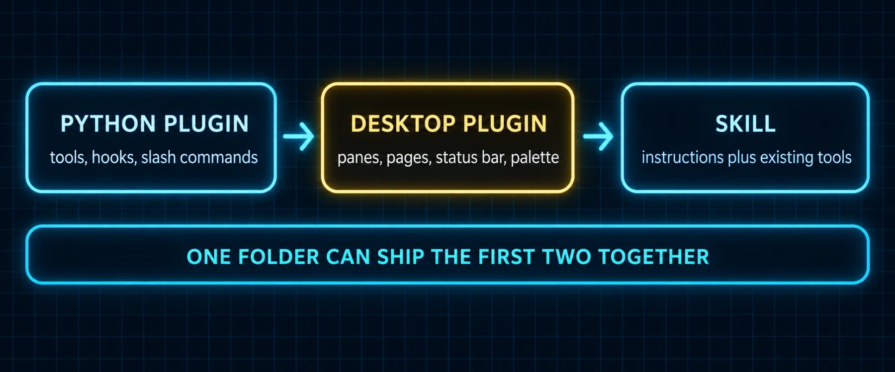

# Build 5: Plugin Workshop I, Hello Hermes



### What you are building

Your first desktop plugin: a pane in the right dock, a chip in the status bar, a palette command and a keybind, in one file of about eighty lines, loaded live into the running app without a build step. It does nothing useful yet. It proves the loop: write a file, watch the app pick it up, see it in Capabilities, and learn the six rules every plugin after this one obeys.

### What the docs say

Checked against the Desktop Plugin SDK page and the Extending section of the Desktop page.

| Fact | Detail |
|---|---|
| One file | `~/.hermes/desktop-plugins/<id>/plugin.js`, plain ESM, loaded uncompiled. The folder name must equal the plugin's `id` |
| Three imports only | `@hermes/plugin-sdk`, `react`, `react/jsx-runtime`. Anything else fails to resolve on purpose |
| No JSX syntax | The file is not compiled, so write `jsx()` and `jsxs()` calls from `react/jsx-runtime` |
| The contract | Default-export `{ id, name, defaultEnabled, register(ctx) }`. `register` receives a scoped context and calls `ctx.register` or `ctx.registerMany` with contributions `{ id, area, title, order, when, render, data }` |
| Where things can go | Panes (`placement` main, left, right, top, bottom, optional `dock`), full pages (`ROUTES_AREA`), sidebar nav, status bar left or right, title bar, palette commands, keybinds, themes, composer slots, transcript directives |
| Styling | Theme variables only, in the `text-(--ui-text-tertiary)` form. Never a literal color. Leave the background alone |
| Hot reload | The app watches the folder, loads a new file within seconds, and reloads on every save. `Cmd+K`, Reload desktop plugins, forces it. Errors show as a toast and in `hermes logs gui -f` |
| App level | A desktop plugin is the same on every profile, gateway and remote machine the window connects to |
| Authority | A loaded plugin runs in the renderer with the app's full authority; the loader isolates errors, not intent. Load only files you or your agent wrote |

> 📝 **From the field: form follows the job**
>
> Tonbi's plugin guide counts twenty-five places a contribution can land and sorts them into four forms: compact (a status-bar item, "one factor, one action that should always be nearby"), anchored (a popover for detail and quick control without leaving the chat), expansive (a route with a sidebar entry, for real applications and dense data) and declarative (structured data the host decides how to show). His rule: decide the form from what the plugin is for before writing a line. His limits are worth pinning too: a plugin's storage is small JSON state, not a database; a plugin only runs while the app is open; it can only occupy areas the app itself consumes; and "a renderer-only plugin is strong for UI. A plugin plus a Python backend can become a real product." Builds 5, 6 and 7 walk that ladder in order.

### The file

*`~/.hermes/desktop-plugins/hello-hermes/plugin.js`*

```javascript
// Hello Hermes - a Hermes Desktop plugin. Folder name must equal the id.
// Loaded uncompiled: no JSX syntax, and only these specifiers resolve.
import { host, haptic, useValue, STATUSBAR_AREAS, PALETTE_AREA, KEYBINDS_AREA } from '@hermes/plugin-sdk'
import { jsx, jsxs } from 'react/jsx-runtime'

function HelloHermesPane() {
  const gateway = useValue(host.state.gateway)
  const profile = useValue(host.state.profile)

  return jsxs('div', {
    className: 'flex h-full flex-col gap-2 p-3 text-sm',
    children: [
      jsx('div', { className: 'font-medium', children: "Hello Hermes" }),
      jsx('div', {
        className: 'text-(--ui-text-tertiary)',
        children: 'gateway: ' + String(gateway)
      }),
      jsx('div', {
        className: 'text-(--ui-text-tertiary)',
        children: 'profile: ' + String(profile)
      })
    ]
  })
}

function HelloHermesChip() {
  return jsx('button', {
    type: 'button',
    className: 'px-1.5 text-[0.6875rem] text-(--ui-text-tertiary)',
    onClick: () => {
      haptic('tap')
      host.notify({ kind: 'info', message: "Hello Hermes is loaded." })
    },
    children: "hello-hermes"
  })
}

export default {
  id: "hello-hermes",
  name: "Hello Hermes",
  defaultEnabled: false,
  register(ctx) {
    ctx.register({
      id: 'pane',
      area: 'panes',
      title: "Hello Hermes",
      data: { placement: "right", width: "280px" },
      render: () => jsx(HelloHermesPane, {})
    })

    ctx.register({
      id: 'chip',
      area: STATUSBAR_AREAS.right,
      order: 130,
      render: () => jsx(HelloHermesChip, {})
    })

    ctx.register({
      id: 'open',
      area: PALETTE_AREA,
      data: {
        id: "hello-hermes.open",
        label: "Open Hello Hermes",
        keywords: ["hello-hermes", 'hermes', 'pane'],
        run: () => host.notify({ kind: 'info', message: "Hello Hermes pane is in the right dock." })
      }
    })

    ctx.register({
      id: 'keybind',
      area: KEYBINDS_AREA,
      data: {
        id: "hello-hermes.focus",
        label: "Focus Hello Hermes",
        category: "Hello Hermes",
        defaults: ['mod+alt+h'],
        run: () => host.notify({ kind: 'info', message: "Hello Hermes focused." })
      }
    })
  }
}
```

> ℹ️ **Why defaultEnabled is false**
>
> A plugin with `defaultEnabled: false` inventories in Capabilities, Plugins and stays dark until you flip it on. That is the right default for anything you are still writing: the app loads the file, you enable it when you want to see it, and a broken save never surprises you mid-conversation. Ship it that way too; the person installing it decides.

### Commands

*`hello.sh`*

```bash
mkdir -p ~/.hermes/desktop-plugins/hello-hermes
# paste the file above as ~/.hermes/desktop-plugins/hello-hermes/plugin.js
# then in the app: Cmd+K, "Reload desktop plugins", then Capabilities, Plugins, switch Hello Hermes on
hermes logs gui -f            # the load line, or the error toast's cause
```

### Prompts

*`prompt-d5-explain-my-plugin.md`*

```markdown
Read https://hermes-agent.nousresearch.com/docs/developer-guide/desktop-plugin-sdk
sections "Mental model", "The plugin contract" and "Pitfalls". Then read the
file ~/.hermes/desktop-plugins/hello-hermes/plugin.js and explain it to me
contribution by contribution: what each register call adds, which area it
lands in, and which host door it uses. Finish with the three rules from the
Pitfalls section that this file already obeys and the one thing I would
break first if I edited it carelessly.
```

*`prompt-d5-change-one-thing.md`*

```markdown
Change the Hello Hermes plugin so the pane also shows the active model
(host.state.model) and the chip shows the gateway state instead of the
word hello-hermes. Keep every rule of the format: only the three imports,
jsx() calls, theme variables, folder name equal to id. Show me the diff
before you write it. After I say go, save it and tell me what I should see
after the hot reload, then tail hermes logs gui for ten seconds and report
any error.
```

### Verify

- [ ] Capabilities, Plugins lists Hello Hermes with a Desktop switch; flipping it on adds the pane to the right dock
- [ ] The status bar shows the hello-hermes chip and clicking it toasts
- [ ] Cmd+K finds "Open Hello Hermes"; Cmd+Option+H fires the keybind (Cmd+Shift+H is taken: it toggles the HUD)
- [ ] hermes logs gui -f shows the load with no error line

---

[← Back to the index](../README.md) · [Whole volume in one file](FULL-HERMES-DESKTOP.md)
