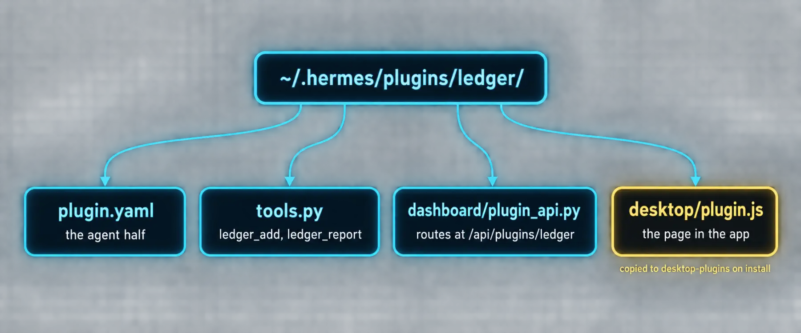

# Build 7: Plugin Workshop III, the Ledger (agent and desktop in one package)



### What you are building

The first plugin with two halves in one folder. The agent gets two tools, `ledger_add` and `ledger_report`, and a `/ledger` slash command, so telling Hermes "I paid 42.50 for groceries" records it and "how much did I spend this month" answers from real numbers. The desktop gets a Ledger page that reads the same database through the plugin's own backend routes, with a form and bars by category. Money lands in a SQLite file under the plugin data directory, never in the plugin folder, so updates cannot erase it.

### What the docs say

Checked against Build a Hermes Plugin, the Desktop Plugin SDK's "One package, both SDKs" and "The Python side", and Extending the Dashboard.

| Fact | Detail |
|---|---|
| Layout | `~/.hermes/plugins/<id>/` with `plugin.yaml`, `__init__.py` (`register(ctx)`), `schemas.py`, `tools.py`, `dashboard/manifest.json` plus `dashboard/plugin_api.py`, and `desktop/plugin.js`. One installable folder |
| Manifest v2 | `manifest_version: 2`, `api_version: 1`, `name`, `version`, `description`, `license`, `tags`, `provides_tools`; optional `requires_env`, `python_dependencies` or a `pyproject.toml`, `config_schema` |
| Handlers | `def handler(args: dict, **kwargs) -> str`: always a JSON string, never raise. The schema description is what makes the model call the tool |
| Slash commands | `ctx.register_command("ledger", handler, description=...)` gives `/ledger` on every surface |
| Durable state | `from plugins.plugin_storage import plugin_db` returns a SQLite connection at `<home>/plugin-data/<id>/data.db`, WAL mode. Never write into the plugin directory |
| The backend | `dashboard/manifest.json` is `{"name": "<id>", "api": "plugin_api.py"}`; `plugin_api.py` exports a FastAPI `router`; routes mount under `/api/plugins/<id>/` inside the gateway, at startup, only when the plugin is in `plugins.enabled` |
| The desktop half | `desktop/plugin.js` is an ordinary disk plugin; the app copies it to `~/.hermes/desktop-plugins/<id>/` when the package is installed and reaches the backend with `ctx.rest('/summary')` |
| Two switches | The Python half is gated by `plugins.enabled` in config.yaml; the desktop half by its own switch in Capabilities, Plugins. Both default to off |
| Doctor | `hermes plugins doctor ~/.hermes/plugins/ledger --ci` runs real discovery, manifest parsing, import and registration |

### The files

*`~/.hermes/plugins/ledger/plugin.yaml`*

```yaml
name: ledger
version: 1.0.0
description: "A personal money ledger: the agent records entries by tool, the desktop shows the month."
manifest_version: 2
api_version: 1
license: MIT
tags: [finance, personal, desktop]
provides_tools:
  - ledger_add
  - ledger_report
```

*`~/.hermes/plugins/ledger/schemas.py`*

```python
"""JSON schemas for the ledger tools. The description is how the model decides to call them."""

from __future__ import annotations

LEDGER_ADD = {
    "name": "ledger_add",
    "description": (
        "Record one money entry in the personal ledger: an expense or an income, "
        "with an amount, a category, an optional note and an optional date. "
        "Use it whenever the user mentions spending, paying, earning, or receiving money."
    ),
    "parameters": {
        "type": "object",
        "properties": {
            "amount": {"type": "number", "description": "Positive amount in the ledger currency, e.g. 42.50"},
            "kind": {"type": "string", "enum": ["expense", "income"], "description": "expense or income"},
            "category": {
                "type": "string",
                "description": "Short category such as groceries, rent, software, transport, salary, client",
            },
            "note": {"type": "string", "description": "What it was, in a few words"},
            "date": {"type": "string", "description": "ISO date YYYY-MM-DD; today when omitted"},
        },
        "required": ["amount", "kind", "category"],
    },
}

LEDGER_REPORT = {
    "name": "ledger_report",
    "description": (
        "Summarize the personal ledger for a month: totals for income and expenses, "
        "the net, and expenses grouped by category. Use it when the user asks how much "
        "they spent or earned, where the money went, or for a monthly budget check."
    ),
    "parameters": {
        "type": "object",
        "properties": {
            "month": {"type": "string", "description": "Month as YYYY-MM; the current month when omitted"},
            "limit": {"type": "integer", "description": "How many recent entries to include, default 10"},
        },
        "required": [],
    },
}
```

*`~/.hermes/plugins/ledger/ledger_core.py`*

```python
"""Ledger core: the SQLite store and the two operations. No Hermes imports at module level,
so both the agent tools and the dashboard API can load this file.

Durable state lives under <hermes home>/plugin-data/ledger/ through plugins.plugin_storage,
never inside the plugin folder (updates and removals wipe the folder).
"""

from __future__ import annotations

import datetime as dt

_SCHEMA = """
CREATE TABLE IF NOT EXISTS entries (
  id INTEGER PRIMARY KEY AUTOINCREMENT,
  date TEXT NOT NULL,
  kind TEXT NOT NULL CHECK (kind IN ('expense', 'income')),
  category TEXT NOT NULL,
  amount REAL NOT NULL CHECK (amount > 0),
  note TEXT NOT NULL DEFAULT '',
  created_at TEXT NOT NULL
);
CREATE INDEX IF NOT EXISTS entries_date ON entries(date);
"""


def db():
    """Open the plugin's SQLite database (WAL mode, created on first use)."""
    from plugins.plugin_storage import plugin_db

    conn = plugin_db("ledger")
    conn.executescript(_SCHEMA)
    return conn


def _month(value: str | None) -> str:
    if value and len(value) == 7 and value[4] == "-":
        return value
    return dt.date.today().strftime("%Y-%m")


def add_entry(amount: float, kind: str, category: str, note: str = "", date: str | None = None) -> dict:
    day = date or dt.date.today().isoformat()
    dt.date.fromisoformat(day)  # raises on a bad date
    conn = db()
    with conn:
        cur = conn.execute(
            "INSERT INTO entries(date, kind, category, amount, note, created_at) VALUES (?,?,?,?,?,?)",
            (day, kind, category.strip().lower(), float(amount), note.strip(), dt.datetime.now().isoformat(timespec="seconds")),
        )
    return {"id": cur.lastrowid, "date": day, "kind": kind, "category": category.strip().lower(), "amount": float(amount), "note": note.strip()}


def month_report(month: str | None = None, limit: int = 10) -> dict:
    month = _month(month)
    conn = db()
    like = month + "-%"
    income = conn.execute("SELECT COALESCE(SUM(amount),0) FROM entries WHERE kind='income' AND date LIKE ?", (like,)).fetchone()[0]
    expense = conn.execute("SELECT COALESCE(SUM(amount),0) FROM entries WHERE kind='expense' AND date LIKE ?", (like,)).fetchone()[0]
    by_cat = conn.execute(
        "SELECT category, ROUND(SUM(amount),2) AS total, COUNT(*) AS n FROM entries "
        "WHERE kind='expense' AND date LIKE ? GROUP BY category ORDER BY total DESC",
        (like,),
    ).fetchall()
    recent = conn.execute(
        "SELECT id, date, kind, category, amount, note FROM entries WHERE date LIKE ? ORDER BY date DESC, id DESC LIMIT ?",
        (like, int(limit)),
    ).fetchall()
    return {
        "month": month,
        "income": round(income, 2),
        "expenses": round(expense, 2),
        "net": round(income - expense, 2),
        "by_category": [{"category": c, "total": t, "count": n} for c, t, n in by_cat],
        "recent": [
            {"id": i, "date": d, "kind": k, "category": c, "amount": a, "note": nt} for i, d, k, c, a, nt in recent
        ],
    }
```

*`~/.hermes/plugins/ledger/tools.py`*

```python
"""Handlers for the ledger tools.

Rules Hermes holds every handler to: take the parsed args dict, return a JSON
string, never raise.
"""

from __future__ import annotations

import json
from typing import Any

from . import ledger_core as core


def ledger_add(args: dict, **kwargs: Any) -> str:
    try:
        amount = float(args.get("amount", 0))
        kind = str(args.get("kind", "expense")).lower()
        category = str(args.get("category", "")).strip()
        if amount <= 0 or kind not in ("expense", "income") or not category:
            return json.dumps({"error": "need a positive amount, a kind of expense or income, and a category"})
        entry = core.add_entry(amount, kind, category, str(args.get("note", "")), args.get("date") or None)
        return json.dumps({"ok": True, "entry": entry})
    except Exception as exc:  # a handler never raises
        return json.dumps({"error": str(exc)})


def ledger_report(args: dict, **kwargs: Any) -> str:
    try:
        return json.dumps(core.month_report(args.get("month"), int(args.get("limit", 10) or 10)))
    except Exception as exc:
        return json.dumps({"error": str(exc)})
```

*`~/.hermes/plugins/ledger/__init__.py`*

```python
"""ledger plugin for Hermes Agent: two tools and one slash command.

register() runs once at load. A crash here disables only this plugin.
"""

from __future__ import annotations

import json
import logging

from . import ledger_core as core, schemas, tools

logger = logging.getLogger(__name__)

TOOLSET = "ledger"


def _slash_ledger(raw_args: str) -> str:
    """/ledger [YYYY-MM]: print the month summary without spending a model turn."""
    try:
        report = core.month_report(raw_args.strip() or None, limit=5)
    except Exception as exc:
        return f"ledger: {exc}"
    lines = [
        f"Ledger {report['month']}: income {report['income']:.2f}, expenses {report['expenses']:.2f}, net {report['net']:.2f}",
    ]
    for row in report["by_category"][:8]:
        lines.append(f"  {row['category']:<16} {row['total']:>10.2f}  ({row['count']})")
    return "\n".join(lines)


def register(ctx) -> None:
    ctx.register_tool(name="ledger_add", toolset=TOOLSET, schema=schemas.LEDGER_ADD, handler=tools.ledger_add)
    ctx.register_tool(name="ledger_report", toolset=TOOLSET, schema=schemas.LEDGER_REPORT, handler=tools.ledger_report)
    ctx.register_command("ledger", _slash_ledger, description="Month summary of the personal ledger, e.g. /ledger 2026-09")
    logger.debug("ledger registered: %s", json.dumps(["ledger_add", "ledger_report", "/ledger"]))
```

*`~/.hermes/plugins/ledger/dashboard/manifest.json`*

```json
{
  "name": "ledger",
  "api": "plugin_api.py"
}
```

*`~/.hermes/plugins/ledger/dashboard/plugin_api.py`*

```python
"""Backend routes for the ledger desktop page. Mounted at /api/plugins/ledger/ inside the gateway.

The dashboard loads this file by path, not as part of the plugin package, so the core
module is loaded by path too (the same pattern the bundled examples use).
"""

from __future__ import annotations

import importlib.util
from pathlib import Path

from fastapi import APIRouter, HTTPException

_HERE = Path(__file__).resolve().parent
_spec = importlib.util.spec_from_file_location("hermes_ledger_core", _HERE.parent / "ledger_core.py")
core = importlib.util.module_from_spec(_spec)
_spec.loader.exec_module(core)

router = APIRouter()


@router.get("/summary")
async def summary(month: str | None = None) -> dict:
    return core.month_report(month, limit=20)


@router.post("/entries")
async def create(body: dict) -> dict:
    try:
        amount = float(body.get("amount", 0))
        kind = str(body.get("kind", "expense")).lower()
        category = str(body.get("category", "")).strip()
        if amount <= 0 or kind not in ("expense", "income") or not category:
            raise ValueError("need a positive amount, a kind, and a category")
        return {"ok": True, "entry": core.add_entry(amount, kind, category, str(body.get("note", "")), body.get("date") or None)}
    except ValueError as exc:
        raise HTTPException(status_code=400, detail=str(exc))


@router.delete("/entries/{entry_id}")
async def remove(entry_id: int) -> dict:
    conn = core.db()
    with conn:
        cur = conn.execute("DELETE FROM entries WHERE id = ?", (int(entry_id),))
    if cur.rowcount == 0:
        raise HTTPException(status_code=404, detail="no such entry")
    return {"ok": True, "deleted": int(entry_id)}
```

*`~/.hermes/plugins/ledger/desktop/plugin.js`*

```javascript
// Desktop half of the ledger plugin: a page that reads /api/plugins/ledger/ through ctx.rest.
// Loaded uncompiled: no JSX syntax, only the three allowed imports, theme variables only.
import {
  host, useQuery, useQueryClient, Button, Input, ScrollArea, EmptyState,
  ROUTES_AREA, SIDEBAR_NAV_AREA, PALETTE_AREA
} from '@hermes/plugin-sdk'
import { useState } from 'react'
import { jsx, jsxs } from 'react/jsx-runtime'

const ID = 'ledger'
const ROUTE = '/ledger'

function thisMonth() {
  const d = new Date()
  return d.getFullYear() + '-' + String(d.getMonth() + 1).padStart(2, '0')
}

function money(n) {
  return (Math.round(Number(n) * 100) / 100).toFixed(2)
}

function Bar({ label, value, max, count }) {
  const pct = max > 0 ? Math.max(2, Math.round((value / max) * 100)) : 0
  return jsxs('div', { className: 'flex flex-col gap-0.5', children: [
    jsxs('div', { className: 'flex justify-between text-[0.75rem]', children: [
      jsx('span', { children: label + (count ? '  (' + count + ')' : '') }),
      jsx('span', { className: 'text-(--ui-text-tertiary)', children: money(value) })
    ]}),
    jsx('div', { className: 'h-1.5 w-full rounded bg-(--ui-stroke-secondary)', children:
      jsx('div', { className: 'h-1.5 rounded bg-(--ui-accent)', style: { width: pct + '%' } })
    })
  ]})
}

function LedgerPage({ ctx }) {
  const qc = useQueryClient()
  const [month, setMonth] = useState(thisMonth())
  const [amount, setAmount] = useState('')
  const [kind, setKind] = useState('expense')
  const [category, setCategory] = useState('')
  const [note, setNote] = useState('')
  const { data, isLoading, error } = useQuery({
    queryKey: [ID, 'summary', month],
    queryFn: () => ctx.rest('/summary?month=' + encodeURIComponent(month)),
    refetchInterval: 20000
  })
  const invalidate = () => qc.invalidateQueries({ queryKey: [ID, 'summary'] })

  const add = async () => {
    try {
      await ctx.rest('/entries', { method: 'POST', body: { amount: Number(amount), kind, category, note } })
      setAmount(''); setCategory(''); setNote('')
      invalidate()
      host.notify({ kind: 'info', message: 'Entry saved.' })
    } catch (e) {
      host.notifyError(e, 'Could not save the entry. Is the ledger plugin enabled in plugins.enabled?')
    }
  }
  const remove = async (id) => {
    try { await ctx.rest('/entries/' + id, { method: 'DELETE' }); invalidate() } catch (e) { host.notifyError(e, 'Could not delete.') }
  }

  const cats = (data && data.by_category) || []
  const max = cats.reduce((m, c) => Math.max(m, c.total), 0)

  return jsxs('div', { className: 'flex h-full flex-col gap-3 p-4 text-sm', children: [
    jsxs('div', { className: 'flex items-center justify-between', children: [
      jsx('div', { className: 'text-base font-medium', children: 'Ledger' }),
      jsx(Input, { value: month, className: 'w-28', onChange: (e) => setMonth(e.target.value), placeholder: 'YYYY-MM' })
    ]}),
    error ? jsx('div', { className: 'text-(--ui-text-tertiary)', children: 'Backend not reachable: ' + String(error.message || error) + '. Enable the ledger plugin and restart the gateway.' }) : null,
    data ? jsxs('div', { className: 'grid grid-cols-3 gap-2', children: [
      jsxs('div', { className: 'rounded border border-(--ui-stroke-secondary) p-2', children: [ jsx('div', { className: 'text-[0.6875rem] text-(--ui-text-tertiary)', children: 'Income' }), jsx('div', { className: 'font-medium', children: money(data.income) }) ]}),
      jsxs('div', { className: 'rounded border border-(--ui-stroke-secondary) p-2', children: [ jsx('div', { className: 'text-[0.6875rem] text-(--ui-text-tertiary)', children: 'Expenses' }), jsx('div', { className: 'font-medium', children: money(data.expenses) }) ]}),
      jsxs('div', { className: 'rounded border border-(--ui-stroke-secondary) p-2', children: [ jsx('div', { className: 'text-[0.6875rem] text-(--ui-text-tertiary)', children: 'Net' }), jsx('div', { className: 'font-medium', children: money(data.net) }) ]})
    ]}) : (isLoading ? jsx('div', { className: 'text-(--ui-text-tertiary)', children: 'Loading' }) : null),
    jsxs('div', { className: 'grid gap-2 rounded border border-(--ui-stroke-secondary) p-2', children: [
      jsxs('div', { className: 'grid grid-cols-4 gap-2', children: [
        jsx(Input, { value: amount, placeholder: 'Amount', onChange: (e) => setAmount(e.target.value) }),
        jsx('select', { value: kind, className: 'rounded border border-(--ui-stroke-secondary) bg-transparent px-2', onChange: (e) => setKind(e.target.value), children: [
          jsx('option', { value: 'expense', children: 'expense' }),
          jsx('option', { value: 'income', children: 'income' })
        ]}),
        jsx(Input, { value: category, placeholder: 'Category', onChange: (e) => setCategory(e.target.value) }),
        jsx(Input, { value: note, placeholder: 'Note', onChange: (e) => setNote(e.target.value) })
      ]}),
      jsx('div', { children: jsx(Button, { size: 'sm', onClick: add, children: 'Add entry' }) })
    ]}),
    jsx(ScrollArea, { className: 'min-h-0 flex-1', children: jsxs('div', { className: 'flex flex-col gap-3 pr-2', children: [
      cats.length ? jsx('div', { className: 'flex flex-col gap-2', children: cats.map(c => jsx(Bar, { key: c.category, label: c.category, value: c.total, max, count: c.count })) })
                  : (data ? jsx(EmptyState, { title: 'No expenses this month', description: 'Add one above, or tell Hermes what you spent.' }) : null),
      data && data.recent && data.recent.length ? jsx('div', { className: 'flex flex-col gap-1', children: data.recent.map(r => jsxs('div', { key: r.id, className: 'flex items-center justify-between gap-2 text-[0.75rem]', children: [
        jsx('span', { className: 'text-(--ui-text-tertiary)', children: r.date }),
        jsx('span', { className: 'flex-1', children: r.category + (r.note ? ', ' + r.note : '') }),
        jsx('span', { className: r.kind === 'income' ? '' : 'text-(--ui-text-secondary)', children: (r.kind === 'income' ? '+' : '-') + money(r.amount) }),
        jsx(Button, { size: 'sm', variant: 'ghost', onClick: () => remove(r.id), children: 'x' })
      ]})) }) : null
    ]}) })
  ]})
}

export default {
  id: 'ledger',
  name: 'Ledger',
  defaultEnabled: false,
  register(ctx) {
    ctx.registerMany([
      { id: 'page', area: ROUTES_AREA, data: { path: ROUTE }, render: () => jsx(LedgerPage, { ctx }) },
      { id: 'nav', area: SIDEBAR_NAV_AREA, data: { path: ROUTE, label: 'Ledger', codicon: 'graph' } },
      { id: 'open', area: PALETTE_AREA, data: { id: 'ledger.open', label: 'Open Ledger', keywords: ['ledger', 'money', 'budget'], run: () => host.navigate(ROUTE) } }
    ])
  }
}
```

### Commands

*`ledger-install.sh`*

```bash
# 1. Put the folder in place (or clone it from the masterclass repo's kits/)
cp -R kits/agent-plugins/ledger ~/.hermes/plugins/ledger     # from a clone of the masterclass repo
/bin/ls ~/.hermes/plugins/ledger ~/.hermes/plugins/ledger/dashboard ~/.hermes/plugins/ledger/desktop

# 2. Prove the agent half before enabling it
hermes plugins doctor ~/.hermes/plugins/ledger --ci

# 3. Enable the Python half (this is the security gate for the backend routes too)
hermes plugins enable ledger
hermes plugins list | grep ledger

# 4. Restart the gateway so the routes mount, then make the app copy the desktop half and switch it on
hermes gateway restart
# In the app: Capabilities, Plugins, Rescan. That copies desktop/plugin.js to ~/.hermes/desktop-plugins/ledger/
# beside a .hermes-package.json marker (hermes plugins update does the same). Then: Ledger, Desktop switch on.
/bin/ls ~/.hermes/desktop-plugins/ledger/     # plugin.js and .hermes-package.json must both be there

# 5. Talk to it
hermes chat -q "I paid 42.50 for groceries today, record it in the ledger"
hermes chat -q "How much did I spend this month and on what?"
```

> ⚠️ **If the page says the backend is not reachable**
>
> Four causes, in order: the desktop half was never copied because nothing triggered a Rescan (check for `~/.hermes/desktop-plugins/ledger/.hermes-package.json`), the plugin is not in `plugins.enabled` (the desktop switch alone never imports Python, by design), the gateway was not restarted after enabling (routes mount at startup), or the route failed to import. The last one leaves a line in `~/.hermes/logs/errors.log` reading `Failed to load plugin ledger API routes`.

### Prompts

*`prompt-d7-install-and-prove.md`*

```markdown
Install the ledger plugin from the masterclass kit. Do these in order and
show me the output of each step:
1. Read https://hermes-agent.nousresearch.com/docs/developer-guide/plugins
   section "Store durable state" and tell me where the ledger's database
   will live on this machine.
2. Copy the kit folder to ~/.hermes/plugins/ledger and run
   hermes plugins doctor ~/.hermes/plugins/ledger --ci.
3. Show me the diff hermes plugins enable ledger would make to my
   config.yaml, then run it after I say go, then restart the gateway.
4. Record one expense and one income with the ledger tools, run
   ledger_report for this month, and show me the JSON.
5. Tell me exactly where to click in the app to switch the desktop half on.
```

*`prompt-d7-categorize-with-the-model.md`*

```markdown
Extend the ledger plugin's Python half with one auxiliary task: when
ledger_add is called without a category, classify the note into one of my
categories with ctx.llm. Read
https://hermes-agent.nousresearch.com/docs/developer-guide/plugin-llm-access
first and register the task with ctx.register_auxiliary_task("ledger_classifier")
so I can pin it to a cheap model under auxiliary.ledger_classifier in
config.yaml. Keep the handler contract: JSON string back, never raise, the
classification failing must fall back to the category "uncategorized".
Show me the diff, then run the doctor.
```

### Verify

- [ ] hermes plugins doctor ~/.hermes/plugins/ledger --ci prints OK and registrations: 2 tool(s)
- [ ] After enable and restart, hermes plugins list shows ledger enabled and the banner lists ledger_add, ledger_report
- [ ] /ledger in any chat prints the month summary without a model call
- [ ] The Ledger page shows the entry the agent recorded, and an entry added on the page shows up in ledger_report
- [ ] ~/.hermes/plugin-data/ledger/data.db exists and the plugin folder holds no database

---

[← Back to the index](../README.md) · [Whole volume in one file](FULL-HERMES-DESKTOP.md)
