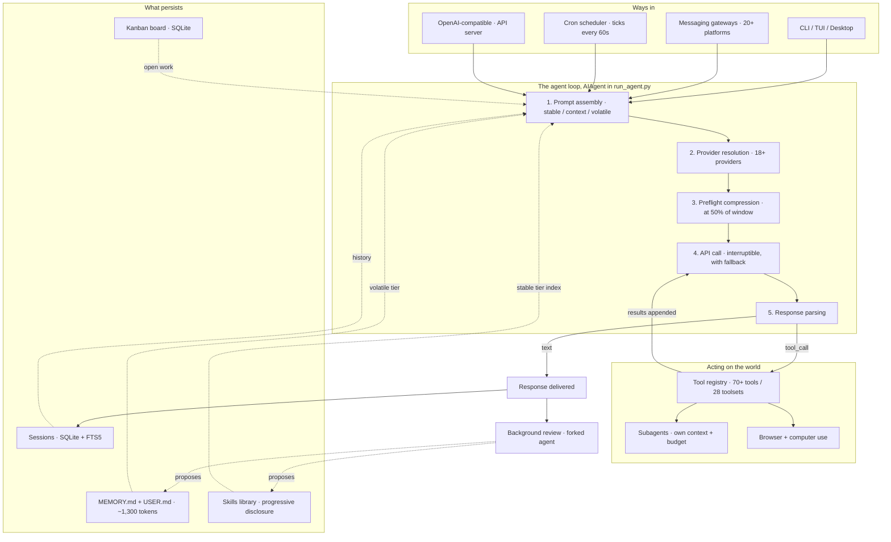

# The System in One Picture

Twelve articles describe nine subsystems. They fit together like this.

**The whole Hermes system, one graph**

Read it as three rings. The **middle ring is the loop**, and it is the only part that is always running. The **top ring is every way a turn can start**, and the loop cannot tell them apart. The **bottom ring is what survives the turn**, which is the entire reason the system compounds instead of merely responding.

The dotted lines matter as much as the solid ones. Memory, skills, sessions and the board feed *into* prompt assembly, and the background review feeds back into memory and skills. That cycle is the learning system, and it is the difference between an agent and a chatbot with a plugin folder.

---

[← Back to the index](../README.md) · [Whole masterclass in one file](FULL-MASTERCLASS.md)
