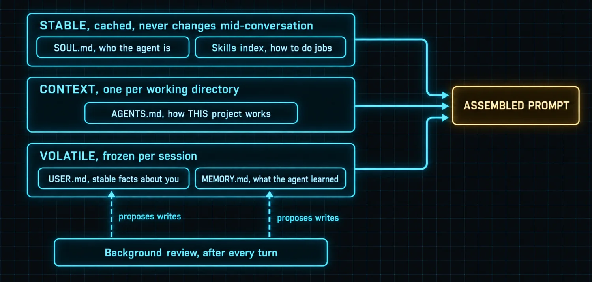

# Appendix F: Personality and Profile, SOUL.md and USER.md

Parts 1 and 3 explain where these files sit in the prompt. Neither shows what to put in them, which is the gap most people fall into: they write a long adjective-laden character sketch, watch the agent ignore it, and conclude that identity files do not work.

They do work. They are just not the place for adjectives.

### Three files, three different jobs



| File | Answers | Written by | Budget |
|---|---|---|---|
| SOUL.md | Who are you, how do you behave, what do you never do | You, deliberately | No hard cap, but it is in EVERY prompt |
| USER.md | Who am I, what do I prefer, what should you never ask twice | You, plus the background review | Shares the ~1,300 token memory budget |
| MEMORY.md | What has the agent learned about my environment and projects | The agent, via the background review | 2,200 characters, hard |
| AGENTS.md or .hermes.md | How does THIS project work | You, per project | Per working directory, one file wins |

> ⚠️ **The single most common mistake**
>
> Putting project facts in SOUL.md. Identity is stable and global; project facts belong in that project's context file, where they load only when you are working there. A SOUL.md that names your current client is a SOUL.md that will be wrong in three months and will still be costing tokens in every unrelated conversation.

### What actually belongs in SOUL.md

Write behavior, not personality. The test for every line: **could an observer tell whether the agent followed it?** "Be insightful" fails that test. "When I ask for a recommendation, give one option and the reason, not a list of five" passes it.

A SOUL.md that works has roughly these parts, and stays short enough to read in one screen.

*`~/.hermes/SOUL.md`*

```markdown
# Identity

You are my working agent. You run tasks end to end and report what actually
happened, not what was attempted.

# How you behave

- Lead with the answer, then the reasoning. Never the reverse.
- When you recommend something, recommend ONE option and say why. If the
  choice is genuinely close, say that in a sentence and still pick one.
- Report failures as plainly as successes. A task that half worked is a task
  that failed; say which half.
- If a claim can be checked with a tool, check it before stating it.
- Ask a question only when the answer changes what you would do. Otherwise
  state your assumption and continue.

# What you never do

- Never send, publish, delete, or spend money without my explicit go in the
  conversation where it happens.
- Never present a guess as a finding. Label uncertainty out loud.
- Never silently drop part of a task. If you skipped something, say so.

# Escalation

If you hit something ambiguous mid-task, finish everything that does not
depend on the ambiguity, then ask one specific question about the part that
does.
```

> ℹ️ **Why this shape survives contact with the model**
>
> Every line is a rule with an observable outcome, so a future turn can be judged against it. The "what you never do" block is the load-bearing half, because prohibitions are what stop an agent taking an irreversible action at 2 a.m. on a cron schedule. Note it also names the approval boundary, which is exactly what the two worked prompts in Appendix H rely on.

### What actually belongs in USER.md

USER.md is the answer to "what should you never make me say twice". It is not a biography. It shares a roughly 1,300-token budget with MEMORY.md, so every line is competing with something the agent learned on its own.

*`~/.hermes/USER.md`*

```markdown
# Who I am

Time zone: America/New_York. Working hours 07:00 to 19:00.
Primary machine: macOS. Shell: zsh.

# How to talk to me

- I dictate, so expect typos and run-on sentences. Read for intent and do not
  comment on the typos.
- Short answers. If it fits in three sentences, use three sentences.
- I want the recommendation, not the survey.

# Standing preferences

- Package manager: bun, never npm.
- Language: TypeScript over Python unless I say otherwise.
- US spelling in everything you write for me.
- Never commit secrets. Sweep before any first push.

# Things I do not want asked again

- My email address is on file; do not ask for it.
- Default repo visibility is private. Going public is always an explicit call.
```

### The interview beats the blank page

Writing these cold produces adjectives. The reliable method is to let the agent draft them from evidence and then edit what it got wrong. This is a prompt you can paste as-is.

*`prompt-write-my-soul.md`*

```markdown
Interview me so we can write SOUL.md and USER.md properly, then write them.

Do not ask me fifty questions and do not ask for anything you can already
infer from our history in this session.

Run it in short rounds, one subject per round, and start each round by telling
me what you already believe so I only have to correct you:

1. Outcomes. What am I actually trying to get out of working with you?
2. Working style. How do I want answers shaped, and what annoys me?
3. Initiative. What should you just do, what should you propose first, and
   what must always stop for my explicit go?
4. Boundaries. What should you never do, never store, and never say?
5. Standing facts. What should you never make me repeat?

Ask me for concrete examples rather than adjectives: one answer of yours I
liked, one I did not, one decision you should have made alone, and one you
should have checked with me first.

Then write two files and show me both before saving anything:
- SOUL.md, containing only behavior rules an observer could check, plus an
  explicit list of what you never do.
- USER.md, containing only stable facts and preferences that would otherwise
  make me repeat myself.

Keep project-specific facts OUT of both. Those belong in that project's
context file. Tell me which things you deliberately left out and where they
should live instead.
```

> ✅ **Operator drill · test the identity, do not admire it**
>
> After writing SOUL.md, give the agent a task that should trip one of its "never" rules, for example asking it to push something without saying go. If it stops and asks, the file is doing work. If it complies, the rule is decoration and needs rewriting as a concrete prohibition. An identity file you have never tested is a file you are hoping about.

---

[← Back to the index](../README.md) · [Whole masterclass in one file](FULL-MASTERCLASS.md)
