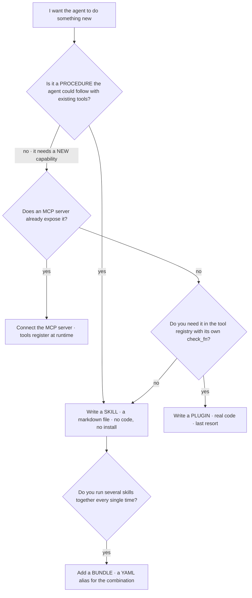

# Appendix G: Skills and Plugins by Example

Part 4 covers the anatomy of a skill and why progressive disclosure lets a library scale. This appendix is the practical companion: complete working files you can copy, the difference between the three things people confuse, and the rule for when a plugin is actually warranted.

### Skill, bundle, or plugin

**Choosing the right extension point**



The ordering is not arbitrary. A skill costs one markdown file and one index line. A plugin costs code you now maintain against a moving project. Part 12's advice is explicit: skip custom plugin development until the built-in tools genuinely do not cover the case.

### A complete skill, with the parts that usually get skipped

The two sections people omit are Pitfalls and Verification, which are the two that decide whether the agent can run the procedure without you watching.

*`~/.hermes/skills/ops/deploy-web/SKILL.md`*

```markdown
---
name: deploy-web
description: Deploy the web app to staging or production, verify it is actually serving, and roll back if it is not
version: 1.0.0
---

## When to Use
When I ask you to deploy, ship, release, or push the web app to an
environment. Not for library releases and not for database migrations.

## Procedure
1. Confirm which environment. If I did not say, ask. Never assume production.
2. Run the test suite. If anything fails, stop and report; do not deploy.
3. Record the currently deployed version so a rollback target exists.
4. Build. If the build emits warnings about missing env vars, stop and list them.
5. Deploy to the named environment.
6. Wait 15 seconds, then run the Verification section below.
7. If verification fails, roll back to the version recorded in step 3, then
   report what failed. Do not retry the deploy automatically.

## Pitfalls
- Staging uses port 2222 for SSH, not 22.
- The deploy API returns 202 before the release is live. A 202 is not success.
- A cached CDN response can look healthy while the origin is broken. Always
  verify with a cache-busting query string.
- Never deploy to production on a Friday after 15:00 without asking me twice.

## Verification
- The health endpoint returns HTTP 200 with a cache-busting parameter.
- The version string served matches the version just deployed.
- The error log has no new entries in the 60 seconds after deploy.
- Report all three results explicitly. Two out of three is a failed deploy.
```

> ⚠️ **The description is the whole trigger**
>
> The agent scans descriptions at session start and loads the body only on a match. "Deployment helper" will never fire. The description above names the verbs a person would actually use, which is what makes it findable. If a skill never seems to load, rewrite the description as the request it should answer, not as a summary of the file.

### A bundle is an alias, not a skill

Bundles exist for combinations you run constantly. They do not replace the individual skills and they carry no procedure of their own.

*`~/.hermes/skills/bundles/ship-it.yaml`*

```yaml
name: ship-it
description: The full release path, review through deploy
skills:
  - code-review
  - run-tests
  - deploy-web
```

Running `/ship-it fix the login redirect` loads all three skill bodies and the agent follows all three sets of instructions against the one task.

### Installing from the hub, safely

*`hub.sh`*

```bash
hermes skills browse                 # what exists
hermes skills search postgres        # find by topic
hermes skills inspect pg-backup      # READ IT before you install it
hermes skills install pg-backup      # installs, after the security scan
hermes skills tap add myorg/skills   # a private team repo of SKILL.md files
```

> ⚠️ **Read before you install**
>
> A skill is instructions a model will follow with your whole tool surface attached. The hub runs a security scanner for exfiltration, prompt injection and destructive commands, and that is a real control, but `inspect` costs thirty seconds and shows you exactly what you are granting. Treat an unread skill the way you would treat a shell script from a stranger.

### When a plugin is genuinely the answer

A plugin adds a tool to the registry. Reach for one only when all three of these are true:

- [ ] The capability does not exist in the 70+ built-in tools
- [ ] No MCP server already exposes it
- [ ] The agent needs to call it as a TOOL mid-reasoning, not follow it as a procedure

Plugins participate in the same registry pattern as built-in tools, which means they self-register and carry a `check_fn` that gates availability. That gate is the part worth writing carefully: a plugin whose `check_fn` always returns true will appear in the schema even when its dependency is missing, and the model will call it and fail. Make the check test the real dependency, not a config flag.

> ℹ️ **The cheap path most people miss**
>
> Before writing a plugin, try `execute_code`. The agent can write a Python script that does the job and run it, which covers a large share of what people reach for plugins to do, with no code to maintain and no registry surface to keep working across upgrades.

> ✅ **Operator drill · make one skill you already explained twice**
>
> Find a workflow you have walked the agent through more than once. Write it as a SKILL.md with all four sections. Then open a brand new session and trigger it with a natural request that matches your "When to Use" wording, without naming the skill. If it loads, your description is right. If it does not, the description is a summary rather than a trigger, and that single fix is the difference between a library that compounds and a folder nobody reads.

---

[← Back to the index](../README.md) · [Whole masterclass in one file](FULL-MASTERCLASS.md)
