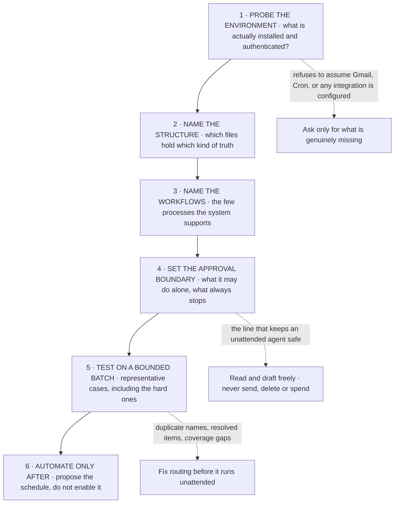

# Appendix H: Worked Build Prompts

Everything up to here describes what Hermes can do. This appendix is about how to ask for it. Both prompts below are real and both produce working systems, and the reason they work is a pattern you can reuse for anything.

### The pattern underneath both

**The shape of a prompt that produces a working system**



Six moves, and the order matters more than the wording. Most failed agent builds skip move 1 and move 5: they assume an integration is ready, and they automate before testing on real messy input.

| Move | Why it is in the prompt | What goes wrong without it |
|---|---|---|
| Probe the environment | check_fn gating (Part 5) means capability is dynamic, not assumed | The agent designs around a tool that is not authenticated, then fails silently |
| Name the structure | Durable state must outlive a session (Part 2) | Follow-ups live in conversation memory and vanish on restart |
| Name the workflows | Bounded scope is what makes a skill writable (Part 4) | An unbounded assistant that does everything badly |
| Set the approval boundary | Cron and gateways run this unattended (Parts 6 and 7) | An agent that sends or deletes at 3 a.m. |
| Test on a bounded batch | Compression and misrouting only show on real input (Part 12) | Confident wrong classifications at scale |
| Automate last | Schedules are cheap to add and expensive to un-ring | A scheduled job nobody validated |

### Example one, an email inbox manager

*`prompt-inbox-manager.md`*

```markdown
Build me a practical Hermes Email Inbox Manager in this working directory.

Start by checking which supported email connector is already available and
authenticated. If none is ready, tell me the simplest supported setup for my
email provider and ask only for what you actually need.

Create a minimal project structure for the Inbox Manager. Use AGENTS.md for
stable project behavior, a separate rules file for my inbox classifications
and approval boundaries, and durable follow-up state so waiting items do not
depend on session memory.

The system should support four core workflows:
1. New Mail Triage
2. Reply Draft Queue
3. Follow-Up Watch
4. Daily Inbox Digest

Default to read + classify + draft. Do not send, delete, archive, or make
other sensitive mailbox changes without my explicit approval unless I later
define a specific safe policy.

Before automating anything, test the workflow on a small bounded batch of
messages. Read full relevant threads, explain the classifications, prepare
drafts for review, record follow-ups, and show any coverage gaps or failures.

Once the manual flow works, propose the smallest useful automation plan for a
daily digest and follow-up checks. Do not enable schedules until I approve
them.

Keep the build simple, inspectable, and easy to change later.
```

> ℹ️ **What makes this one work**
>
> "Default to read + classify + draft" is the whole safety model in six words, and it maps onto a real Hermes boundary: drafting touches nothing irreversible, sending does. "Durable follow-up state so waiting items do not depend on session memory" is Part 2's lesson stated as a requirement rather than discovered after a restart loses a week of follow-ups. And the last line, keep it inspectable, is what stops the agent building a clever opaque system you cannot correct.

### Example two, a contact and relationship manager

*`prompt-relationship-manager.md`*

```markdown
Build me a Contact & Relationship Manager inside this Hermes workspace under
projects.

First inspect the current environment and available tools/Skills. Do not
assume Gmail, Calendar, Google Contacts, Cron, or any other integration is
configured. Tell me what is available and ask only for information or access
that is genuinely missing.

Use a transparent file-backed system as the default source of truth. Create
the smallest useful structure with:
- AGENTS.md for the operating role,
- RELATIONSHIP_RULES.md for privacy, capture, identity, follow-up, and
  approval rules,
- CONTACT_INDEX.md for canonical contact lookup,
- FOLLOW_UPS.md for the active follow-up queue,
- a contacts/ folder with one Markdown record per maintained relationship.

The system should support four core processes:
1. interaction capture,
2. contact context updates,
3. follow-up reminders,
4. pre-conversation briefs.

Rules:
- match people by stable identifiers when possible and never merge on name
  alone,
- capture concise useful context instead of dumping full conversations,
- date source-grounded updates,
- keep facts separate from inference,
- do not infer sensitive personal traits,
- preserve interaction history,
- only create follow-up dates or cadences when there is a reason,
- keep outbound messages, calendar changes, and other consequential external
  actions under my approval,
- treat Google Contacts as an optional identity source, not as the
  relationship database unless the current environment proves richer write
  support,
- do not use Hermes built-in MEMORY.md or USER.md as the contact database.

If Google Workspace is available, verify the current authentication and scopes
and use Gmail, Calendar, and Contacts only for the parts they currently
support, or a better option you already have.

Before automating anything, test the build with representative cases including
a duplicate-name case, a resolved follow-up, and an upcoming conversation.
Show me the results and fix any bad routing or overcapture.

Once the manual system works, propose a simple recurring relationship review
that surfaces due follow-ups and useful pre-conversation briefs without
sending anything automatically. Do not schedule it until I approve the exact
behavior.
```

> ⚠️ **The line that matters most in example two**
>
> "Do not use Hermes built-in MEMORY.md or USER.md as the contact database." Without it, an agent will happily start writing people into memory, and memory has a 2,200 character hard cap it will then silently fight against by consolidating away the very details you wanted kept. Appendix F covers what those two files are actually for. Domain data belongs in domain files.

> ℹ️ **Why the test cases are named explicitly**
>
> A duplicate name proves the identity rule. A resolved follow-up proves items leave the queue rather than accumulating forever. An upcoming conversation proves the brief actually assembles from stored context. Naming three adversarial cases is worth more than asking for "thorough testing", because the agent will otherwise test the happy path and report success.

### A reusable template

Strip either example down and this is what remains. Fill the brackets.

*`prompt-template.md`*

```markdown
Build me a [SYSTEM NAME] in [WHERE IT LIVES].

First inspect the current environment and available tools and skills. Do not
assume [INTEGRATIONS] are configured. Tell me what is available and ask only
for what is genuinely missing.

Use a transparent file-backed system as the source of truth. Create the
smallest useful structure with:
- AGENTS.md for the operating role,
- [RULES FILE] for the policies and approval boundaries,
- [STATE FILES] for anything that must outlive a session.

The system should support these core processes:
1. [PROCESS]
2. [PROCESS]
3. [PROCESS]

Rules:
- [the domain rules that keep the data trustworthy]
- keep [the irreversible actions] under my approval.

Before automating anything, test with representative cases including
[HARD CASE], [HARD CASE], and [HARD CASE]. Show me the results and fix any
bad routing before we continue.

Once the manual system works, propose the smallest useful recurring job. Do
not schedule it until I approve the exact behavior.

Keep the build simple, inspectable, and easy to change later.
```

> ✅ **Operator drill · build one of these for real**
>
> Pick the one closer to a problem you actually have and run it as written. Watch specifically for what the agent does at move 1: if it starts building without telling you what is and is not authenticated, stop it and say so. That single habit, refusing to assume the environment, is the difference between a system that works on your machine and a system that works on the machine it was imagined on.

---

[← Back to the index](../README.md) · [Whole masterclass in one file](FULL-MASTERCLASS.md)
