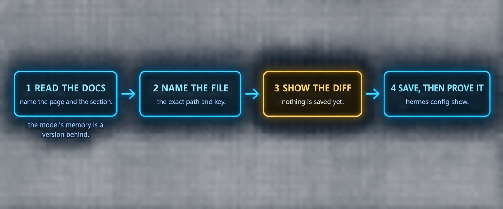

# The Build Track: Ten Builds, One Agent

The twelve parts explain how Hermes works. This second half is where you build one. Ten builds, in the order the pieces depend on each other, each one a page you can work through top to bottom with prompts you paste as they are.

Two rules shaped every prompt here, and they are worth knowing before you paste the first one.

**Every prompt is Hermes-native.** The file paths, config keys, commands and tool names come from the official Hermes documentation and from the bundled files in the Hermes repository, and each build names the page it was checked against. Nothing here is a general "AI agent" recipe wearing a Hermes label. If a prompt asks the agent to edit a key, that key exists in `config.yaml`. If it names a tool, that tool is in the registry.

**Every prompt reads the docs before it writes.** Hermes ships often and the model's memory of the project is always a version behind. So the prompts follow one shape, borrowed from the people who run Hermes hardest: tell the agent which documentation page to read, name the exact file and key to change, and require the diff before anything is saved. The agent has the web tools to fetch the page, the file tools to edit the config, and the terminal to prove the change took. That is the whole trick, and it is why these prompts keep working after the next release.

| Build | You end up with | Checked against | Time |
|---|---|---|---|
| 0 | A working install, a chosen provider, and the daily command set in your hands | Quickstart, CLI reference | 30 minutes |
| 1 | A SOUL.md that shapes behavior, plus personality overlays for the moods | Personality doc | 45 minutes |
| 2 | USER.md and MEMORY.md seeded from an interview and from your machine | Memory doc, import doc | 45 minutes |
| 3 | An AGENTS.md per project so the agent stops re-learning your repo | Context Files doc | 30 minutes |
| 4 | Your first skills, a bundle, and a curator that keeps the library clean | Skills docs, Creating Skills guide | 60 minutes |
| 5 | The right bundled plugins switched on, and the judgment for when to write one | Plugins docs | 30 minutes |
| 6 | A four-layer memory: built-in, session search, one provider, an Obsidian vault | Memory Providers, Honcho docs | 90 minutes |
| 7 | A profile roster with a frontier planner and inexpensive workers | Profiles doc | 45 minutes |
| 8 | Cron jobs that brief themselves, stay silent when nothing is wrong, and cost nothing when no reasoning is needed | Cron doc | 60 minutes |
| 9 | Delegation with a cheap child fleet, and a kanban board the profiles work from | Delegation and Kanban docs | 60 minutes |
| 10 | Approvals, model routing, effort levels and a weekly maintenance habit | Configuration and Security docs | 45 minutes |

### How to use a build

Each build has the same four pieces. **What you are building** says what exists at the end. **What the docs say** is the short list of facts the build rests on, with the page named. **Prompts** are the blocks marked with a file name like `prompt-something.md`: paste the whole block into a Hermes chat, in the CLI, the TUI, or any gateway platform. **Commands** are the blocks marked `bash`: those run in your own terminal. Every build ends with a **verify** list, and a build is not done until that list passes.

> ℹ️ **Where the prompts come from**
>
> The doc-first, diff-before-save shape is the pattern that shows up again and again in the best community material, in particular the "hand this to your agent" prompts published by Nous-affiliated operators on X. The template files, the roster, the memory ladder and the cron jobs were written for this masterclass from the documentation named in each build. The one exception is the nightly memory consolidation job in Build 6, which follows a pattern a community member described publicly; it is built entirely from documented Hermes primitives and is marked where it appears.

> ⚠️ **Do the builds in order**
>
> Build 6 assumes Build 2's memory files exist. Build 8's cron jobs attach skills from Build 4 and deliver to a gateway from Build 0. Build 9 routes kanban cards to the profiles from Build 7. Skipping ahead works about as well as it does in the twelve parts, which is to say each build will quietly reference a foundation you have not laid.

---

[← Back to the index](../README.md) · [Whole masterclass in one file](FULL-MASTERCLASS.md)
