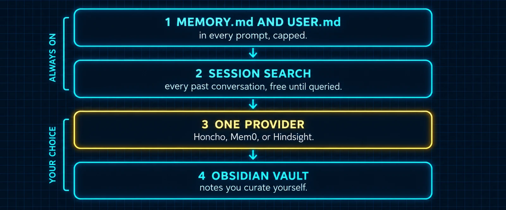

# Build 6: The Memory Stack



### What you are building

A memory that actually works across weeks, built in four layers that each do one job. The two you already have from Build 2. One external provider chosen on purpose: Hindsight first, local or cloud, because it is the one that makes a memory shared across sessions, profiles and machines actually work; Mnemosyne when everything must stay on one machine with no service running; Honcho when what you want modeled is you rather than your facts. An Obsidian vault for the structured notes you want to read yourself. And a nightly job that turns yesterday's conversations into tomorrow's context.

### What the docs say

Checked against the Memory Providers page, the Honcho page, and the bundled Obsidian skill in the Hermes repository.

| Layer | What it holds | Always on? | Costs |
|---|---|---|---|
| 1. MEMORY.md and USER.md | The few facts that must be in every prompt | Yes | Tokens in every prompt, capped |
| 2. session_search | Every past conversation, full-text, in state.db | Yes | Nothing until queried |
| 3. One external provider | Facts, a user model, or a knowledge graph that outlives any session | One at a time, your choice | Provider pricing, or free when self-hosted or local |
| 4. Obsidian vault | Structured notes with links, curated by you in the app | A bundled skill, not a provider | Nothing |

| Fact | Detail |
|---|---|
| One provider | Eight ship as plugins. Only one is active at a time, and the built-in files stay on alongside it |
| Picking | `hermes memory setup` is the interactive picker. `hermes memory status` shows what is active. `hermes memory off` disables the external one. Or set `memory.provider` in config.yaml by hand |
| Honcho | Dialectic user modeling: after each turn it reasons about your preferences, habits and goals, and injects a session-scoped context. Config in `$HERMES_HOME/honcho.json`, key in `HONCHO_API_KEY`. Tools: `honcho_profile`, `honcho_search`, `honcho_context`, `honcho_reasoning`, `honcho_conclude` |
| Mnemosyne | A third-party provider (MIT, mnemosyne-oss), local-first: one SQLite file with vector and full-text search, no daemon, no LLM needed to run, no telemetry. Installed into a venv of its own and exposed under `~/.hermes/plugins/mnemosyne`, then `memory.provider: mnemosyne`. Tools are prefixed `mnemosyne_`; `hermes mnemosyne stats` shows what it holds |
| Hindsight | Knowledge graph with entity resolution and a `hindsight_reflect` tool that synthesizes across memories. Three modes: cloud with an API key, local embedded (Hermes runs the daemon for you, free, needs an LLM key or any OpenAI-compatible endpoint for extraction), or local external (a Hindsight you run yourself, one URL). Config in `$HERMES_HOME/hindsight/config.json`, key in `HINDSIGHT_API_KEY`; the bank is named by `bank_id`, and one profile connects to exactly one bank. Tools: `hindsight_retain`, `hindsight_recall`, `hindsight_reflect` |
| Obsidian | The bundled skill at `skills/note-taking/obsidian` reads, lists, searches, creates and appends notes with the ordinary file tools. It resolves the vault from `OBSIDIAN_VAULT_PATH` in `~/.hermes/.env`, falling back to `~/Documents/Obsidian Vault`. No app needed to write; the app is how you read |

### Which provider

| You want | Pick | Because |
|---|---|---|
| The agent to know who you are, across every session and every gateway chat, without you writing it down | Honcho | It models the user, not just facts, and its context injection is session-aware |
| Memory that is shared across sessions today and across profiles and machines tomorrow, with recall that follows relationships and a tool that reasons across memories | Hindsight, and set it up first | The graph, the reflect tool and the bank model are unique among the three; local embedded mode is free, and the same bank serves a whole team later |
| Everything on one machine, nothing running in the background, and the fastest possible recall | Mnemosyne | One SQLite file, local embeddings, no service; the trade is no reflect and a smaller project behind it |

### Honcho

*`honcho.sh`*

```bash
hermes memory setup                 # pick "honcho"; the wizard asks for the key
# or by hand:
hermes config set memory.provider honcho
echo 'HONCHO_API_KEY=your-key' >> ~/.hermes/.env
hermes memory status
```

*`~/.hermes/honcho.json`*

```json
{
  "recallMode": "hybrid",
  "contextCadence": 1,
  "dialecticCadence": 3,
  "dialecticDepth": 1,
  "sessionStrategy": "per-directory",
  "observationMode": "directional"
}
```

| Knob | Default | What it does |
|---|---|---|
| recallMode | hybrid | hybrid injects context automatically and exposes the tools; context injects only; tools leaves the model to call honcho_reasoning itself |
| contextCadence | 1 | Turns between refreshes of the base layer: session summary, your representation, the peer cards |
| dialecticCadence | 2 | Turns between the LLM reasoning passes about you. Recommended 1 to 5; raise it to spend less |
| dialecticDepth | 1 | Passes per reasoning invocation, 1 to 3 |
| sessionStrategy | per-directory | per-directory, per-repo, per-session, or global |
| observationMode | directional | directional keeps every observation; unified pools them |

*`prompt-06-honcho.md`*

```markdown
Set up Honcho as my memory provider. Do these in order.

1. Read https://hermes-agent.nousresearch.com/docs/user-guide/features/honcho
   and tell me in five lines what the two context layers are and what
   contextCadence, dialecticCadence and recallMode control.
2. Run hermes memory status and tell me what is active now.
3. Propose the honcho.json for my profile with recallMode hybrid,
   dialecticCadence 3, dialecticDepth 1, and sessionStrategy
   per-directory. Explain each value in one line and show me the file.
   Do not write it, and do not touch .env; I will add the key myself.
4. After I say go and confirm the key is in .env, run hermes memory
   setup non-interactively if it supports it, or set memory.provider
   honcho with hermes config set, then run hermes memory status and show
   me the honcho tools in /tools.
5. Ask me two questions about how I work, then call honcho_profile and
   show me what Honcho now believes about me.
```

### Mnemosyne

*`mnemosyne.sh`*

```bash
# A venv of its own: hermes update rebuilds the managed venv and wipes extra packages.
python3 -m venv ~/.hermes/.mnemosyne/venv
~/.hermes/.mnemosyne/venv/bin/python -m pip install --upgrade "mnemosyne-memory[embeddings]" mnemosyne-hermes
~/.hermes/.mnemosyne/venv/bin/mnemosyne-hermes install --mode wrapper --force --python ~/.hermes/.mnemosyne/venv/bin/python
hermes memory setup                 # pick "mnemosyne", local; set the remember scope to global, not per session
hermes memory status                # provider mnemosyne, plugin installed, status available
hermes mnemosyne stats 2>/dev/null || true   # the plugin's own CLI command as shown in a recorded walkthrough; optional
```

*`prompt-06-mnemosyne.md`*

```markdown
Set up Mnemosyne as my memory provider, fully local. Do these in order.

1. Read the Hermes section of https://github.com/mnemosyne-oss/mnemosyne
   and tell me in five lines what it stores, where the database lives,
   and why it must be installed in a venv of its own rather than the
   Hermes-managed one.
2. Run hermes memory status and tell me what is active now.
3. Show me the exact commands you will run: the side venv under
   ~/.hermes/.mnemosyne, the pip install with local embeddings, the
   wrapper install, then hermes memory setup. Tell me which wizard
   answer sets the remember scope to global and why that one matters.
   Do not run anything yet. If my terminal backend is Docker, tell me,
   because then I run these on the host myself.
4. After I say go, run them, then show me hermes memory status and the
   mnemosyne_ tools in /tools, and hermes mnemosyne stats.
5. Tell me three facts about how I work, start a new session with /new,
   ask "who am I?", and show me the recall. Then propose whether to turn
   off the built-in MEMORY.md and USER.md injection for this profile in
   config.yaml, and what I would lose if I did.
```

### Hindsight

*`hindsight.sh`*

```bash
hermes memory setup                 # pick "hindsight", then cloud, local embedded, or local external
# cloud, by hand:
hermes config set memory.provider hindsight
echo 'HINDSIGHT_API_KEY=your-key' >> ~/.hermes/.env
# local embedded has a UI:
hindsight-embed -p hermes ui start
# the bank name, and the tags that say which profile wrote a memory, live in the config file below
hermes memory status
```

*`~/.hermes/hindsight/config.json`*

```json
{
  "mode": "local_embedded",
  "bank_id": "hermes",
  "retain_tags": ["default"],
  "memory_mode": "hybrid",
  "recall_budget": "mid",
  "recall_types": ["observation"],
  "auto_retain": true,
  "auto_recall": true
}
```

*`prompt-06-hindsight.md`*

```markdown
Set up Hindsight as my memory provider in <cloud | local embedded | local external>
mode. This is the provider to get right; the others are optional. Do these in order.

1. Read the Hindsight section of
   https://hermes-agent.nousresearch.com/docs/user-guide/features/memory-providers
   and tell me what retain, recall and reflect each do, and what
   memory_mode and recall_budget control.
2. Run hermes memory status and tell me what is active now.
3. Show me the hindsight/config.json you propose: mode as I named,
   bank_id hermes, retain_tags with this profile's name, memory_mode
   hybrid, recall_budget mid, auto_retain and auto_recall on. Do not
   write it. For cloud mode, I add the key to .env myself. For local
   embedded, tell me which LLM key or local endpoint extraction will use.
4. After I say go, run hermes memory setup or set memory.provider
   hindsight, confirm the client installed, then show me the three
   hindsight tools in /tools.
5. Tell me three related facts, then in a fresh session call
   hindsight_reflect with a question that needs all three, and show me
   the answer and which memories it drew on.
```

### Obsidian

*`obsidian.sh`*

```bash
echo 'OBSIDIAN_VAULT_PATH=/absolute/path/to/your/vault' >> ~/.hermes/.env
# Open that folder as a vault in the Obsidian app to read what the agent writes.
```

*`prompt-06-obsidian.md`*

```markdown
Using the obsidian skill, resolve my vault path from OBSIDIAN_VAULT_PATH
and confirm the folder exists. Then create a folder called Agent inside
the vault and write one note per topic we have covered today, each with
a one-line summary at the top, the decisions as a bullet list, and
wikilinks between notes that reference each other. Finish with an index
note that links every note you wrote. Show me the file list when done.
```

> ℹ️ **What goes where**
>
> Layer 1 is for what must be in every prompt. Layer 2 is for "what did we say about X three weeks ago". Layer 3 is for what the agent should know about you or your world without either of you writing it down. Layer 4 is for what you want to read, curate and link yourself. When a fact is sitting in the wrong layer, that is usually why memory feels like it does not work.

### The nightly consolidation

This job is a community pattern, described publicly by an operator running dozens of cron jobs, and it is built entirely from the primitives documented above: a cron job in a fresh session, `session_search` over yesterday, the `memory` tool for the two files, and the Obsidian skill for the daily note. Build 8 explains the cron flags; this is the job.

*`nightly-consolidation.sh`*

```bash
hermes cron create "every day at 03:00" \
  "You are running unattended with no chat history. Use session_search to read every session from the last 24 hours. Extract: decisions made, projects touched, bugs chased and their fixes, people mentioned, and mistakes that must not repeat. Then: (1) update MEMORY.md with the memory tool, target memory, adding only durable facts and merging or replacing entries so it stays under its limit; (2) update USER.md, target user, only if you learned a new stable preference; (3) using the obsidian skill, write a note at Agent/Daily/<today>.md in the vault with those five sections and wikilinks to any project notes that exist. Reply with a five-line summary of what changed, or with only [SILENT] if nothing durable happened." \
  --skill obsidian \
  --name "nightly-consolidation"
```

### Verify

- [ ] hermes memory status names the provider you chose and nothing else
- [ ] /tools lists that provider's tools (hindsight_*, mnemosyne_*, or honcho_*)
- [ ] A fact stored in one session is recalled in a fresh one after /new
- [ ] The Obsidian folder shows the notes, with links that resolve in the app
- [ ] hermes cron list shows nightly-consolidation, and hermes cron run <id> produces a summary or [SILENT]

---

[← Back to the index](../README.md) · [Whole masterclass in one file](FULL-MASTERCLASS.md)
