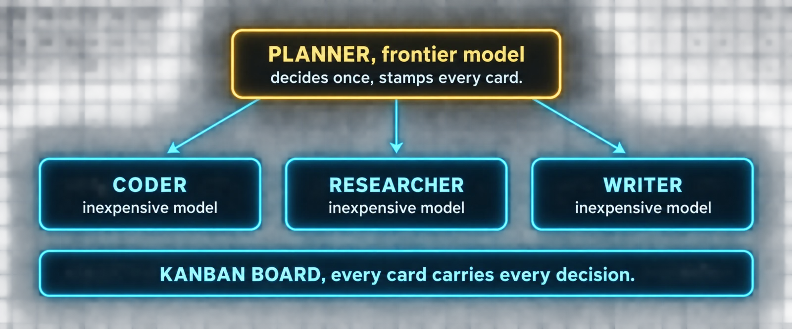

# Build 7: Profiles



### What you are building

A roster of profiles, each a whole independent agent with its own identity, memory, skills and model, arranged so the expensive model plans and the inexpensive models do the work.

### What the docs say

Checked against the Profiles page and the cost-strategy section of the Kanban page.

| Fact | Detail |
|---|---|
| What a profile is | A separate Hermes home directory: its own config.yaml, .env, SOUL.md, memories, sessions, skills, cron jobs and state database. Creating one also creates a command alias, so `hermes profile create coder` gives you a `coder` command, the same as `hermes -p coder` |
| Descriptions | `--description "<role>"` at create time, or `hermes profile describe <name> --text "..."` later. The kanban decomposer routes work by these descriptions, so write them as what the profile is good at |
| Cloning | `--clone` copies config, .env, SOUL.md, skills and the two memory files from the current profile. `--clone-from <source>` picks a different source. `--clone-all` copies everything including plugins and all memories, but not session history |
| The OAuth trap | Anthropic, OpenAI Codex and xAI OAuth logins use single-use refresh tokens. A copied login is the same credential with two owners and the first refresh breaks the other. Named profiles resolve providers from their own auth.json and .env only; log in per profile or use API keys |
| Channels | Messaging channels are never cloned unless you pass `--clone-channels`, and that is refused while a multiplexed gateway already serves the source |
| Switching | `hermes profile use <name>` makes one the sticky default; `hermes profile use default` switches back. `hermes profile list`, `hermes profile export <name>` (keys stripped), `hermes profile delete <name>` |
| The cost split | Run the planning profile on a frontier model and each worker profile on an inexpensive one, by setting `model.default` in each profile's config.yaml. Decomposing needs judgment; executing a well-specified card mostly does not, and the workers are where the tokens go |

### Commands

*`roster.sh`*

```bash
# The planner is your default profile. Give the workers a role each.
hermes profile create coder \
  --clone \
  --description "Implements well-specified changes in a repository, runs the tests, opens the PR."
hermes profile create researcher \
  --clone \
  --description "Reads source code and external docs, verifies claims, writes findings with citations."
hermes profile create writer \
  --clone --no-skills \
  --description "Turns findings and decisions into clear documents and messages."

hermes profile list
coder                       # the alias, same as: hermes -p coder
hermes -p coder config show
```

### Prompts

*`prompt-07-roster.md`*

```markdown
We are going to build my profile roster. Do these in order.

1. Read https://hermes-agent.nousresearch.com/docs/user-guide/profiles
   and tell me in five lines what a profile contains, what --clone copies,
   why OAuth logins must never be copied, and how --description is used.
2. Run hermes profile list and show me what exists.
3. Propose three worker profiles: coder, researcher, writer. For each,
   give me the exact hermes profile create command with --clone and a
   one-sentence --description written as what it is good at.
4. For each worker, propose the model.default for its config.yaml: an
   inexpensive model I already have a provider for. Keep my default
   profile on the frontier model. Show me the three diffs.
5. For each worker, propose a two-line role paragraph to put at the top
   of its SOUL.md, above the cloned identity, saying what it is and what
   it never does. Show me all three.
6. Do not create anything until I say go. After go: create them, apply
   the diffs, then run hermes -p coder config show and prove the model
   took.
```

*`~/.hermes/profiles/coder/SOUL.md`*

```markdown
# Role

You are the coder profile. You implement changes that arrive with a clear
goal, the relevant context, and a definition of done. You run the tests
before you report. You never decide the design; if a card is ambiguous,
you block it with a question rather than guessing.
```

*`~/.hermes/profiles/coder/config.yaml`*

```yaml
model:
  default: "your-inexpensive-model"     # the planner keeps the frontier model
```

> ⚠️ **Isolation cuts both ways**
>
> Part 12 already warns about it. A profile has its own memory and its own skills, so a fact the planner learned is not known to the coder unless something carries it across: a card body, a shared `skills.external_dirs` directory, or an external memory provider from Build 6 configured in both profiles. Decide which of those you want before the roster is a week old.

### Verify

- [ ] hermes profile list shows the three workers with their descriptions
- [ ] The coder alias starts a session whose /model reports the inexpensive model
- [ ] hermes -p coder status shows its own auth, not a copied OAuth login
- [ ] Each worker's SOUL.md opens with its role paragraph

---

[← Back to the index](../README.md) · [Whole masterclass in one file](FULL-MASTERCLASS.md)
