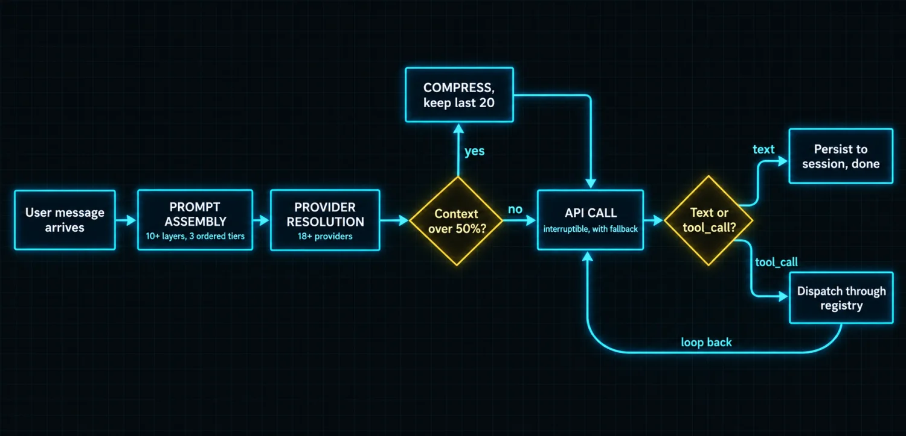
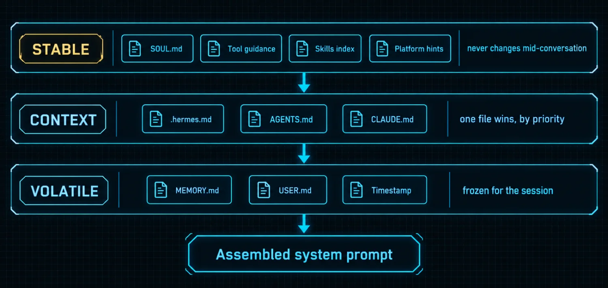

# Part 1: How Hermes Actually Processes Work

Every AI chatbot you have used has the same architecture. Type a message, the model generates a response. One step, done.

Hermes is different in a way that is not obvious from screenshots. When you send it a message it runs a structured process, prompt assembly through provider resolution, API call, tool dispatch, result evaluation and context persistence, before it responds. Some messages trigger ten tool calls, each feeding back into the model for another round of reasoning. Then the session is saved, memory is flushed, and the whole thing is ready to resume later.

That is an **agent loop**, and understanding it is the key to understanding why this tool compounds in ways a chatbot does not.

### The loop versus the chat

A chatbot's architecture is one arrow: user message, model predicts, response. Every input is a fresh inference against static training data. The model does not run anything and does not check anything. It guesses, based on what it learned during training.

Hermes has a loop. The `AIAgent` class lives in `run_agent.py` and handles the entire lifecycle of a single turn: prompt assembly, provider selection, API call, tool dispatch, compression, fallback and persistence. It supports three API execution modes, OpenAI chat completions, OpenAI Codex/Responses, and native Anthropic Messages, and converges all of them into one internal message format.

That last detail is worth pausing on. **Three wire protocols, one internal representation.** It is why switching providers does not change how skills, memory or tools behave, and why the rest of the system can be written without knowing which vendor is answering.

### The five stages, in order, every time

**1. Prompt assembly.** The system builds your context from ten-plus layers. SOUL.md for identity. Skills for procedural knowledge. Memory and user profile snapshots. Context files from your project directory. Platform hints for where you are chatting from. All assembled into three ordered tiers: stable, context, volatile.

**2. Provider resolution.** Maps your provider and model selection to the right API endpoint, API key and mode. Handles 18+ providers, OAuth flows and credential pools.

**3. Preflight compression.** If the conversation exceeds 50% of the model's context window, Hermes compresses *before* making the API call. Middle turns are summarized, the last 20 messages are preserved intact, and a new session lineage ID is generated.

**4. API call.** The assembled context goes to the model. The HTTP request runs in a background thread with an interrupt event watching it. You can cancel mid-flight with a signal, a `/stop` command, or by sending a new message. On a 429 or 5xx, Hermes checks its fallback provider list and tries the next one.

**5. Response parsing.** Text means that is the answer and it gets persisted. Tool calls mean the loop continues.

> ℹ️ **Why compression is preflight, not reactive**
>
> Compressing before the call rather than after a failure means you never eat a context-length error. It also means the compression decision is made with full knowledge of what is about to be sent. The cost is that compression is lossy and silent: a summarized middle is not the original, and nothing tells you it happened except a new lineage ID. Part 12 returns to this as the first wall you will hit.

### Where tools enter

This is the part that is fundamentally different from a chatbot. When a language model determines it needs to *do* something, run a command, search the web, write a file, read a document, it returns a `tool_call` instead of text. Hermes catches that and dispatches it through a central registry at `tools/registry.py`.

The registry holds **70+ registered tools across roughly 28 toolsets**. Each tool file calls `registry.register()` at import time with its name, schema, handler function, availability check and metadata.

When a `tool_call` arrives, three things can happen:

| Path | Which tools | Why it is separate |
|---|---|---|
| Intercepted by the agent loop | memory, todo, session search, delegation | They need direct access to agent state, not just arguments |
| registry.dispatch() | Everything else | Looks up the handler, checks availability via check_fn, executes, returns JSON |
| Error wrapping | Both paths | dispatch() catches handler exceptions, handle_function_call() catches dispatch exceptions |

That double error wrap has a specific consequence: **the model always receives a well-formed result, never an unhandled error.** A tool that throws becomes a result describing the throw. The model can then reason about the failure instead of the loop dying.

Multiple tool calls from a single model response run **concurrently** via a thread pool executor. The exception is tools marked `interactive`, like `clarify`, which force sequential execution. Once all results come back they are appended as tool-role messages and the loop returns to the API call with the new context. This continues until the model returns text or hits the iteration budget.

### The prompt architecture is the product

The reason Hermes gets better over time is not magic, it is structural. The system prompt is built as three ordered tiers.

| Tier | Contents | Changes when |
|---|---|---|
| Stable | SOUL.md identity, tool guidance, skills index, environment and platform hints | Never mid-conversation |
| Context | Project .hermes.md or AGENTS.md or CLAUDE.md, plus any caller system message | Per working directory, one type only, discovered by priority |
| Volatile | Memory snapshot, user profile snapshot, external memory block, timestamp and session line | Between sessions, frozen during one |

Memory is written to disk mid-session but does not mutate the cached system prompt until a rebuild path runs: new session, compression, or explicit invalidation. This keeps the prompt prefix stable for provider-side caching.

The separation is deliberate and buys three things:

1. The first part of the prompt, identity and tools and skills, benefits from API-level prompt caching.
2. Memory changes do not break that cache mid-conversation.
3. Skills, context files and platform hints each have a defined slot with defined precedence.

> ⚠️ **Context file precedence is a real gotcha**
>
> Only ONE project context type loads, discovered by priority from the working directory. A `.hermes.md` in your project root beats an `AGENTS.md` in the same directory. A `CLAUDE.md` loads only if neither of the other two exists. If you have all three and wonder why your CLAUDE.md is being ignored, this is why.

### Five design choices that explain the behavior

| Principle | What it means in practice |
|---|---|
| Prompt stability | The system prompt does not change mid-conversation. No cache-breaking mutations unless you switch models with /model |
| Observable execution | Every tool call is visible: a spinner in the CLI, progress messages in Telegram, callbacks in Discord |
| Interruptible | API calls and tool execution cancel mid-flight cleanly. Send a new message and the old request is abandoned, not force-quit |
| Platform-agnostic core | One AIAgent class serves CLI, gateways, the ACP editor integration, batch, and the API server. Platform differences live in the entry point |
| Loose coupling | MCP servers, plugins, memory providers and RL environments all use registry patterns and check_fn gating. A failed plugin does not take the agent down |

### What this changes about how you use it

Four consequences follow directly from the architecture, and each one changes a habit.

**Skills load into the stable tier**, so they are always available but do not change mid-conversation. If you want the agent to adopt new expertise, add or switch skills *between* sessions, not during one.

**Context files load by priority from your working directory.** Structure your project context accordingly rather than scattering three files and hoping.

**Tool calls are concurrent by default.** If you ask for four independent things, they happen simultaneously. Write prompts that exploit that: "check the disk, the last deploy, the open PRs and the error log" is one turn, not four.

**The iteration budget is real.** Default 90 turns, each tool call counting as one. A complex task needing 15 tool calls eats 15 of your 90. Subagents get independent budgets capped at 50. For long workflows, budget the tool calls, not the conversation turns.

| Budget | Default | Counted against |
|---|---|---|
| Main agent iterations | 90 turns | One task in one session |
| Subagent iterations | 50 turns | Each child independently |
| Preflight compression trigger | 50% of context window | Before the API call |
| Gateway auto-compression | 85% of context window | During a gateway session |
| Messages preserved on compression | Last 20 | Everything older is summarized |

> ✅ **Operator drill · trace one turn**
>
> Ask Hermes something that forces exactly three tool calls, for example: "Check my disk usage, then search the web for the current version of Bun, then write both answers to /tmp/hermes-drill.txt." Watch the CLI. You should see three tool executions, the first two running concurrently, then the file write. Afterwards, confirm the file exists and holds both answers. You have now watched stages 4 and 5 loop three times against one message, which is the entire lesson of Part 1 made concrete.

### The compounding claim, stated precisely

Skills compound because they are loaded as stable context the model never forgets it has. Memory compounds because it is written to disk mid-session but snapshotted at session boundaries. The tool system grows because new tools self-register at import time without manual wiring.

Chatbots predict the next token. Hermes runs a process. That is the difference that compounds, and everything in the remaining eleven parts is downstream of it.

---

[← Back to the index](../README.md) · [Whole masterclass in one file](FULL-MASTERCLASS.md)
