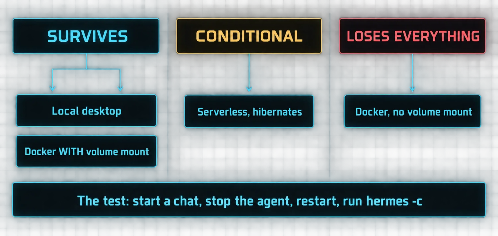

# Part 2: The Choices That Compound

Most people spend their first hour with Hermes picking a provider and running the installer. Both things matter. Neither is the decision that will matter a month from now.

The choices that compound are three: **where does your agent live, does it persist sessions across restarts, and can it actually use its tools.** Get these right on day one and everything after gets easier. Get them wrong and you will spend the next month wondering why the learning loop never seems to kick in.

### Where your agent lives is the infrastructure decision

Hermes runs on six terminal backends and each one changes how you interact with the agent.

| Backend | What it gives you | The tradeoff |
|---|---|---|
| Local desktop | Native app on macOS and Windows, manages its own config, sessions and Python env. Sessions in SQLite, memory on disk, always available when the machine is on | Your agent dies with your laptop. Close the lid and Hermes goes quiet |
| Docker | Survives reboots and laptop swaps. Maps ~/.hermes to /opt/data. Runs as a supervised gateway service. The agent lives on your server | You must remember the volume mount. Forget it and the agent starts fresh every time |
| Daytona | Serverless, hibernates when idle, costs nearly nothing | Not reachable during hibernation |
| Modal | Serverless, same hibernation model. Good for batch and research | Same unreachability |
| SSH | The right call when you have a beefy remote machine and want commands running there | Keeps the agent away from its own code, which is a feature and a constraint |
| Singularity | HPC and scientific computing environments | Narrow by design |

The pattern that works for most people is a progression, not a choice: **start local to learn the system, add Docker or a cloud backend when you want the agent running independently, then wire up gateways so you can reach it from anywhere.**

> 📝 **The single volume that holds everything**
>
> In Docker, `~/.hermes` mapped to `/opt/data` is the whole of your agent: config, sessions, skills, memories and gateway credentials. That is a genuinely good design, because it means you can pull a new image, destroy the container, and spin up a fresh one against the same data directory without losing anything. It also means one forgotten `-v` flag silently discards your agent's entire accumulated life.

### Session persistence is the feature everyone discovers the hard way

Every conversation with Hermes is saved as a session, stored in a SQLite database at `~/.hermes/state.db`. Sessions get titles. They get full-text search via FTS5. They track lineage across compression events. The agent can search them, resume them, and hand them off between platforms.

This is the infrastructure that makes the learning loop work. Without it, every conversation starts from zero and the agent has no way to build on previous work.

On serverless backends the environment hibernates when idle and the agent's state hibernates with it. Sessions resume when it wakes, but the agent is not reachable during hibernation. That is fine for scheduled cron work. It is not fine if you want to ping the agent from Telegram and get an answer in real time.

The lesson, stated as the author states it: **session persistence is invisible when it works and catastrophic when it does not.**

### The first real task should test tools, not chat

Here is the mistake almost everyone makes on day one. They ask Hermes a conversational question. "Write a poem about AI." The agent responds, the conversation looks good, and they assume everything works.

That test proves the model works. It does not prove the agent works. The thing that makes Hermes different from ChatGPT is the tool surface. If the tools are not wired up, you have paid for a chatbot with extra steps.

- [ ] Terminal: "What's my disk usage?" or "Show me the last 5 files modified in my project." Real output means the terminal tool is working
- [ ] Web: "Find the latest news about [something current] and summarize it in three bullets." Live results mean the web tool is working
- [ ] File: "Write today's date to a file called test.txt and tell me the absolute path." A file on disk means the file tools are working

If all three pass, the agent is functional and you can move on to memory, skills, cron and the rest. If one fails, fix it before doing anything else. A missing API key or a misconfigured backend will frustrate you for weeks if you do not catch it early.

> ⚠️ **Design the smoke test to prove the surface, not exhaust the budget**
>
> Each tool call costs one of your 90 iterations. A smoke test that takes ten tool calls has spent an ninth of the budget proving something three calls would have proven. Keep it to three.

### What actually compounds

The three choices are not the exciting part of setting up Hermes. They are the important part.

A local agent with persistent sessions and working tools is a **platform**. Every skill you add, every cron job you schedule, every memory the agent accumulates compounds against a stable foundation.

An agent that loses sessions on restart, cannot reach the web, or lives on a laptop that gets closed every night will never develop the compounding effect. It will always feel like a chatbot, because without these three things holding steady, that is all it is.

> ✅ **Operator drill · prove persistence, do not assume it**
>
> Run the three-tool smoke test. Then start a distinctive conversation ("remember that my drill codeword is BASALT"), stop the agent completely, restart it, and run `hermes -c`. If the codeword comes back, your foundation is real. If it does not, stop reading this document and fix storage, because Parts 3 through 12 all assume this works.

---

[← Back to the index](../README.md) · [Whole masterclass in one file](FULL-MASTERCLASS.md)
