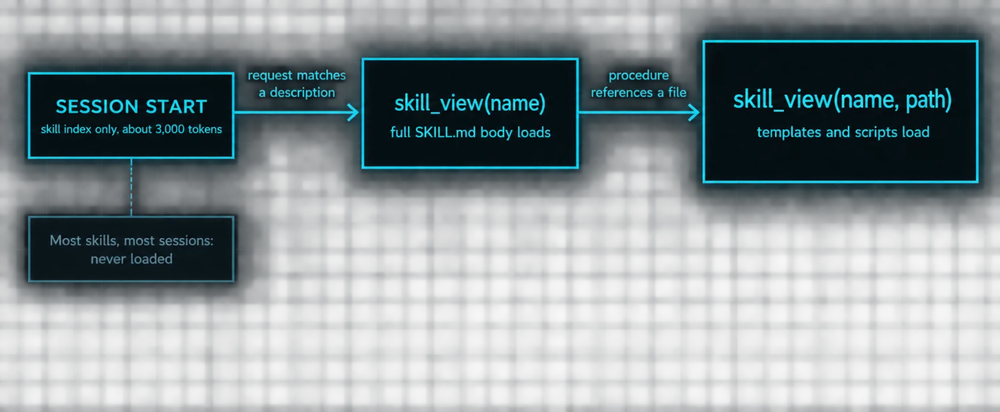
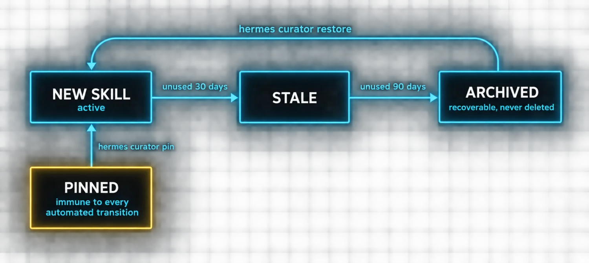

# Part 3: The Learning System

Parts 1 and 2 covered the engine and the chassis. The engine fires, the chassis is stable. Now the question that actually separates Hermes from the field: **does it get better over time?**

That is not rhetorical. Most AI tools ship at a fixed capability level and stay there. ChatGPT today knows roughly what it knew last week. Claude Code is the same Claude Code it was on install day. The vendor might ship an update, but the tool itself does not learn from your work.

Hermes does. Not because the model trains on your data, but because of three systems that accumulate, formalize and maintain what the agent learns about you, your projects and your workflows.

### Memory is the raw material

Memory in Hermes is not a log of everything that happened. It is a small, curated set of facts the agent keeps in context at all times, held in two files.

**The**

| Field | Type | Notes |
|---|---|---|
| MEMORY.md | agent notes | environment facts, project conventions, tool quirks, completed work |
| USER.md | your profile | preferences, communication style, technical level, pet peeves |
| combined cap | ~1,300 tokens | tight by design, because memory costs tokens in every single prompt |
| MEMORY.md hard limit | 2,200 characters | exceeding it returns an error, not a silent drop |

The agent writes to memory automatically when it learns something durable. You correct it about a convention, it saves that. It discovers your project uses Go 1.22 and sqlc, it saves that. You ask it to remember your API key rotation schedule, it saves that.

**Memory is a frozen snapshot at session start.** Everything remembered is loaded into the system prompt as a block of text, available from the first message. Mid-session memory changes are persisted to disk but do not appear in the prompt until the next session. This is what keeps the prompt prefix stable for provider-side caching, exactly as Part 1 described.

When memory fills, and at 2,200 characters it will, the agent does not silently drop entries. The tool returns an error carrying the current entries and the usage count. The agent then consolidates: merging related entries, removing stale facts, making room. The error message shows exactly what is in memory so the agent can decide what to keep.

> ℹ️ **The economics that drive the design**
>
> Memory costs tokens in every prompt. Session search costs nothing until you run a query. So the agent uses session search for recall ("what did I learn about project X last week?") and saves to memory only what should *always* be in context. If you find memory filling with things you rarely need, that is the split being applied wrongly.

### Skills are the procedures

Memory stores facts. Skills store procedures.

When the agent solves a novel problem in a multi-step workflow, five or more tool calls, significant back-and-forth, a correction from you, it can save the approach as a skill: a markdown file in `~/.hermes/skills/` with a name, description, step-by-step procedure, pitfalls section and verification steps.

Skills use **progressive disclosure** to minimize token overhead, and this is the mechanism that lets the library scale.

Multiple skills can be stacked in a single command. Running `/github-pr-workflow /test-driven-development fix issue #123` loads both skills and the agent follows both sets of instructions for the same task. For workflows you repeat constantly, skill bundles group several skills under a single slash command.

| Source | What it is | How you get it |
|---|---|---|
| Bundled | Ships with Hermes, covers code review, PR management, research | Already there |
| Hub | Community-contributed | hermes skills install, after a security scan |
| Agent-created | The procedural memory of your specific work patterns | The agent writes them after complex tasks |

### The background review is invisible infrastructure

Memory and skills do not just accumulate passively. **After every conversation turn, Hermes forks a background review that examines what happened.**

The fork runs as a separate AI agent in its own prompt cache and never touches the active conversation. It reviews the turn for things worth remembering: corrections you made, workflows you walked through, facts about your environment. If it finds something, it proposes a memory save or a skill patch.

This is the part that makes the learning loop feel like magic. You correct the agent once about how your project is structured. The background review catches the correction and saves it. Next session the agent has that fact in context from the first message and you never say it again.

| Control | Setting | Effect |
|---|---|---|
| Staged writes | memory.write_approval: true | Every proposal is staged, not committed. Review with /memory pending |
| Staged skills | skills.write_approval: true | Same gate for skill patches. Review with /skills pending |
| Cheaper reviewer | route the review to a smaller model | Benchmarks showed memory capture identical, skill capture near-identical |
| Default reviewer | your main chat model | The conversation is warm in its prompt cache, so it is effectively free cache reads |

> 📝 **Why the default is not wasteful**
>
> Routing the review to your main model sounds expensive and mostly is not, because the conversation is already in that model's prompt cache. Cache reads are a fraction of fresh input cost. The case for downgrading is when your main model is genuinely expensive per token, and the measured quality cost of doing so was close to zero.

### The curator prevents skill rot

The curator is the garbage collector for skills. It runs on a ticker, every 7 days by default, when the agent has been idle for at least 2 hours.

The deterministic phase handles the lifecycle above. **Nothing is ever deleted**, archival is recoverable with `hermes curator restore <name>`.

The optional LLM phase runs an auxiliary-model review: it surveys your library, identifies overlapping skills, proposes umbrella skills that consolidate narrow ones, and patches drift. It is **off by default because it costs tokens**. Opt in with `curator.consolidate: true` or trigger it on demand with `hermes curator run --consolidate`.

Pinning protects critical skills. `hermes curator pin <name>` prevents any automated transition, archival or deletion. Patches and edits still go through, so the agent can improve a pinned skill's content over time, but the skill can never be automatically removed.

Before every curator run, a tar.gz snapshot of the entire skills directory is saved. Any run can be rolled back with `hermes curator rollback`, and the rollback itself is reversible.

### How the system compounds

Memory and skills are both injected into the prompt, memory in the volatile tier frozen per session, skills in the stable tier as an always-present index. The agent sees both at all times.

When it encounters a problem it checks memory for relevant facts and loads matching skills. It executes the procedure, calling tools. Results feed back. The background review examines the turn, identifies what worked, and saves it: a memory entry for a discovered fact, a skill patch for a refined procedure.

Over multiple sessions the cycle repeats. Memory consolidates as it fills. Skills are curated as they age. The curator removes what stopped being useful. The agent has fewer, better entries to work with.

**This is why the Part 2 decisions matter.** The learning loop only works if sessions persist. If every conversation starts from zero, the agent learns in the session, forgets on restart, and never gets better.

> ✅ **Operator drill · force a write and verify it survives**
>
> Tell the agent a durable, checkable fact about your environment that it could not already know, for example a convention you use in one specific repo. Finish the turn. Start a **new** session and ask it to state that convention back. If it does, the background review wrote it and the volatile tier loaded it. If it does not, check whether write_approval is on and the proposal is sitting in `/memory pending`. Either answer teaches you where your learning loop actually stands.

---

[← Back to the index](../README.md) · [Whole masterclass in one file](FULL-MASTERCLASS.md)
