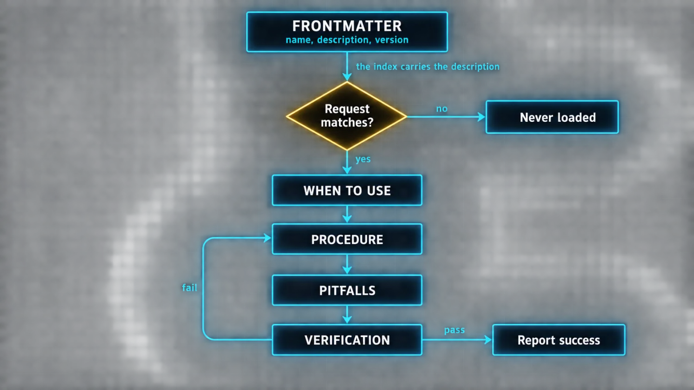

# Part 4: Skills as Executable SOPs


A skill in Hermes is a markdown file. That is it. A plain text file with a YAML header and a body made of headings, bullets and numbered steps. Nothing compiles it. Nothing transpiles it. The agent reads it and follows the instructions.

That simplicity is the point. You do not need a plugin SDK, a manifest file or a deployment pipeline to create a skill. You need a text editor and an opinion about how a workflow should run.

### The anatomy of a good skill

Every skill lives at `~/.hermes/skills/<category>/<name>/SKILL.md` and has two parts.

The **frontmatter** carries metadata: name, a one-line description, version, optional platform restrictions, tags and category.

*`SKILL.md`*

```yaml
---
name: my-skill
description: Brief description of what this skill does
version: 1.0.0
---
```

> ⚠️ **The description is the single most important field**
>
> It is what appears in the skill index the agent scans at session start. The body is never read unless the description wins the match. A weak description means the agent never knows to load the skill, and a skill that never loads is a skill that does not exist. Write the description as the trigger condition, not as a summary.

The **body** holds the procedure. The docs recommend four sections, and the four are not arbitrary, each one answers a question the agent would otherwise have to guess.



| Section | The question it answers | What a weak version looks like |
|---|---|---|
| When to Use | Should I load this at all? | "When the user needs help with infrastructure" |
| Procedure | What exactly do I do, in order? | Prose paragraphs instead of numbered concrete actions |
| Pitfalls | What will bite me that is not obvious? | Omitted entirely, which is the most common failure |
| Verification | How do I know it worked? | Omitted, so the agent finishes without knowing if it succeeded |

A strong "When to Use" is specific: "When the user asks to deploy a service" beats "When the user needs help with infrastructure." A strong Procedure gives one concrete action per numbered step, naming the tool and the arguments when a tool call is required, and naming the decision rule when judgment is required. Pitfalls is where tribal knowledge lives: "The staging server uses port 2222, not 22." "The API returns a 202 before the resource is ready."

Here is the author's worked example, complete.

*`~/.hermes/skills/research/news-research/SKILL.md`*

```markdown
---
name: news-research
description: Research a technology news topic -- gather sources, extract claims, produce a brief
version: 1.0.0
---

## When to Use
When the user asks you to research a news story, find the latest information on a
topic, or verify a claim from an X post or press release.

## Procedure
1. Identify the core claim or announcement. Ask the user to clarify if the topic is vague.
2. Search the web for at least 3 independent sources covering the topic.
3. Extract the key facts from each source: who announced it, what changed, when it
   happened, and why it matters.
4. Compare the sources. If they agree on the facts, synthesize a summary. If they
   contradict each other, note the disagreement and why.
5. Present the brief as: two-line summary, key facts in bullets, source links, and
   any uncertainty you found.
6. Save the research brief as a file at
   ~/nexus-wiki/wiki/queries/YYYY-MM-DD-topic-slug.md if the user approves.

## Pitfalls
- Do not rely on a single source. Three is the minimum for verification.
- Press releases and blog posts are not independent sources. Look for journalism
  or official documentation.
- If the topic was published more than 6 months ago, flag it as potentially outdated.

## Verification
- At least 3 independent sources are cited.
- Every factual claim is mapped to a source URL.
- The brief includes at least one open question or uncertainty.
```

Notice what the Verification section does: it converts "did the agent do a good job" from a judgment call into three checkable conditions. That is the difference between documentation and an executable SOP.

### Progressive disclosure is why skills scale

The agent does not load every skill into every conversation. That would burn tokens on workflows it never uses.

At session start it loads a compact index: every skill's name, description and category, roughly **3,000 tokens for a library of dozens of skills**. When a request matches a description, it calls `skill_view(name)` for the full body. If that skill references supporting files, templates, scripts, reference documents, those load on demand with `skill_view(name, path)`.

Three levels, and the agent pays the token cost only when it actually uses the skill. This is how Hermes ships with dozens of bundled skills and still fits in a reasonable context window.

### Stacking, bundling and the ecosystem

**Multiple skills run together in one command.** Type `/github-pr-workflow /test-driven-development fix issue 123` and the agent loads both files and follows both. The leftmost slash commands are parsed as skill invocations, and parsing stops at the first token that is not a skill name, so path arguments and filenames that happen to start with `/` are never swallowed.

**Bundles group related skills under one shortcut.** A `backend-dev` bundle might pair code review, testing and PR workflow. Running `/backend-dev` loads all three. Bundles are just YAML files listing skill names, aliases for combinations you use constantly, not replacements for the individual skills.

**The Skills Hub is where the community publishes.**

*`skills-hub.sh`*

```bash
hermes skills browse              # see what exists
hermes skills search <keyword>    # find by topic
hermes skills inspect <name>      # read it BEFORE installing
hermes skills install <name>      # install, after the security scan
hermes skills tap add <org/repo>  # add a team's private GitHub repo of skills
```

The hub covers multiple sources: official optional skills from Hermes, the skills.sh directory from Vercel, well-known endpoints from doc sites, and direct GitHub repos. **Every hub install runs through a security scanner** that checks for data exfiltration, prompt injection and destructive commands.

> ⚠️ **Inspect before install is not optional advice**
>
> A skill is instructions a model will follow with your tool surface attached. The security scanner is a real control, but `hermes skills inspect` costs you thirty seconds and lets you read exactly what you are about to give the agent permission to do. Treat an installed skill the way you would treat a shell script from a stranger.

For teams, **taps** let you publish a GitHub repo of SKILL.md files. Members add the tap and install individual skills from it. No registry signup, no server, no pipeline.

### What makes skills compound

Two sources feed the library and they compound differently.

**The agent creates skills automatically** after completing complex tasks. Solve a novel problem with five or more tool calls, and the workflow gets saved. Next time it loads that skill and executes faster.

**You create skills for workflows you have already internalized.** The deploy runbook. The incident response checklist. The code review standards. The agent does not need to learn these from scratch, it has them as a file it reads and follows.

The curator keeps the library from growing forever, exactly as Part 3 described. The compounding effect is narrower than people expect and that is fine: **every skill makes the agent faster at that specific workflow, not at everything.** A library of 20 well-written skills covering workflows you actually run beats 100 vague ones that never get loaded.

> ✅ **Operator drill · write one real skill**
>
> Pick a workflow you have explained to the agent more than twice. Write it as a SKILL.md with all four sections, and make the Verification section genuinely checkable. Then start a fresh session and trigger it with a natural request that matches your "When to Use" wording, without naming the skill. If it loads, your description is good. If it does not, your description is a summary rather than a trigger, and that is the most common and most fixable skill-authoring mistake.

---

[← Back to the index](../README.md) · [Whole masterclass in one file](FULL-MASTERCLASS.md)
