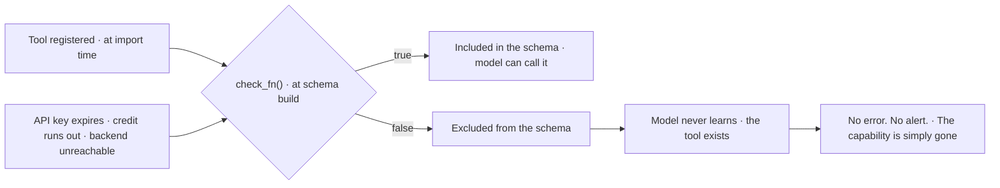

# Part 5: Tools and Toolsets


The simplest test for whether Hermes is working is asking it a question and getting an answer. The test works. It is also misleading, because it tests the chat and misses the machine.

What makes Hermes different is the tool surface, not the conversation. The agent runs commands, searches the web, reads and writes files, navigates browsers, generates images, transcribes speech and spawns subagents. **The chat is the input layer. The tools are the output.**

### The registry and how tools find their way in

Every tool lives in a central registry at `tools/registry.py`. When a tool module is imported it calls `registry.register()` at module level with its name, schema, handler function and an optional availability check. The call self-registers the tool into a singleton dict keyed by name.

Discovery is automatic. On startup, `discover_builtin_tools()` scans every Python file in `tools/`, does an AST check for top-level `registry.register()` calls, and imports matching modules. **New tool files are picked up without manual wiring.** After the core scan, MCP tools and plugin tools are discovered through their own paths.

The registry holds 70-plus tools across roughly 28 toolsets, and that count excludes MCP tools you connect yourself, which add dynamically.

### What the tools actually do

| Category | Tools | What it unlocks |
|---|---|---|
| Web | web_search, web_extract | The difference between an agent that makes things up and one that checks its facts |
| Terminal and files | execute, background process management, read, write, patch edit, content search | Six backends: local, Docker, SSH, Singularity, Modal, Daytona |
| Browser | navigate, click, type, screenshot, run JS, scroll | Five backends including cloud, local CDP and a managed Chromium |
| Media | vision analysis, image generation, text to speech | Via the Nous Portal Tool Gateway or individual API keys |
| Agent orchestration | todo, clarify, execute_code, delegate_task | execute_code collapses multi-step workflows into one inference turn |
| Memory and recall | memory, session_search | Memory compounds across sessions, search keeps last week reachable |
| Automation | cronjob | The full lifecycle of recurring jobs from one tool |
| Integrations | Home Assistant, plus any MCP server | Each MCP server exposes its own toolset under mcp-<server-name> |

### Toolsets are how you control reach

A toolset is a named bundle of tools, and they exist so you can grant different capability sets to different surfaces. The CLI profile loads a broad toolset. A Telegram bot profile might load messaging, session search and cron, but **not** terminal or browser. The platform preset system handles the common mappings automatically.

*`toolsets.sh`*

```bash
hermes tools                                   # what is actually loaded right now
hermes chat --toolsets "web,terminal,file"     # scope a single session
```

> ⚠️ **The 'all' shortcut does not mean all**
>
> `all` enables most toolsets but not every one. Specialist toolsets like `kanban` are opt-in and must be added explicitly alongside `all`. Check `hermes tools` to see what is actually loaded on your current profile before assuming a tool is available. This is the single most confusing behavior in the tool layer.

### Availability is dynamic, not static

Every tool can provide a `check_fn`, a callable returning True when the tool can be used and False otherwise. Web search checks for a search API key. The browser tool checks whether a backend is reachable. Image generation checks whether the FAL AI client is installed.

When the agent builds its schema list for the model, it runs each `check_fn` and **excludes unavailable tools from the schema entirely.** The model never sees tool definitions it cannot use.

**Why a tool can silently vanish**



This cuts both ways and it is worth holding both halves. The good half: **your capability surface changes with your configuration and no code changes.** Install an MCP server, restart, and the agent gains tools. The bad half is Part 12's warning in advance: a credential that expires takes a tool with it, silently, and the agent does not know what it cannot do.

### Terminal backends are their own discussion

| Backend | Isolation | Persistence characteristic |
|---|---|---|
| Local | None, full access to your machine | Whatever your machine does |
| Docker | Read-only root filesystem, dropped capabilities | Single long-lived container; cwd, packages and env persist across tool calls and subagent delegations for the process lifetime |
| SSH | Delegates to a remote server, keeps the agent away from its own code | Whatever the remote does |
| Singularity | HPC cluster semantics | Cluster-managed |
| Modal | Serverless cloud | Hibernates when idle |
| Daytona | Serverless cloud | Hibernates when idle |

The Docker backend deserves attention. Hermes starts one long-lived container on first use and routes every terminal, file and `execute_code` call through it. The container is stopped and removed on shutdown, but with `container_persistent: true` the workspace survives across Hermes restarts.

**Background process management** is built into the tool surface. The `process` tool can list, poll, wait, kill, write to and close background processes started with `terminal(background=true)`. PTY mode enables interactive CLI tools like Codex and Claude Code, which is how Hermes drives other agents.

### Dangerous commands are gated

The terminal tool carries a `DANGEROUS_PATTERNS` regex list covering recursive deletes, filesystem formatting, SQL destructive operations, system config overwrites, service manipulation, remote code execution and fork bombs.

When a command matches, the agent prompts for approval: an interactive prompt in the CLI, an approval request through chat on messaging platforms. **Approvals are tracked per-session**, and a permanent allowlist can be configured in `config.yaml`.

### Why the tool surface is the foundation

Every feature in the rest of the series depends on tools. Skills are procedures that execute through tools. Cron jobs schedule tool calls. Delegation spawns subagents that use tools. Browser automation and computer use are tool categories. The agent loop dispatches tools.

Without a working tool surface, Hermes is a chatbot with persistent memory. With it, the agent can act on the world.

> ✅ **Operator drill · audit your live surface**
>
> Run `hermes tools` and read the whole list, not the summary. For every tool you expected to see and do not, find its `check_fn` precondition and fix it. For every tool you see and did not expect, ask whether that surface should be reachable from this profile. Then repeat the exercise on your most locked-down profile, for instance the one behind a messaging gateway. The delta between those two lists is your actual security boundary, and most people have never looked at it.

---

[← Back to the index](../README.md) · [Whole masterclass in one file](FULL-MASTERCLASS.md)
