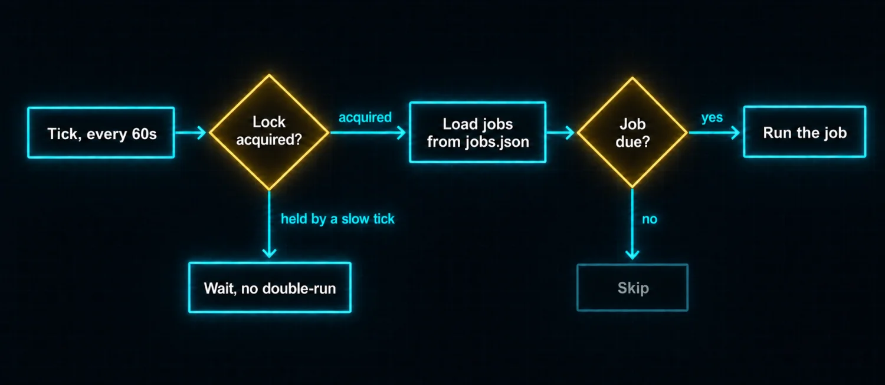
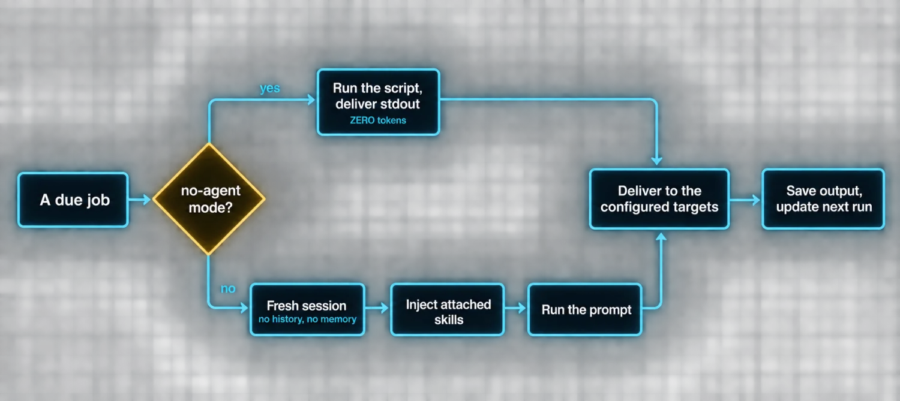
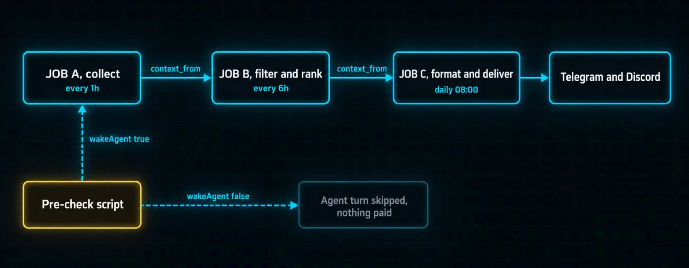

# Part 6: Cron Makes Hermes Infrastructure


Every part so far has described a reactive system. You send a message, the agent processes it, you get a response. The loop is initiated by you.

**Cron breaks that pattern.** A scheduled job is something the agent does without being asked, on a schedule you define, in a fresh context every time, delivering results to whatever platform you choose. The agent stops being something you talk to and starts being something that runs.

### How cron works under the hood

The cron system lives inside the gateway daemon. Every 60 seconds the scheduler ticks.





The file lock at `~/.hermes/cron/.tick.lock` prevents overlapping ticks from double-running the same batch. If a tick takes longer than 60 seconds, the next one waits. Atomic file writes prevent corrupted job data from a crashed write.

> ⚠️ **Fresh session means fresh, with no exceptions**
>
> No conversation history. No memory from previous runs. A clean slate, every single time. This is the single most important fact about cron and it is the one that breaks people's first three jobs. Everything the agent needs must be in the prompt.

### Creating jobs is the best part

You can create a cron job in natural language. "Every morning at 9am, check Hacker News for AI stories and summarize them on Telegram." One sentence. The agent parses the intent, creates the job, and it fires at the next scheduled time.

| Format | Syntax | Behavior |
|---|---|---|
| Relative delay | "30m", "2h" | One-shot, fires once after the delay |
| Interval | "every 30m", "every 2h", "every 1d" | Repeats until removed |
| Cron expression | "0 9 * * 1-5", "0 */6 * * *" | Weekdays at 9 AM; every 6 hours |
| ISO timestamp | "2026-07-15T09:00:00" | Exact date-and-time one-shot |

The full lifecycle runs through a single `cronjob` tool: create, list, pause, resume, run now, edit, remove. All of it from a chat message, no CLI required. The agent also accepts **job names in place of hex IDs**, so "pause the morning briefing" works instead of copying an ID.

### Skills make cron smarter

A cron job can load one or more skills before running its prompt. This is the difference between a scheduled task that fumbles through a workflow and one that executes a known procedure.

A single attached skill behaves like a reusable playbook: its trigger conditions, numbered procedure, pitfalls and verification become the job's operating context. Multiple skills load in order, so a morning digest job might load `blogwatcher` and `maps` together and have both contexts available.

> ⚠️ **The profile trap that costs people an afternoon**
>
> Skills attached to cron jobs must be available **in the profile that runs the gateway**. Cron jobs run in the gateway process, and the gateway uses the default profile's skill catalog. If your skill lives in a sub-profile, the job will run and quietly behave as though the skill does not exist. Copy it to the default profile's skills directory.

### Delivery is the whole point

A cron job that runs but never tells you the result is a job that did not happen. Delivery covers 20-plus platforms.

| Target | Meaning |
|---|---|
| origin | Back to where the job was created. The default for messaging platforms |
| local | Saves output to files at ~/.hermes/cron/output/. The default for CLI-created jobs |
| all | Every connected home channel, resolved AT FIRE TIME |
| "telegram,discord" | Exactly those two |
| "origin,all" | The origin chat plus every other channel |

The `all` token resolving at fire time is a small detail with a real payoff: **a job created before you wired up Discord picks up Discord automatically once you configure it.** You do not go back and edit old jobs.

Two behaviors are worth knowing by name.

**The continuable flag.** By default cron is fire-and-forget: the message lands but you cannot reply to it with the agent aware of context. With `attach_to_session: true`, the delivery is seeded into a session thread. You reply and the agent has the brief in context. On thread-capable platforms like Telegram and Discord, each delivery opens its own dedicated thread.

**The silent suppression pattern.** If the agent's final response contains `[SILENT]`, delivery is suppressed entirely. The output is still saved locally for audit, but no message is sent. This is *the* pattern for monitoring jobs:

*`monitoring-job-prompt.txt`*

```text
Check if nginx is running. If everything is healthy, respond with only [SILENT].
Otherwise, report the issue.
```

### No-agent mode is the hidden gem

Not every scheduled job needs an LLM. A memory usage check. A disk space alert. A heartbeat ping. These are classic watchdog patterns that should be cheap and reliable.

No-agent mode skips the LLM entirely. The scheduler runs your script on schedule and delivers its stdout directly. **Zero tokens. Zero provider calls. Zero model fallback.**

| Script outcome | What happens |
|---|---|
| Non-empty stdout | Delivered verbatim |
| Empty stdout | Silent tick. Nothing sent, nothing logged as a failure |
| Non-zero exit code | Error alert fires |
| Timeout | Error alert fires |

That last pair matters: **a broken watchdog cannot fail silently**, which is the classic way monitoring lies to you.

The agent can set these up for you. Describe the watchdog in chat, "Ping me on Telegram if RAM is over 85%, every 5 minutes", and Hermes writes the check script, creates the no-agent job, and wires the delivery. The entire lifecycle happens without touching the CLI.

### Chaining jobs creates pipelines

Cron jobs run in isolated sessions with no memory of previous runs. But sometimes one job's output is exactly what the next needs.



The `context_from` parameter wires the connection automatically: Job B gets Job A's most recent output prepended as context at runtime. The chain can be any length, and each job fires on its own schedule reading the upstream job's last output.

**The wakeAgent gate** lets a pre-check script decide at runtime whether the LLM should be invoked at all. A script that polls a feed, an API or a database emits `{"wakeAgent": false}` if nothing changed, skipping the agent turn. For frequent polls every 1 to 5 minutes, this is the difference between paying for zero-content agent turns and paying for nothing.

### Self-contained prompts are non-negotiable

Because cron runs in a completely fresh session, the prompt must contain everything.

| This fails | This works |
|---|---|
| "Check on that server issue" | "SSH into server 192.168.1.100 as user deploy, check if nginx is running with systemctl status nginx, and verify https://example.com returns HTTP 200" |

The first fails because the agent has no idea what server issue you mean. The second works because every detail is in the prompt. If the task changes, edit the prompt with cron's edit action rather than deleting and recreating.

### What cron changes

Before cron, Hermes is a tool you reach for. Reactive by definition. After cron, Hermes runs on your behalf: it checks things you would forget to check, summarizes things you would miss, and delivers to the same chat you use for everything else.

The transition from reactive to proactive is what makes Hermes feel less like a chatbot and more like an operator.

> ✅ **Operator drill · ship a zero-token watchdog**
>
> Create a no-agent cron job that checks one real condition on your machine every 5 minutes and prints nothing when healthy. Then deliberately break the condition and confirm the alert arrives. You have now built monitoring that costs zero tokens, cannot lie to you when the script dies, and took one chat message to create. Do this before you build any LLM-backed scheduled job, because most of what people reach for cron to do does not need a model at all.

---

[← Back to the index](../README.md) · [Whole masterclass in one file](FULL-MASTERCLASS.md)
