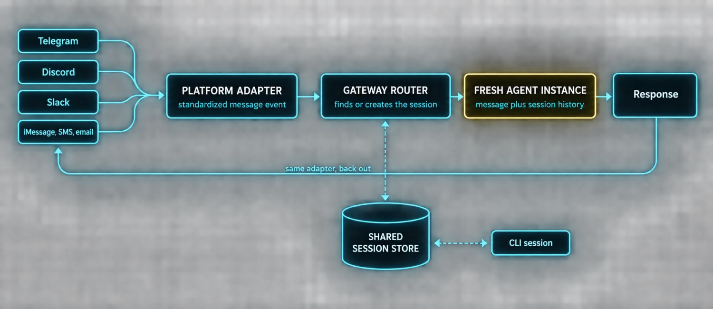
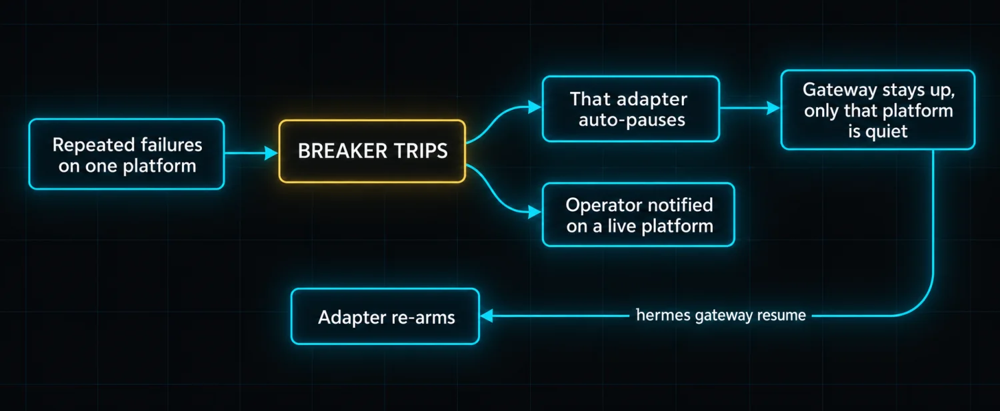

# Part 7: Messaging Gateways Make Hermes Ambient


Everything so far has assumed you are sitting at a keyboard. CLI, TUI, desktop app. It works, and it is also a limitation, because it means Hermes is only useful when you are at your machine.

Messaging gateways break that constraint. Telegram, Discord, Slack, WhatsApp, Signal, iMessage, SMS, email, Matrix, Teams and about a dozen more. **The agent does not know or care which platform you are using.** Sessions carry across platform boundaries: start something in the CLI, check the result on Telegram, pick it back up in Discord.

The gateway is a single background process. It runs alongside the agent, connects to every platform you configure, handles session routing, runs cron jobs and delivers voice messages. It is what makes Hermes feel like infrastructure instead of an application.

### How the gateway works



Sessions are portable because the session store is shared. A session started on Telegram has the same history and memory as one started in the CLI or on Discord. You can start a research task on your phone, walk to your desk, and see the same conversation in the terminal.

### Setup is one command

*`gateway-setup.sh`*

```bash
hermes gateway setup
```

The interactive wizard walks through each platform with arrow-key selection, shows which are already configured, validates credentials, and offers to start the gateway when done.

**Telegram is the easiest path for most people.** Create a bot through BotFather, paste the token, done. No static IP required, no webhook configuration. The gateway uses long polling, so it works behind NAT, on a laptop that changes networks, or on a VPS with a dynamic IP.

Discord needs a bot token and application ID from the Developer Portal. WhatsApp uses the built-in Baileys bridge. Signal needs a signal-cli daemon.

### Platform personality

Different platforms get different tool configurations by default, and this matters more than you would think. A five-paragraph response with markdown tables looks great in the CLI and terrible on a phone screen.

| Surface | Default posture |
|---|---|
| Telegram | Treated as a mobile inbox. Auto-progress messages off to reduce notification noise, shorter responses, plain text preferred over markdown |
| CLI | Broad toolset including terminal and file access |
| Discord | In the middle |

The platform hint system tells the agent where it is talking and the agent adjusts output format accordingly. You can override the defaults per platform: tool-progress messages, still-working heartbeats and status updates are independently switchable, and the `platform_hints` config key lets you append or replace the per-platform guidance the agent receives.

### Authorization keeps it secure

**By default the gateway denies every message from every user who is not explicitly authorized.** Nobody can message your agent unless you approve them.

| Mechanism | How it works |
|---|---|
| Allowlist | A list of user IDs permitted to talk to the agent |
| DM pairing | A one-time code the user types into a direct message to prove they control the account |
| Admin tier | Full access, all slash commands, can manage the gateway |
| User tier | Standard conversation access |

Tiers are configured independently per platform, and **DM admin does not imply group admin.** When an unpaired user sends a message the agent ignores it unless pairing is initiated from an authorized account.

### Circuit breakers keep it running

Every platform adapter is wrapped in a circuit breaker. Repeated retryable failures, network blips, rate-limit replies, 5xx responses, websocket disconnects, trip the breaker.



The `/platform` slash command lets you inspect and steer individual adapters without restarting the gateway: list all, pause one, resume one. **Pausing keeps the adapter loaded and its background loops alive** so incoming messages are silently dropped but the connection stays open, which makes resume instant.

### The ambient shift

The gateway turns Hermes from something you open when you need it into something that is just there. You message it from your phone while commuting and continue the same conversation at your desk. Cron results and alerts land in the same chat you already use.

When a tool call takes time the gateway pushes progress updates. When it restarts after an update it sends a one-shot notification to each platform's home channel so you know it is back.

And it closes a loop from Part 3: **the learning system only compounds if the agent is reachable.** A skill you wrote is useless if you can only reach it from a terminal you are not sitting at.

> ✅ **Operator drill · cross-surface one session**
>
> Start a task in the CLI that produces a durable intermediate result. Without finishing it, open Telegram and ask the agent what it was just working on. If the session store is genuinely shared, it answers from the CLI context. Then finish the task from the phone and confirm the result is visible back in the terminal. This single exercise proves session portability, gateway routing and the shared store in about two minutes.

---

[← Back to the index](../README.md) · [Whole masterclass in one file](FULL-MASTERCLASS.md)
