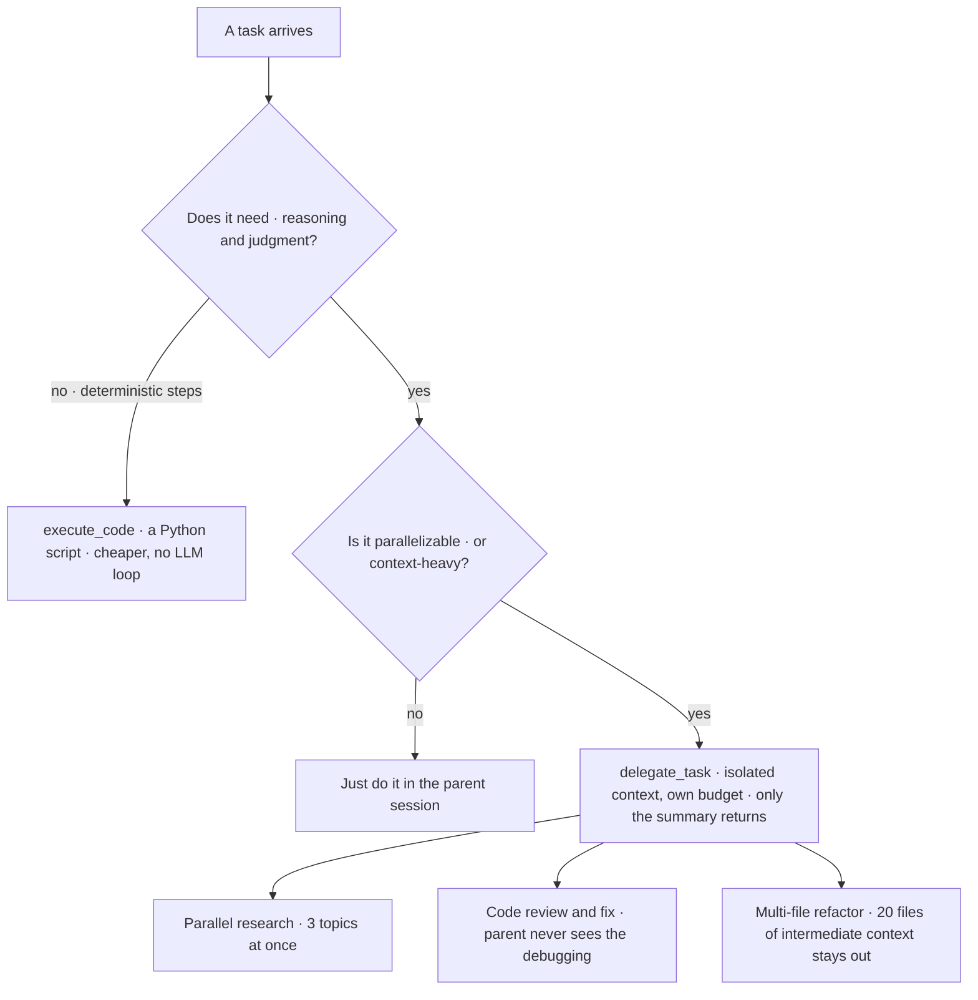

# Part 8: Delegation and Subagents

A single agent session is a serial process. One message in, the model thinks, calls tools, evaluates results and responds. Everything in sequence. For most tasks this is fine. For research, code review, refactoring and parallelizable workflows, it is a bottleneck.

Delegation spawns child agents that work independently and in parallel. Each child gets its own conversation, its own terminal session, its own toolset and its own budget. **Only the final summary comes back to the parent.** The children's intermediate work, their tool calls, errors, dead ends and debugging noise, stays in their context and never enters yours.

That last clause is the real product. Delegation is as much a context-management technique as a speed technique.

### How delegation works

The `delegate_task` tool spawns a fresh `AIAgent` instance. The child starts with a completely clean conversation and zero knowledge of the parent's history. The only context it receives is what the parent puts into the `goal` and `context` fields.

> ⚠️ **Subagents know nothing. This is the whole lesson**
>
> If you delegate a task and say "fix the error," the subagent has no idea what error you mean. The goal must be self-contained: file paths, error messages, project conventions, expected outcomes, all of it in the goal and context fields. This is the same constraint as a cron prompt from Part 6, arising from the same cause, a fresh session with no history.

A single task creates one child. A batch creates up to three by default, running concurrently in a thread pool. The parent blocks until all children complete, and results are returned in input order regardless of completion order.

### When to delegate, and when not to

**Delegate, or script it?**

The three patterns the author calls out, with what each one actually buys:

**Parallel research.** Three subagents research three topics simultaneously, each running independent web searches and returning a structured brief. The parent synthesizes. This is the highest-ROI use case for most people.

**Code review and fix.** Delegate a security audit of the authentication module. The child reviews, finds issues, fixes them, runs tests and returns a summary of what it changed. The parent never sees the debugging process.

**Multi-file refactoring.** A refactor touching 20 files generates enormous intermediate context. Delegating keeps the parent session clean. The child works through each file and returns a summary; the parent only loads the diff.

### Toolset selection is a cost lever, not just a permission

Each subagent gets its own `toolset` parameter. Research children need `["web"]`. Code children need `["terminal", "file"]`. Full-stack tasks get `["terminal", "file", "web"]`.

| Tool | Status for subagents | Why |
|---|---|---|
| clarify | Blocked | Subagents cannot interact with the user |
| memory | Blocked | Subagents should not write to shared persistent state |
| delegation | Blocked for leaf subagents | Prevents runaway recursive spawning |

Restricting the toolset also **reduces token consumption**. A research child with only web tools does not load terminal, file, browser or image tool schemas into its prompt. The model has fewer options to consider and a smaller tool index. Scoping a child is therefore both a safety decision and a cost decision, and most people only think of it as the former.

### The async model

The original delegation tool blocked the parent chat while children ran. You fired three research subagents and sat watching a spinner. If a child got stuck you either waited it out or cancelled the whole batch.

**Async subagents fixed this.** `delegate_task_async` fires a subagent and returns immediately. You keep working.

| Action | What it does |
|---|---|
| check | Progress on running children |
| steer | Redirect a stuck child mid-execution |
| collect | Gather results once they are done |
| cancel | Kill tasks no longer needed |
| list | See the full fan-out |

This is the model that makes delegation feel like real parallelism instead of slower sequential work. **Fire and forget. Check later. Collect when ready.**

The `/agents` slash command in the TUI turns the fan-out into a live tree view: running children, finished results, per-branch cost and token rollups, kill and pause controls, and turn-by-turn history. The classic CLI prints a text summary; the TUI renders it as an interactive overlay.

### Budgets, timeouts and depth

| Control | Default | Notes |
|---|---|---|
| Child iteration limit | 50 turns | A file check might take 5; a deep review might need all 50 |
| Child timeout | Removed by default | An earlier hard 300s cap killed legitimate long-running work |
| Stuck detection | Heartbeat staleness monitor | Replaces the removed timeout |
| Hard timeout | Opt-in via config | For cost control on unattended cron-driven delegation |
| Concurrent children per batch | 3 | The default fan-out width |
| Orchestration depth | 1 (flat) | Raise to 2 to allow one level of nesting |

> ⚠️ **Depth multiplies, and it multiplies fast**
>
> By default delegation is flat: a parent spawns children, and those children cannot spawn their own. For multi-stage workflows an orchestrator child retains the delegation toolset and can spawn leaf workers. Each level multiplies cost. Depth 3 with 3 concurrent children means **27 leaf agents** at the deepest point. Raise the depth limit intentionally, never casually.

### When parallelism changes the workflow

Single-agent sessions are simple, predictable and easy to debug. You see every tool call and know what the agent is doing.

Parallel delegation introduces uncertainty. Three subagents run simultaneously, you do not see their intermediate work unless you check, one might get stuck, and in the synchronous model the parent is blocked until all complete.

The tradeoff is worth it when the parallelism saves meaningful time. Three research tasks in sequence take three times as long as one; in parallel they take roughly as long as the slowest. For comparative work, testing three approaches, researching three vendors, reviewing three modules, delegation turns a 15-minute wait into a 5-minute wait. The async model eliminates the waiting entirely.

> ✅ **Operator drill · a real three-way fan-out**
>
> Pick a genuine comparison you need to make, three tools, three vendors, three approaches. Fire three async subagents, each scoped to `["web"]` only, each with a fully self-contained goal naming exactly what to find and what shape to return it in. Keep working while they run. Collect, then have the parent synthesize. Two things to notice afterwards: how little of their intermediate noise reached your context, and whether any child failed because your goal assumed knowledge it did not have. The second is the lesson.

---

[← Back to the index](../README.md) · [Whole masterclass in one file](FULL-MASTERCLASS.md)
