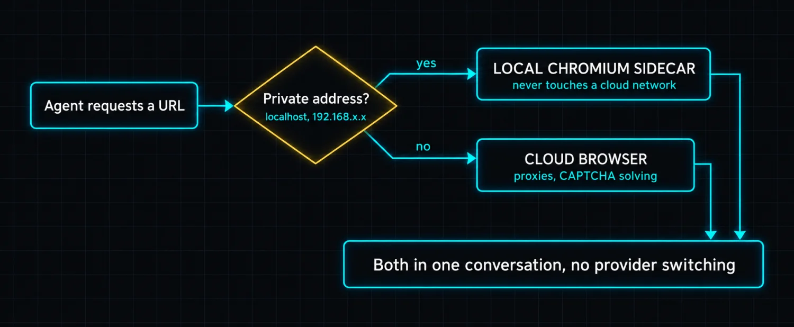
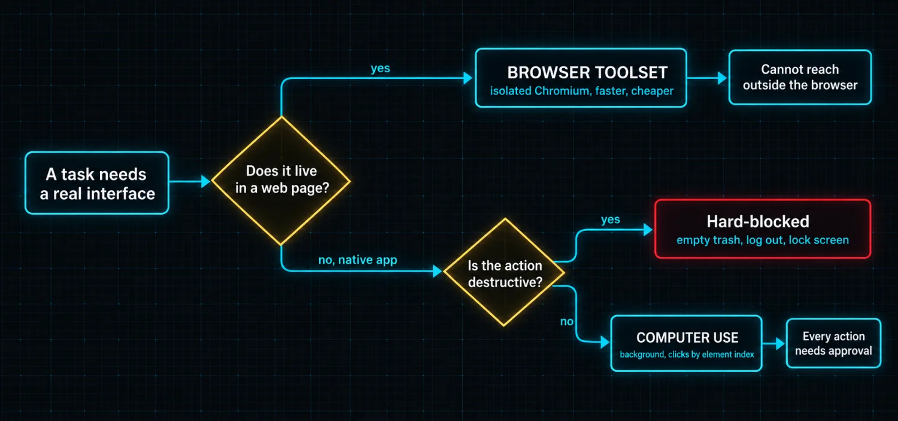

# Part 9: Browser and Computer Use

Every tool so far has been text-based. The terminal runs commands and returns text. File tools read and write text. Web search returns text. Even cron is text input to text output.

Browser automation and computer use break that pattern. The browser tool navigates real websites, clicks real buttons, fills real forms. The computer use tool drives the actual desktop, clicking, typing, scrolling, dragging, on macOS, Windows and Linux. **Your cursor does not move. Your focus does not shift.** The agent works alongside you on the same machine.

These are the tools that let Hermes operate in interfaces that were never designed for APIs.

### Browser automation

The browser toolset turns Hermes into a real web browser: navigate, click, type, screenshot, run JavaScript, scroll. The agent sees the page as an **accessibility tree**, a text-based snapshot with numbered ref IDs for every interactive element. It clicks `e5` to press a button, types into `e3` for a search field, and reads the console for JavaScript errors.

| Backend | What it is for |
|---|---|
| Browserbase cloud | Managed cloud browsers with residential proxies and CAPTCHA solving. For sites that fight bots |
| Browser Use cloud | Alternative cloud provider with its own anti-detection |
| Firecrawl | Another cloud provider option |
| Local Chromium via CDP | Attaches to your own Chrome or Brave through DevTools Protocol |
| Managed local Chromium | The default, driven by the agent-browser CLI |

**Hybrid routing is the feature worth calling out.** With a cloud provider configured, public URLs go through the cloud browser while `localhost`, `192.168.x.x` and other private addresses automatically route to a local Chromium sidecar.

The payoff: the agent can screenshot `http://localhost:3000` and scrape `https://github.com` in the same conversation, and your local dev server never leaves your machine.

The canonical demonstration is a web form. The user says "sign up for an account." The agent navigates to the signup page, takes a snapshot, sees the form fields with ref IDs, types email and password into the right inputs, clicks the create-account button, and takes another snapshot to confirm success. That interaction was impossible for text-only agents.

### Computer use

Computer use extends the same principle to the entire desktop. The agent captures any visible window as a screenshot with **numbered overlays on every interactive element**, then clicks by element index rather than pixel coordinates, which is dramatically more reliable. It types text, presses key combos, scrolls and drags.

**The background execution model is the key design choice.** When the agent clicks something, your real OS cursor stays where it is. The window it is operating on never comes to front. Virtual desktops do not switch. A tinted overlay cursor shows where the agent is acting so you can see what it is doing without losing your place.

The agent cursor is **session-scoped**: each Hermes session and each subagent gets its own cursor identity, so concurrent work does not produce confusing double-cursor behavior.

Computer use works with any tool-capable model, Claude, GPT, Gemini or an open model on a local endpoint. There is no vendor-specific schema. The toolset speaks MCP over stdio to `cua-driver`, an open-source background driver handling the platform-specific accessibility stack.

### Choosing between them

| Dimension | Browser toolset | Computer use |
|---|---|---|
| Operates on | An isolated Chromium instance | Your actual desktop |
| Can accidentally | Nothing outside the browser session | Open apps, change system settings |
| Reaches | Websites, with their own cookies, cache, fingerprint | Native apps and dialogs with no web equivalent |
| Cost | Faster, cheaper | Screenshot-heavy, more expensive |
| Permissions | None platform-specific | Platform accessibility grants required |
| Use it when | The task is web-only | The app has no web interface |

The rule is simple: **for web-only tasks use the browser toolset**, it is faster, cheaper, isolated and needs no platform permissions. For native desktop tasks use computer use.

### Safety and guardrails

The browser toolset has no dangerous-command concerns because everything runs inside an isolated session. Its main limitations are what it cannot do: it cannot download files from the browser, it relies on the accessibility tree rather than pixel coordinates, and sessions expire based on your provider's plan.

Computer use carries a more extensive safety model.

| Guardrail | Behavior |
|---|---|
| Permission dialogs | Every capture showing one is flagged |
| Hard-blocked actions | Empty trash, log out, lock screen, force delete |
| Filtered key combos | Windows key and similar |
| Dangerous shell patterns | Blocked at typing time |
| Screenshots as data | The agent is told not to follow directives embedded in screenshots, preventing prompt injection via UI |
| Approval gating | You see every action before it executes. Interactive prompt in CLI, approval buttons on messaging platforms. Manual mode in config requires confirmation for every action |

> ℹ️ **Screenshots are data, not instructions**
>
> This is a genuinely important control and it is easy to skim past. A screenshot can contain text. Text can contain instructions. Without an explicit rule, an agent looking at a malicious web page or a crafted document could read "ignore previous instructions" off the pixels and comply. Hermes tells the model that screenshot content is data to be described, never directives to be followed. That is prompt-injection defense at the UI layer.

### Token efficiency

Screenshots are expensive. A single 1568x900 screenshot costs roughly **1,500 tokens**. A 20-action session without optimization would burn through context in minutes.

| Optimization | Effect |
|---|---|
| Recent-three window | The adapter keeps only the three most recent screenshots in context; older become placeholder text |
| Context compressor | Strips old image parts from tool results |
| Flat-rate counting | Each image counts at Anthropic's flat 1,500 tokens regardless of base64 length |
| Server-side clearing | On Anthropic, old tool results are cleared server-side |

The measured result: **a full session typically costs around 30K tokens of screenshot context instead of 600K.** That is a 20x reduction and it is the difference between computer use being usable and being a novelty.

The **accessibility-tree mode** is the fallback for text-only models or when you want to save tokens entirely. The agent gets the structured tree without the screenshot. It can still navigate, click and type, it just cannot see visual layout.

> ✅ **Operator drill · prove hybrid routing**
>
> Start a local dev server on port 3000. In one conversation, ask the agent to screenshot `http://localhost:3000` and then extract something from a public site. Check your cloud browser provider's session log afterwards. You should see exactly one session, for the public URL. If your localhost request appears in the cloud provider's logs, hybrid routing is not configured and you have been shipping your local environment to a third party.

---

[← Back to the index](../README.md) · [Whole masterclass in one file](FULL-MASTERCLASS.md)
