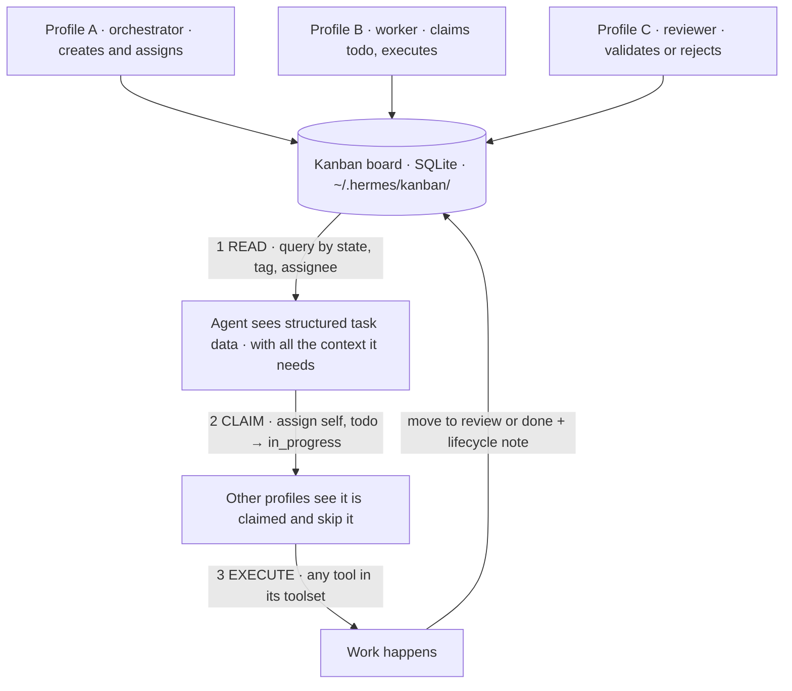

# Part 10: Kanban as a Coordination Model

Everything so far has assumed one agent, one conversation, one task at a time. You ask, the agent does, you get a result. Serial processing.

Kanban breaks that model. It gives you a durable, SQLite-backed task board that multiple agents can read from, claim and write to. The board survives restarts. Tasks have states, assignees, priority and tags. **The agent does not need to remember what work is open, it reads the board.**

Kanban in Hermes is not a project management feature. It is an agent coordination model for work spanning multiple profiles, sessions and agent instances.

### The board model

A kanban workspace is a SQLite database at `~/.hermes/kanban/`. It stores tasks with labels, states, assignees, priority, tags and timestamps, and the agent interacts with it through the `kanban` tool.

| State | Meaning |
|---|---|
| todo | Created, unclaimed |
| in_progress | A profile has claimed it and is working |
| review | Work is done and awaiting validation |
| done | Finished |
| cancelled | No longer makes sense |

Each task has an **assignee field that maps to a Hermes profile**. When a profile picks up a task it claims ownership, and other profiles can see who is working on what and avoid duplicating effort. Priority ranks tasks within a state; tags group related tasks. The agent filters by state, priority, tags or assignee to find exactly the work it should be doing.

### Read, claim, execute

**Read, claim, execute, and how profiles stay out of each other's way**

**Read.** The agent queries the board for tasks in a relevant state. An orchestrator might query all `todo` tasks tagged "research"; a worker might query `in_progress` tasks assigned to itself.

**Claim.** The agent picks a task and assigns itself. The task moves to `in_progress` with the profile name on it.

**Execute.** The agent does the work using any tool in its toolset, then moves the task to `review` or `done`, optionally adding notes about what it found.

This pattern scales to multiple profiles running concurrently. **The board is the shared state that coordinates them without requiring direct communication between agents.** That is the architectural point: no message bus, no RPC between profiles, just a database they all read.

### Task lifecycle

Four mechanisms turn a list into a workflow.

| Mechanism | What it does | Why it matters |
|---|---|---|
| Blocked tasks | A task lists its blocker task IDs and is not claimable until they resolve | Stops multiple agents spinning on work that cannot proceed |
| Deadlines | Optional; the task alerts as it approaches | Combined with priority, creates a natural triage order |
| Iteration limits | Caps how many tasks can sit in a given state at once | Three in review means review is the bottleneck, and the system stops pulling new work until it clears |
| Lifecycle notes | Appended on each state transition: what was done, found, and left undone | Accumulate into a complete audit trail; the reviewer reads them before starting |

Iteration limits are the subtle one. A cap on `review` does not just throttle, it **surfaces where the workflow is slow.** A board that keeps hitting its review limit is telling you the reviewer is under-resourced, and that is information a chat transcript would never give you.

### Multi-agent coordination

The board comes into its own when multiple profiles share it. Each profile is a separate agent with its own config, memory, skills and toolset, and the board is the bridge.

A typical setup has three:

- **The orchestrator** populates the board from an external source: a cron job reading an RSS feed, a gateway message creating a task, or a manual request.
- **The worker** polls for new tasks, claims them and moves them through the pipeline.
- **The reviewer** checks completed work and either approves it or sends it back for rework.

Each runs independently. The orchestrator does not wait for the worker; the worker does not wait for the reviewer. **The board is the synchronization point.** If the worker is offline, tasks pile up in `todo`, and when it returns it picks up where it left off.

The kanban tutorial in the Hermes docs walks through wiring three profiles with shared Raft state for distributed consistency: profiles on different machines, different networks, with no direct communication channel, coordinating through the board.

### When kanban beats direct chat

Single-agent work is simpler. You ask, the agent does, you get the result. No board, no task states, no profile coordination. Kanban adds overhead, and every step of that overhead is friction direct chat does not have.

The board earns its overhead when:

| Condition | Why the board wins |
|---|---|
| Work is long-running | A durable board survives agent restarts; direct chat loses context when the session ends |
| Work is multi-step | Explicit state transitions give each step a clear owner and completion signal |
| Work is multi-agent | Profile routing means the orchestrator does not need the worker's skills |
| Work is asynchronous | A task created at midnight is claimed by a worker at 8 AM. The board is always on |

### The board as system memory

A board with full task history is a record of what was done, when, by whom, and what was found. Every moved task, every lifecycle note, every state change persisted in SQLite. It answers questions direct chat cannot: how many tasks completed this week, which profiles are overloaded, where the pipeline bottlenecks are.

The board does not replace memory or skills, it completes the set.

| System | Holds | Time horizon |
|---|---|---|
| Memory | Durable facts | Always, in every prompt |
| Skills | Procedures | On demand, when matched |
| Kanban board | The state of in-flight work | Until the work is done |

Together the three give the agent awareness of **what it knows, how to do things, and what it should be working on.**

> ✅ **Operator drill · a minimum viable pipeline**
>
> Create two profiles, a worker and a reviewer. Put three real tasks on the board in `todo`. Have the worker claim and execute them, writing a lifecycle note on each transition. Then have the reviewer read only the notes, not the conversation, and decide whether each passes. If the reviewer can judge the work from notes alone, your lifecycle notes are good enough to coordinate agents. If it cannot, the notes are the thing to fix before you add a third profile.

---

[← Back to the index](../README.md) · [Whole masterclass in one file](FULL-MASTERCLASS.md)
