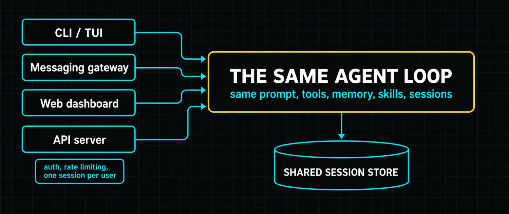

# Part 11: The Admin Layer


One agent is a tool. Two agents is a system. Three or more is an operation.

As soon as you run multiple Hermes profiles, one for coding, one for research, one for the gateway, one as a kanban worker, you need a layer that manages them. **Profiles are the runtime boundary. The dashboard is the control surface. The API server is the integration point.**

### Profiles are the runtime boundary

Each Hermes profile is a completely independent agent: its own `config.yaml`, its own `HERMES_HOME`, its own memory, sessions, skills, cron jobs, gateway state and credentials. `hermes -p coder chat` and `hermes -p researcher chat` start completely separate sessions. **They share nothing by default.**

*`profiles.sh`*

```bash
hermes profile create coder                      # blank profile, fresh config
hermes profile create work --clone-from default  # copies config, skills, SOUL
hermes profile create backup --clone-all         # full snapshot incl. memories,
                                                 # sessions and cron jobs
hermes profile export coder                      # shareable archive (no credentials,
                                                 # no session history)
hermes profile install <archive>                 # install it on another machine
```

Each profile automatically gets its own command alias. Create a profile called `coder` and `coder chat` launches Hermes in it. You never type `hermes -p coder` again.

**Gateways are per-profile too.** Each profile runs its own gateway as a separate process with its own bot token. Profile A can talk to Telegram while Profile B talks to Discord. If two profiles accidentally use the same bot token, the second gateway refuses to start with a clear error naming the conflict.

> ⚠️ **home_mode is the isolation setting people miss**
>
> By default **all profiles share your real home directory** for tool execution. Same git config, same npm state, same SSH keys. Setting `terminal.home_mode: profile` in a profile's config scopes tool execution to that profile's own home directory. Useful when you want a kanban worker to have its own git identity. The tradeoff is that tools like `git` and `gh` need re-authenticating per profile.

### The dashboard is the control surface

The web dashboard runs as an optional web server giving a graphical view of your installation: current profile, active sessions, model configuration, tool settings, gateway status, skill library and cron jobs.

Its main value is the **profile switcher**. Switch between profiles, inspect each one's config, edit skills, adjust model settings and start chat sessions from one browser tab. You can see what the coder profile is working on while chatting from the researcher profile.

From that one tab you can:

- [x] Switch between profiles and see each one's config, model, tools and gateway status
- [x] Edit skills in the browser with syntax highlighting and live preview
- [x] Manage cron jobs: create, edit, pause, resume, remove, without CLI commands
- [x] Inspect session history across profiles and surfaces, all from the same session store
- [x] Monitor active sessions, running tool calls, gateway status and recent completions

The dashboard is **optional**. Everything it does can be done through the CLI. For operators running multiple profiles with multiple gateways, the visual view saves time; for a single-profile setup it is a convenience you can skip.

### The API server is the integration point

Hermes exposes an **OpenAI-compatible HTTP endpoint**. Any frontend that speaks the OpenAI format can drive it: Open WebUI, LobeChat, LibreChat and similar.



The only difference between surfaces is the transport. The API server routes requests through the active profile's agent loop with the same prompt assembly, tool dispatch and session persistence the CLI uses. That is what makes a custom frontend or a team-shared interface cheap to build: you are not reimplementing the agent, only changing how messages arrive.

### What changes with multiple profiles

Single-profile Hermes is simple: one agent, one config, one set of skills, one gateway, everything in one place.

Multi-profile Hermes changes the operational model. The coding profile has terminal access and a capable model. The research profile has web tools and a cheap model for bulk work. The kanban worker has no gateway and a minimal toolset, running as a supervised background service.

Profiles share nothing by default, which is the safe default. They coordinate through the kanban board, or through the shared filesystem if you explicitly configure shared directories. **The board from Part 10 is the recommended path** because it does not require shared filesystem access.

> 📝 **The honest advice on when to add a profile**
>
> More profiles means more config files, more gateways to manage, more things that can break. Start with one and add specialized ones only when you have a clear use case. A general-purpose profile with all tools enabled plus a research profile with a cheap model is usually enough for most setups. Profile sprawl is a real failure mode and it arrives quietly.

> ✅ **Operator drill · prove isolation is real**
>
> Clone your default profile with `--clone-from`. In the clone, set `terminal.home_mode: profile`. Then run the same command in both, something that reveals identity, `git config user.email` works well. Different answers mean isolation is real. Identical answers mean you are running two agents that can reach into each other's world, which is fine if you chose it and dangerous if you assumed otherwise.

---

[← Back to the index](../README.md) · [Whole masterclass in one file](FULL-MASTERCLASS.md)
