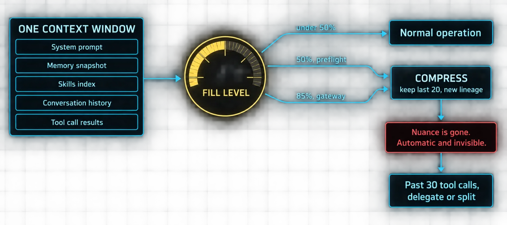
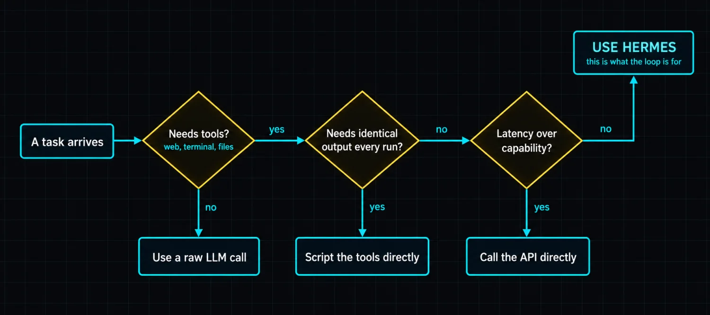

# Part 12: What Breaks, What to Skip, How to Stay Sane

Eleven parts of features, tools and possibilities. Now the real talk.

Hermes is the most capable open-source agent the author has used. It is also a complex system with sharp edges. **Understanding what breaks, what to skip, and when to use something else is the difference between an agent that compounds and one that frustrates.**

### Context windows are the first wall

Every model has a context window and Hermes runs inside it.

The system prompt, memory snapshot, skills index, conversation history and tool call results all compete for the same limited space.

| Threshold | What fires | What it costs |
|---|---|---|
| 50% of window | Preflight compression, before the API call | Middle turns summarized, last 20 preserved, new session lineage |
| 85% of window | Gateway auto-compression | Same mechanism, later trigger |
| Every compression | Nuance | Compressed content is a summary, not the original. Automatic, usually invisible, and destructive |

Long tool call chains accelerate the pressure. A single research task might produce five search results, three page extracts and a summary: nine call-and-result pairs in history. Run another batch and the history doubles. Preflight compression catches it, but the agent loses nuance with every pass.

The iteration budget is the safety valve. Default 90 turns, each tool call counting as one. **Subagents have their own budgets, so delegation is a genuine workaround for tight context** because a child's iterations do not count against the parent.

> ⚠️ **The practical rule, stated plainly**
>
> If a task needs more than 30 tool calls, delegate it to a subagent or break it into multiple sessions. Do not let a single conversation chain grow until it compresses into illegibility. By the time you notice the agent has gone vague, the detail it lost is already gone.

### Integration fragility is constant

Every tool depending on an external service is a point of failure. Web search needs an API key. The browser tool needs a cloud provider credit balance or a running local Chromium. Image generation needs the FAL client installed. TTS needs an ElevenLabs or similar key.

Credentials expire. Rate limits hit. Free tiers run out. The tool's `check_fn` reports unavailable and **the model silently loses access. No error. No alert.** The tool just does not appear in the schema, exactly as Part 5 described.

> ⚠️ **Fallbacks cover the model, not the tools**
>
> The fallback provider system handles model failures: on a 429 or 5xx, Hermes tries the next provider. But fallbacks only cover the model. If your web search API key expires, the search tool disappears regardless of which model you are running. There is no tool-level fallback, so there is no substitute for checking.

The practical rule: run `hermes tools` periodically to verify your surface is intact, and **set up a weekly cron job that tests the three tools from Part 2**, terminal, web and file, alerting you if any fail. A tool that disappears silently is worse than a tool that never worked, because you built on it.

### Profile isolation has footguns

Profiles give you independent agents. They also share your actual system by default.

| Footgun | The symptom | The fix |
|---|---|---|
| Shared home directory | A coding profile's git config is the research profile's git config; profiles can read each other's project files | terminal.home_mode: profile scopes execution to {HERMES_HOME}/home. Tradeoff: re-authenticate git and gh per profile |
| Gateway token conflict | The second gateway refuses to start | Create separate bots for separate profiles |
| Session persistence | Docker without the volume mount loses everything on restart; serverless loses active sessions until wake | Test it: start a chat, stop, restart, hermes -c |

**Profiles are config-isolated, not system-isolated.** That distinction is the whole of this section, and it surprises people who assumed a profile was a sandbox.

### The curator can bite

The curator prevents skill rot by archiving skills unused for 90 days, running automatically every 7 days. That is great for agent-created skills accumulated from a dozen workflows. It is annoying when it archives a skill **you** wrote and use once a quarter.

The fix is one command: `hermes curator pin <name>`. Pinned skills leave the curator's jurisdiction entirely. The agent can still patch them; the curator cannot archive them.

> 📝 **Nothing is ever deleted, so check the archive first**
>
> Archived skills live in `~/.hermes/skills/.archive/` and come back with `hermes curator restore <name>`. If a skill disappears, it is almost certainly there. And pin anything you wrote yourself, as a habit, on the day you write it.

### What to skip

Not every feature is worth your time on day one. Some are genuinely useful for advanced cases. Some are distractions until you have a specific need.

| Skip | Until |
|---|---|
| MCP servers | You need a specific integration. Core tools already cover web, terminal, file, browser and media |
| Multi-provider routing | Your primary model fails regularly. One provider works fine for months |
| Batch processing | You are training models or doing research at scale |
| Custom plugin development | The built-in tools genuinely do not cover your case. A skill covers most procedural needs without code |
| ACP editor integration | You live in VS Code or Zed and want Hermes inside the editor. CLI and gateway cover the same ground |

### When not to use Hermes at all

Hermes is an agent with a tool surface. It is not the right tool for every task, and knowing the boundary is part of using it well.

| Do not use it for | Because | Use instead |
|---|---|---|
| Single-shot generation | The agent loop adds overhead a single inference does not need | A raw LLM call |
| Tasks that need no tools | "Translate this paragraph" needs no web, terminal or file access | A ChatGPT or Claude chat |
| Deterministic output | The loop is inherently non-deterministic: different tools, orders and approaches each run | Script the tools directly |
| Latency-critical work | Every tool call adds round-trip time on top of model reasoning | Call the API directly |

### What compounds, and what breaks it

The eleven parts before this one describe a system that gets better over time: the agent loop, session persistence, memory and skills, the tool surface, cron, gateways, delegation, browser automation, kanban, profiles.

**None of it works if the foundation is wrong.** Sessions that do not persist break the learning loop. Missing API keys break the tool surface. Gateway tokens in the wrong profile break message delivery. The curator archiving a skill you wrote breaks an automation you relied on.

The agent loop is the engine. The learning system is the fuel. The tools are the output. Profiles are the runtime. And the limits are what keep it real.

- [ ] Run hermes tools this week and read the whole list
- [ ] Pin every skill you wrote yourself
- [ ] Test session persistence: start, stop, restart, hermes -c
- [ ] Create the weekly three-tool canary cron job
- [ ] Check ~/.hermes/skills/.archive/ for anything you miss

> ✅ **Operator drill · build the canary**
>
> Write one cron job, in no-agent mode where possible, that exercises terminal, web and file once a week and reports only on failure using the `[SILENT]` pattern from Part 6. This single job converts the entire "integration fragility" section from a thing you have to remember into a thing the system tells you. It is the highest-value twenty minutes in this document.

---

[← Back to the index](../README.md) · [Whole masterclass in one file](FULL-MASTERCLASS.md)
